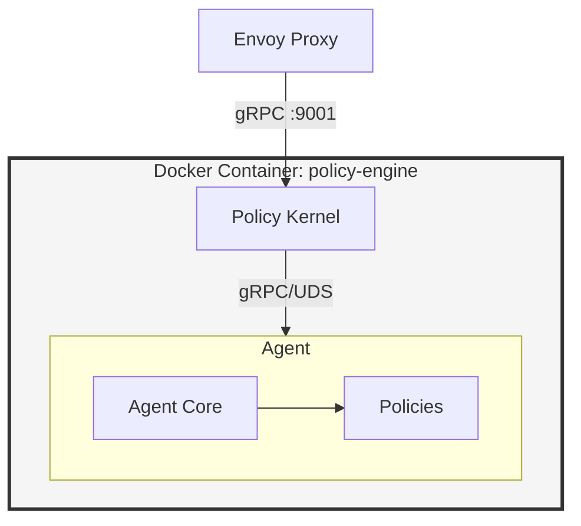

# Envoy Policy Engine

Policy Engine for Envoy using External Processing Filter (v1.36.2)

## Documentation Structure

The specification has been distributed across component-specific documents for easier navigation and maintenance:

```
envoy-policy-engine/
├── SPEC.md                          # Root specification (overview, architecture, deployment)
├── policy-kernel/
│   └── SPEC.md                      # Policy Kernel specification
└── policy-agent/
    ├── SPEC.md                      # Policy Agent specification
    ├── agent-core/
    │   └── SPEC.md                  # Agent Core specification
    └── policies/
        └── SPEC.md                  # Policies specification and development guide
```

## Component Overview

### [Policy Engine (Root)](SPEC.md)
- System architecture
- Deployment model (Docker container with supervisord)
- End-to-end request flow
- Security, observability, and performance requirements
- Build and testing strategy

### [Policy Kernel](policy-kernel/SPEC.md)
- Envoy External Processing API implementation
- Route-based policy selection
- Agent registry and discovery
- Request orchestration and response aggregation
- Configuration schema and hot reload

### [Policy Agent](policy-agent/SPEC.md)
- Binary architecture (compiled-in policies)
- Communication protocols
- Configuration schema
- Deployment and build process

#### [Agent Core](policy-agent/agent-core/SPEC.md)
- gRPC server implementation
- Policy registry
- Sequential execution engine
- Context management
- Instruction accumulation

#### [Policies](policy-agent/policies/SPEC.md)
- Policy interface definition
- Development guidelines and best practices
- Example implementations (API Key, JWT, Rate Limit)
- Testing requirements
- Metadata schema

## Quick Start

### Reading the Specifications

1. Start with [SPEC.md](SPEC.md) for system overview and architecture
2. Read [policy-kernel/SPEC.md](policy-kernel/SPEC.md) to understand Envoy integration
3. Read [policy-agent/SPEC.md](policy-agent/SPEC.md) for agent architecture
4. Dive into [agent-core/SPEC.md](policy-agent/agent-core/SPEC.md) for execution engine details
5. See [policies/SPEC.md](policy-agent/policies/SPEC.md) for policy development

### Architecture Diagram



## Key Concepts

- **Policy Kernel**: Orchestrator that interfaces with Envoy
- **Policy Agent**: Execution runtime with compiled-in policies
- **Agent Core**: Execution engine and policy registry
- **Policy**: Individual enforcement module (auth, rate limiting, etc.)
- **Route-Based Selection**: Different policy chains for different routes
- **Sequential Execution**: Policies execute in order with context updates
- **UDS Communication**: Unix Domain Sockets for kernel-agent communication

## Related Files

- `Spec-v2.md` - Original monolithic specification (reference)
- `Spec.md` - Original v1 specification (archived)

---

For detailed technical specifications, please refer to the component-specific SPEC.md files linked above.
