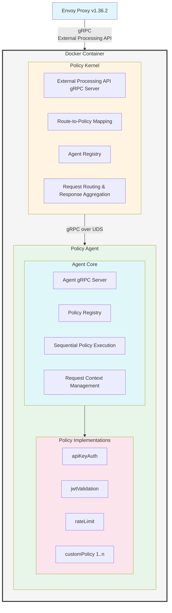
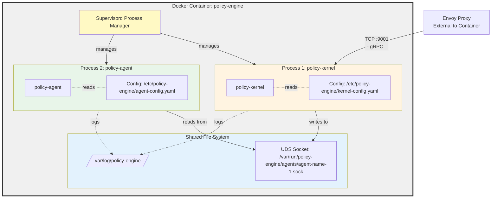
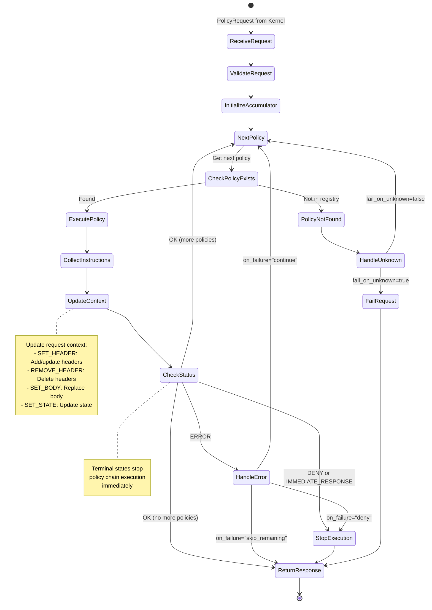
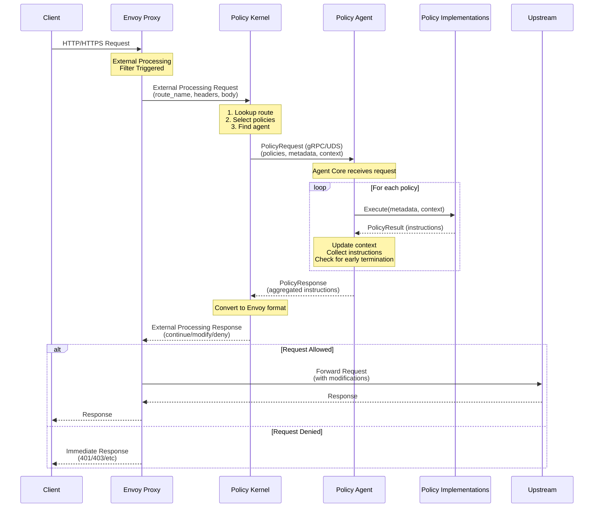

# Policy Engine Specification v2.0

## 1. Executive Summary

Policy Engine is an implementation of Envoy Proxy's External Processing Filter (v1.36.2) that provides extensible, route-based policy enforcement. The engine executes configurable policy chains to make routing decisions, apply authentication, authorization, rate limiting, and other cross-cutting concerns.

## 2. System Architecture

### 2.1 Component Overview



### 2.2 Deployment Model

**Container Architecture:**



**Key Points:**

- **Container**: Single Docker container containing two separate binaries:
  - **policy-kernel**: The Policy Kernel binary (gRPC server for Envoy)
  - **policy-agent**: The Policy Agent binary (gRPC server for policy execution, with all policies compiled in)
- **Process Architecture**:
  - Both binaries run as independent processes within the same container
  - Managed by a process supervisor (supervisord)
  - Each process has its own lifecycle and can be restarted independently
  - Supervisor ensures both processes are running and restarts them on failure
- **Networking**:
  - Envoy ↔ Policy Kernel: gRPC over TCP/HTTP2 (configurable port, default: 9001)
  - Policy Kernel ↔ Policy Agent: gRPC over Unix Domain Sockets (UDS)
  - UDS Path: `/var/run/policy-engine/agents/<agent-name>.sock` (default: `default.sock`)
  - UDS provides fast, secure inter-process communication within the container
- **File System Layout**:
  - `/usr/local/bin/policy-kernel` - Policy Kernel binary
  - `/usr/local/bin/policy-agent` - Policy Agent binary (includes all compiled policies)
  - `/var/run/policy-engine/agents/` - Directory for UDS sockets
  - `/etc/policy-engine/` - Configuration files directory
  - `/var/log/policy-engine/` - Log files directory

## 3. Policy Kernel

### 3.1 Responsibilities

1. **External Processing Server**: Implements Envoy's External Processing gRPC API
2. **Route-Based Policy Selection**: Maps route names to policy chains
3. **Agent Management**: Maintains registry of available Policy Agents and their health status
4. **Request Orchestration**: Routes requests to appropriate agents based on policy configuration
5. **Response Aggregation**: Collects instructions from agents and formats response for Envoy

### 3.2 Configuration Schema

```yaml
policy_kernel:
  server:
    address: "0.0.0.0"
    port: 9001
    max_concurrent_streams: 1000

  agents:
    - name: "default-agent"
      socket_path: "/var/run/policy-engine/agents/default.sock"
      timeout_ms: 500
      retry:
        max_attempts: 3
        backoff_ms: 100
      health_check_interval_ms: 5000

  route_policies:
    - route_name: "/api/v1/users"
      request_policy_chain:
        - policy: "apiKeyAuth"
          metadata:
            header_name: "X-API-Key"
            required: true
        - policy: "rateLimit"
          metadata:
            requests_per_second: 100
            burst: 20
      response_policy_chain:
        - policy: "addSecurityHeaders"
          metadata:
            headers:
              X-Content-Type-Options: "nosniff"
              X-Frame-Options: "DENY"
        - policy: "responseBodyTransform"
          metadata:
            remove_fields: ["internal_id"]

    - route_name: "/api/v1/admin"
      request_policy_chain:
        - policy: "jwtValidation"
          metadata:
            issuer: "https://auth.example.com"
            audience: "api-service"
        - policy: "roleCheck"
          metadata:
            required_roles: ["admin"]
      response_policy_chain:
        - policy: "auditLog"
          metadata:
            log_response_body: true

  default_policy:
    request_policy_chain:
      - policy: "allowAll"
    response_policy_chain: []

  observability:
    metrics_port: 9090
    log_level: "info"
    tracing:
      enabled: true
      sampling_rate: 0.01
```

### 3.3 Agent Configuration Discovery

At startup, the kernel queries each agent to discover its configuration, including supported policies.

**Agent Configuration Protocol (gRPC):**
```protobuf
// Request from Kernel to Agent (sent at startup)
message GetAgentConfigRequest {}

// Response from Agent to Kernel
message GetAgentConfigResponse {
  string agent_name = 1;
  string agent_version = 2;
  repeated PolicyInfo supported_policies = 3;
  map<string, string> agent_metadata = 4; // Additional agent information
}

message PolicyInfo {
  string name = 1;
  string version = 2;
  string description = 3;
  string metadata_schema = 4; // JSON schema for validating policy metadata
  repeated PolicyPhase supported_phases = 5; // REQUEST, RESPONSE, or both
}

enum PolicyPhase {
  REQUEST = 0;
  RESPONSE = 1;
}
```

**Discovery Flow (Startup Only):**
1. Kernel starts and reads its configuration file
   - Configuration contains: agent socket paths, route-to-agent mappings, policy chains with metadata
   - Configuration does NOT define which policies exist or their implementations
2. For each configured agent, kernel connects to the agent via UDS
3. Kernel sends `GetAgentConfigRequest` to the agent
4. Agent responds with `GetAgentConfigResponse` containing:
   - Agent name and version
   - List of all supported policies (compiled into the agent binary)
   - Additional agent metadata
5. Kernel updates its agent registry with the agent configuration
6. Kernel validates that all policies referenced in `route_policies` are supported by their assigned agents
7. If a route references an unsupported policy, kernel logs an error and marks that route as invalid

**Agent Registry Structure:**
```go
type AgentRegistry struct {
    agents map[string]*AgentEntry
}

type AgentEntry struct {
    name              string
    socketPath        string
    version           string
    supportedPolicies map[string]PolicyInfo  // policy name -> policy info
    metadata          map[string]string
    connection        *grpc.ClientConn
    healthy           bool
}
```

**Important Design Principle:**
- **Policies are NOT configured in the kernel** - they are discovered from agents at startup
- The kernel configuration only specifies which policies to execute for each route (policy chains)
- The agent binary contains all policy implementations and advertises them via `GetAgentConfigResponse`
- This separation allows agents to be updated with new policies without changing kernel configuration

### 3.4 Policy Selection Logic

**Request Phase:**
1. Extract `route_name` from Envoy request headers or metadata
2. Lookup route in `route_policies` configuration
3. Validate that the assigned agent supports all policies in the request chain (checked against agent registry)
4. If route found and valid, use associated `request_policy_chain`
5. If route not found, apply `default_policy.request_policy_chain` (if configured)
6. If no default policy, return `CONTINUE` instruction to Envoy

**Response Phase:**
1. Use the same route matched during request phase
2. Validate that the assigned agent supports all policies in the response chain
3. Execute associated `response_policy_chain`
4. If route not found or no response chain configured, return `CONTINUE` instruction to Envoy

### 3.5 Error Handling

| Error Condition | Behavior | Response to Envoy |
|----------------|----------|-------------------|
| Agent unavailable | Log error, skip policy chain | CONTINUE or deny based on `fail_open` config |
| Agent timeout | Cancel request, log timeout | CONTINUE or deny based on `fail_open` config |
| Invalid agent response | Log error, treat as policy failure | DENY with 500 Internal Server Error |
| Policy execution failure | Depends on policy `on_failure` setting | DENY or CONTINUE based on policy config |
| Unknown route | Apply default policy or allow | CONTINUE |
| Configuration reload failure | Continue with previous config, alert | N/A (runtime operation) |

### 3.6 Request/Response Protocol

**Request to Agent (gRPC):**
```protobuf
message PolicyRequest {
  string request_id = 1;
  repeated Policy policies = 2;
  RequestContext context = 3;
  int64 deadline_ms = 4;
  PolicyPhase phase = 5; // REQUEST or RESPONSE
}

enum PolicyPhase {
  REQUEST = 0;
  RESPONSE = 1;
}

message Policy {
  string name = 1;
  map<string, string> metadata = 2;
  string on_failure = 3; // "deny" | "continue" | "skip_remaining"
}

message RequestContext {
  map<string, string> headers = 1;
  bytes body = 2;
  string method = 3;
  string path = 4;
  string scheme = 5;
  string authority = 6;
  map<string, string> query_params = 7;
  string client_ip = 8;
}

message ResponseContext {
  map<string, string> headers = 1;
  bytes body = 2;
  int32 status_code = 3;
}
```

**Response from Agent (gRPC):**
```protobuf
message PolicyResponse {
  string request_id = 1;
  repeated Instruction instructions = 2;
  ResponseStatus status = 3;
  string message = 4;
  map<string, string> metadata = 5;
}

message Instruction {
  InstructionType type = 1;
  oneof payload {
    HeaderInstruction header = 2;
    BodyInstruction body = 3;
    ImmediateResponse immediate_response = 4;
    ContinueRequest continue_request = 5;
  }
}

enum InstructionType {
  SET_HEADER = 0;
  REMOVE_HEADER = 1;
  SET_BODY = 2;
  IMMEDIATE_RESPONSE = 3;
  CONTINUE = 4;
}

message ResponseStatus {
  StatusCode code = 1;
  string policy_name = 2; // Policy that generated this response
}

enum StatusCode {
  OK = 0;
  POLICY_DENIED = 1;
  POLICY_ERROR = 2;
  TIMEOUT = 3;
}
```

### 3.7 Performance Requirements

- **Latency**: P99 < 50ms (excluding policy execution time)
- **Throughput**: Support 10,000 requests/second per instance
- **Resource Limits**:
  - Memory: 512MB base + 256MB per agent
  - CPU: 2 cores minimum
- **Timeouts**:
  - Default agent timeout: 500ms
  - Max agent timeout: 5000ms
  - Health check timeout: 100ms

## 4. Policy Agent

The Policy Agent is a **single binary** (`policy-agent`) that contains:
- **Agent Core**: The gRPC server and execution engine
- **Policy Implementations**: Compiled-in policy modules (apiKeyAuth, jwtValidation, rateLimit, etc.)

### 4.0 Binary Architecture

**Key Architectural Points:**

1. **Single Binary Compilation**: All policy implementations are compiled directly into the `policy-agent` binary
   - Policies are not loaded dynamically or via plugins
   - Each policy is a Go package/module imported at compile time
   - The agent core imports all policy packages and registers them in the policy registry at startup

2. **Policy Registration**: On startup, the agent binary:
   ```go
   // Example: Agent initialization
   func main() {
       agent := NewAgent(config)

       // Register all compiled-in policies
       agent.RegisterPolicy(apikey.NewAPIKeyPolicy())
       agent.RegisterPolicy(jwt.NewJWTPolicy())
       agent.RegisterPolicy(ratelimit.NewRateLimitPolicy())
       // ... other policies

       agent.Start()
   }
   ```

3. **Deployment Model**:
   - To add/update/remove policies: Modify code → Rebuild binary → Redeploy container
   - No runtime plugin loading or dynamic policy addition
   - This provides better performance, simpler deployment, and easier debugging

4. **Trade-offs**:
   - ✅ **Pros**: Better performance (no plugin overhead), simpler architecture, compile-time type safety, easier to test
   - ❌ **Cons**: Requires rebuild/redeploy for policy changes, cannot add policies at runtime
   - Future enhancement: Plugin-based architecture for dynamic loading (see Section 10.1)

### 4.1 Agent Core

#### 4.1.1 Responsibilities

1. **gRPC Server**: Accepts policy execution requests from Policy Kernel via UDS
2. **Policy Registry**: Maintains map of policy name → implementation (in-memory registry)
3. **Sequential Execution**: Executes policies in order, maintaining request context
4. **Context Management**: Updates request context based on policy instructions
5. **Instruction Collection**: Aggregates instructions from all policies
6. **Early Termination**: Stops execution if policy returns DENY or IMMEDIATE_RESPONSE

#### 4.1.2 Policy Interface

```go
type Policy interface {
    // Name returns the unique identifier for this policy
    Name() string

    // Execute runs the policy logic
    // Returns instructions and error
    Execute(ctx context.Context, metadata map[string]string, reqCtx *RequestContext) (*PolicyResult, error)

    // Initialize is called once when policy is registered
    Initialize(config map[string]interface{}) error

    // HealthCheck returns the health status of the policy
    HealthCheck() error
}

type PolicyResult struct {
    Instructions []*Instruction
    Status       StatusCode
    Message      string
    Metadata     map[string]string
}

type RequestContext struct {
    Headers      map[string]string
    Body         []byte
    Method       string
    Path         string
    Scheme       string
    Authority    string
    QueryParams  map[string]string
    ClientIP     string

    // Mutable state for policy chain
    State        map[string]interface{}
}
```

#### 4.1.3 Execution Flow

**Sequential Policy Execution:**



**Textual Description:**

1. Receive PolicyRequest from Kernel
2. Validate request (check deadline, required fields)
3. Initialize response accumulator
4. FOR each policy in policies:
     a. Lookup policy implementation in registry
     b. If not found, handle based on fail_on_unknown config
     c. Execute policy with metadata and current context
     d. Collect instructions
     e. Update request context based on instructions
     f. IF policy returns DENY or IMMEDIATE_RESPONSE:
          - Stop execution
          - Return accumulated instructions
     g. IF policy returns ERROR:
          - Handle based on policy.on_failure:
            * "deny": Stop and return DENY
            * "continue": Log and continue to next policy
            * "skip_remaining": Stop and return CONTINUE
5. Return PolicyResponse with all instructions

#### 4.1.4 Context Update Rules

| Instruction Type | Context Update |
|-----------------|----------------|
| SET_HEADER | Add/update header in context.Headers |
| REMOVE_HEADER | Delete header from context.Headers |
| SET_BODY | Replace context.Body |
| SET_STATE | Update context.State[key] = value |
| IMMEDIATE_RESPONSE | No context update (terminal) |
| CONTINUE | No context update |

#### 4.1.5 Configuration

```yaml
agent_core:
  name: "default-agent"
  socket_path: "/var/run/policy-engine/agents/default.sock"

  server:
    max_concurrent_requests: 1000
    request_timeout_ms: 5000

  policies:
    fail_on_unknown: false

  observability:
    log_level: "info"
    metrics_enabled: true

  resource_limits:
    max_body_size_bytes: 1048576  # 1MB
    max_state_size_bytes: 65536   # 64KB
```

### 4.2 Policy Implementations

#### 4.2.1 Example: API Key Authentication

```go
type APIKeyAuthPolicy struct {
    validKeys map[string]bool
}

func (p *APIKeyAuthPolicy) Name() string {
    return "apiKeyAuth"
}

func (p *APIKeyAuthPolicy) Execute(ctx context.Context, metadata map[string]string, reqCtx *RequestContext) (*PolicyResult, error) {
    headerName := metadata["header_name"]
    required := metadata["required"] == "true"

    apiKey := reqCtx.Headers[headerName]

    if apiKey == "" {
        if required {
            return &PolicyResult{
                Status: POLICY_DENIED,
                Message: "API key required",
                Instructions: []*Instruction{
                    {
                        Type: IMMEDIATE_RESPONSE,
                        Payload: &ImmediateResponse{
                            StatusCode: 401,
                            Headers: map[string]string{
                                "WWW-Authenticate": "API-Key",
                            },
                            Body: `{"error": "API key required"}`,
                        },
                    },
                },
            }, nil
        }
        return &PolicyResult{Status: OK}, nil
    }

    if !p.validKeys[apiKey] {
        return &PolicyResult{
            Status: POLICY_DENIED,
            Message: "Invalid API key",
            Instructions: []*Instruction{
                {
                    Type: IMMEDIATE_RESPONSE,
                    Payload: &ImmediateResponse{
                        StatusCode: 403,
                        Body: `{"error": "Invalid API key"}`,
                    },
                },
            },
        }, nil
    }

    // API key valid - set user context for downstream policies
    return &PolicyResult{
        Status: OK,
        Instructions: []*Instruction{
            {
                Type: SET_HEADER,
                Payload: &HeaderInstruction{
                    Key: "X-User-ID",
                    Value: getUserIDFromAPIKey(apiKey),
                },
            },
        },
        Metadata: map[string]string{
            "auth_method": "api_key",
        },
    }, nil
}
```

#### 4.2.2 Policy Development Guidelines

1. **Stateless Execution**: Policies should be stateless or use external state stores
2. **Timeout Awareness**: Respect context deadlines, implement timeout handling
3. **Error Handling**: Return errors for unexpected conditions, use PolicyResult.Status for policy decisions
4. **Resource Cleanup**: Release resources (connections, file handles) in all code paths
5. **Testing**: Each policy must have unit tests with 80%+ coverage
6. **Documentation**: Each policy must document its metadata schema and behavior

## 5. Request Flow (End-to-End)



## 6. Security Considerations

### 6.1 Inter-Component Security

- **UDS Permissions**: Socket files must have 0600 permissions, owned by policy-engine user
- **Process Isolation**: Run components as non-root user
- **Resource Limits**: Enforce memory and CPU limits via cgroups
- **Input Validation**: Validate all inputs from Envoy and agents

### 6.2 Policy Security

- **Metadata Validation**: Validate all policy metadata against schema before execution
- **Body Size Limits**: Enforce max body size to prevent memory exhaustion
- **Timeout Enforcement**: Hard timeout on all policy execution
- **Secret Management**: Policies must not log sensitive data (API keys, tokens)
- **Injection Prevention**: Sanitize all inputs used in downstream calls

### 6.3 Configuration Security

- **Schema Validation**: Validate configuration against JSON schema on load
- **Secret Storage**: Use environment variables or secret management system for credentials
- **Config Reload**: Support SIGHUP for config reload without restart
- **Audit Logging**: Log all configuration changes

## 7. Observability

### 7.1 Metrics (Prometheus format)

**Policy Kernel:**
- `policy_kernel_requests_total{route, agent, status}` - Counter
- `policy_kernel_request_duration_seconds{route, agent}` - Histogram
- `policy_kernel_agent_health{agent}` - Gauge (0=unhealthy, 1=healthy)
- `policy_kernel_agent_timeouts_total{agent}` - Counter
- `policy_kernel_config_reload_total{status}` - Counter

**Policy Agent:**
- `policy_agent_executions_total{policy, status}` - Counter
- `policy_agent_execution_duration_seconds{policy}` - Histogram
- `policy_agent_policy_failures_total{policy, reason}` - Counter
- `policy_agent_context_size_bytes{type}` - Histogram

### 7.2 Logging

**Structured JSON logs with fields:**
- `timestamp` (ISO8601)
- `level` (debug, info, warn, error)
- `component` (kernel, agent)
- `request_id` (for correlation)
- `message`
- `metadata` (context-specific fields)

**Log Levels:**
- **ERROR**: Policy failures, agent unavailability, config errors
- **WARN**: Timeouts, retries, fallback to defaults
- **INFO**: Request processing, config reload, health status changes
- **DEBUG**: Detailed policy execution, context updates

### 7.3 Tracing

- Support OpenTelemetry tracing
- Create spans for:
  - External processing request (root)
  - Agent call
  - Individual policy execution
- Include trace context in PolicyRequest for downstream propagation

## 8. Testing Strategy

### 8.1 Unit Tests

- Policy Kernel route selection logic
- Agent Core policy execution flow
- Individual policy implementations
- Context update logic
- Error handling paths

### 8.2 Integration Tests

- Kernel ↔ Agent communication over UDS
- Policy chain execution with context updates
- Timeout and retry behavior
- Configuration reload

### 8.3 E2E Tests

- Full Envoy → Kernel → Agent → Policies flow
- Multiple routes with different policy chains
- Failure scenarios (agent down, policy error)
- Performance under load

### 8.4 Performance Tests

- Benchmark policy execution latency
- Load test with 10K req/s
- Memory leak detection
- Resource limit validation

## 9. Operational Considerations

### 9.1 Deployment

**Container Image:**
```dockerfile
FROM alpine:3.18

# Install runtime dependencies and supervisor
RUN apk add --no-cache ca-certificates supervisor

# Create policy-engine user
RUN adduser -D -u 1000 policy-engine

# Create required directories
RUN mkdir -p /var/run/policy-engine/agents \
             /etc/policy-engine \
             /var/log/policy-engine && \
    chown -R policy-engine:policy-engine /var/run/policy-engine \
                                          /etc/policy-engine \
                                          /var/log/policy-engine

# Copy binaries (built separately)
COPY --chown=policy-engine:policy-engine policy-kernel /usr/local/bin/
COPY --chown=policy-engine:policy-engine policy-agent /usr/local/bin/
RUN chmod +x /usr/local/bin/policy-kernel /usr/local/bin/policy-agent

# Copy configurations
COPY --chown=policy-engine:policy-engine kernel-config.yaml /etc/policy-engine/
COPY --chown=policy-engine:policy-engine agent-config.yaml /etc/policy-engine/
COPY supervisord.conf /etc/supervisord.conf

USER policy-engine

# Expose ports
EXPOSE 9001 9090

CMD ["/usr/bin/supervisord", "-c", "/etc/supervisord.conf"]
```

**Supervisord Configuration:**
```ini
[supervisord]
nodaemon=true
user=policy-engine
logfile=/var/log/policy-engine/supervisord.log
pidfile=/var/run/policy-engine/supervisord.pid

[program:policy-kernel]
command=/usr/local/bin/policy-kernel --config=/etc/policy-engine/kernel-config.yaml
autostart=true
autorestart=true
startretries=3
stdout_logfile=/var/log/policy-engine/kernel.log
stderr_logfile=/var/log/policy-engine/kernel-error.log
priority=1

[program:policy-agent]
command=/usr/local/bin/policy-agent --config=/etc/policy-engine/agent-config.yaml
autostart=true
autorestart=true
startretries=3
stdout_logfile=/var/log/policy-engine/agent.log
stderr_logfile=/var/log/policy-engine/agent-error.log
priority=2
```

**Build Process:**

The two binaries are built separately and then packaged into a single container:

```bash
# Build Policy Kernel
cd policy-kernel
go build -o policy-kernel .

# Build Policy Agent (includes all policy implementations)
cd ../policy-agent
go build -o policy-agent .

# Build container image
docker build -t policy-engine:latest .
```

### 9.2 Health Checks

**Liveness Probe:**
- HTTP GET `/health/live` on metrics port
- Returns 200 if processes are running

**Readiness Probe:**
- HTTP GET `/health/ready` on metrics port
- Returns 200 if:
  - All configured agents are reachable
  - Configuration is valid

### 9.3 Configuration Management

- **Hot Reload**: SIGHUP triggers config reload without restart
- **Validation**: New config is validated before replacing old config
- **Rollback**: If new config is invalid, keep using old config and log error
- **Version Tracking**: Include config version in metrics/logs

### 9.4 Monitoring Alerts

- Agent unavailable for > 30 seconds
- P99 latency > 100ms
- Error rate > 1%
- Memory usage > 80% of limit
- Config reload failures

## 10. Future Considerations

### 10.1 Potential Enhancements

- **Async Policies**: Support for policies that call external services
- **Policy Composition**: Allow policies to call other policies
- **Conditional Execution**: Skip policies based on conditions
- **Policy Caching**: Cache policy results based on request attributes
- **Dynamic Policy Loading**: Plugin-based architecture for loading policies at runtime (currently all policies are compiled into the binary)
- **Policy SDK**: Language-specific SDKs for policy development
- **Admin API**: REST API for runtime policy management
- **Hot Reload**: Support reloading policy logic without container restart (requires dynamic loading)

### 10.2 Scalability

- **Horizontal Scaling**: Multiple Policy Kernel instances behind load balancer (Envoy connects to multiple kernels)
- **Multiple Agent Instances**: Run multiple policy-agent processes within the container, each listening on different UDS paths
- **Agent Specialization**: Build different policy-agent binaries with different policy sets (auth-agent, rate-limit-agent, etc.)
- **Distributed Caching**: Shared cache for policy results across multiple containers
- **Container Replication**: Deploy multiple containers with kernel+agent pairs for high availability

## 11. Open Questions & Areas Requiring Clarification

### 11.1 Questions for Stakeholders

1. **Policy Versioning**: How should we handle policy updates during live traffic?
2. **Partial Failures**: If 2 of 5 policies fail, should we deny or allow?
3. **Body Access**: Which phase should we use - headers only or include body?
4. **State Persistence**: Do policies need to persist state across requests?
5. **Multi-Tenancy**: Will multiple tenants share the same policy engine instance?
6. **Compliance**: Any specific compliance requirements (PCI-DSS, HIPAA, etc.)?
7. **Backward Compatibility**: How to handle Envoy version upgrades?
8. **External Dependencies**: Can policies call external services (AuthN servers, databases)?

### 11.2 Implementation Decisions Needed

1. **Programming Language**: Go, Rust, or C++ for performance?
2. **gRPC Framework**: grpc-go, tonic (Rust), or other?
3. **Configuration Format**: YAML, JSON, or protobuf?
4. **Policy Discovery**: Static config or dynamic registration?
5. **Testing Framework**: Which framework for E2E tests?
6. **CI/CD Pipeline**: Build, test, and deployment automation

## 12. Success Criteria

### 12.1 Functional Requirements

- ✅ Route-based policy selection working
- ✅ Sequential policy execution with context updates
- ✅ At least 3 example policies implemented (apiKey, jwt, rateLimit)
- ✅ Configuration hot reload
- ✅ Error handling for all failure scenarios

### 12.2 Non-Functional Requirements

- ✅ P99 latency < 100ms (including policy execution)
- ✅ Support 10K req/s on 2-core instance
- ✅ Memory usage < 1GB under load
- ✅ 90% unit test coverage
- ✅ Zero downtime config reload
- ✅ Comprehensive documentation

## 13. Glossary

- **Policy Kernel**: The main orchestrator component that interfaces with Envoy
- **Policy Agent**: The policy execution runtime containing agent core + policies
- **Agent Core**: The gRPC server and execution engine within a policy agent
- **Policy**: Individual enforcement logic module (e.g., authentication, rate limiting)
- **Route Name**: Identifier sent by Envoy to select policy chain
- **Instruction**: Action to be taken (modify headers, deny request, etc.)
- **Request Context**: Mutable state passed through policy chain
- **UDS**: Unix Domain Socket for inter-process communication
- **External Processing Filter**: Envoy extension point for custom request processing

---

## Document Revision History

| Version | Date | Author | Changes |
|---------|------|--------|---------|
| 2.0 | 2025-11-01 | Senior Engineer Review | Complete specification with protocols, error handling, deployment, security, and observability |
| 1.0 | - | Original | Initial high-level specification |
