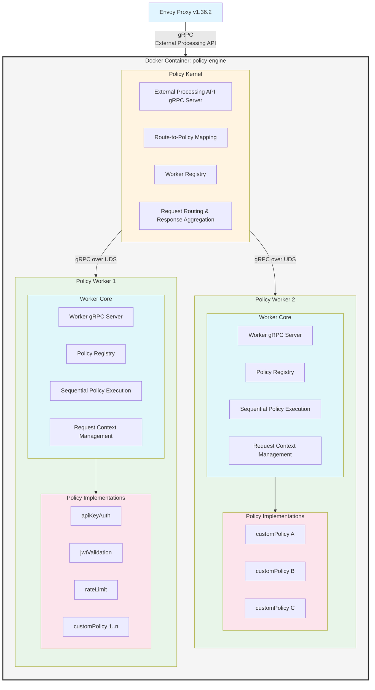
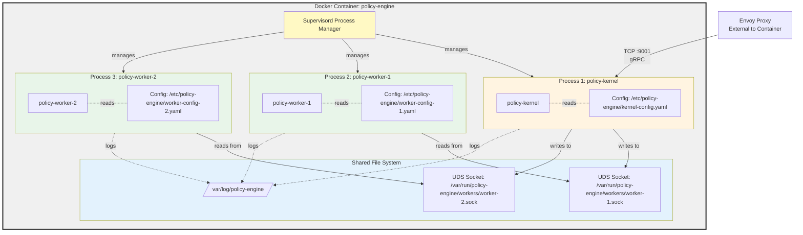
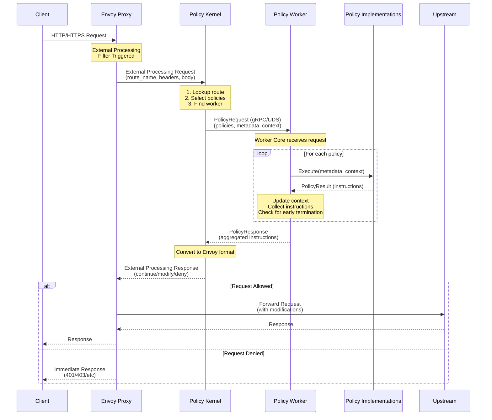
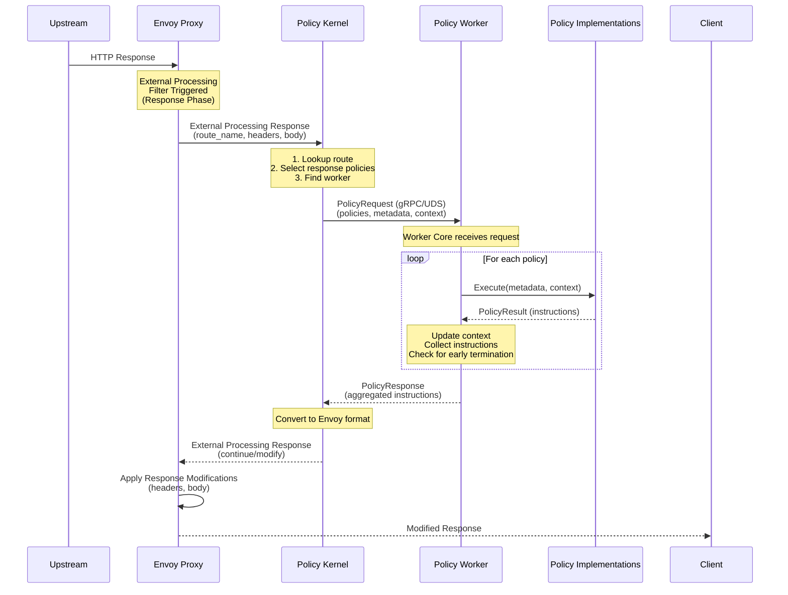

# Policy Engine Specification

## 1. Executive Summary

Policy Engine is an implementation of Envoy Proxy's External Processing Filter (v1.36.2) that provides extensible, route-based policy enforcement. The engine executes configurable policy chains to make routing decisions, apply authentication, authorization, rate limiting, and other cross-cutting concerns.

## 2. System Architecture

### 2.1 High-Level Architecture



### 2.2 Component Overview

The Policy Engine consists of one Policy Kernel and one or two Policy Workers running in a single Docker container:

| Component | Description | Technology | Location |
|-----------|-------------|------------|----------|
| **Policy Kernel** | Envoy integration layer, route mapping, worker orchestration | Go binary | `/usr/local/bin/policy-kernel` |
| **Policy Worker(s)** | Policy execution runtime with compiled-in policies (1-2 workers) | Go binary | `/usr/local/bin/policy-worker-1`, `/usr/local/bin/policy-worker-2` |

**Communication:**
- Envoy ↔ Policy Kernel: gRPC over TCP (port 9001)
- Policy Kernel ↔ Policy Worker(s): gRPC over Unix Domain Socket (UDS)

### 2.3 Deployment Model



**Key Points:**

- **Container**: Single Docker container with one Policy Kernel binary and one or two Policy Worker binaries
- **Process Architecture**:
  - One Policy Kernel process and one or two Policy Worker processes run as independent processes within the same container
  - Managed by supervisord for process supervision and restart
  - Each process has its own lifecycle and can be restarted independently
  - Default deployment includes one Policy Worker, with option for two workers for specialization
- **File System Layout**:
  - `/usr/local/bin/policy-kernel` - Policy Kernel binary
  - `/usr/local/bin/policy-worker-1`, `/usr/local/bin/policy-worker-2` - Policy Worker binaries (one or two)
  - `/var/run/policy-engine/workers/` - Directory for UDS sockets (one or two sockets)
  - `/etc/policy-engine/` - Configuration files directory
  - `/var/log/policy-engine/` - Log files directory

## 3. Request Flow (End-to-End)



### 3.2 Response Flow (End-to-End)



## 4. Component Specifications

Detailed specifications for each component:

- **[Policy Kernel](policy-kernel/SPEC.md)** - Envoy integration, route mapping, worker management
- **[Policy Worker](policy-worker/SPEC.md)** - Policy execution runtime
  - **[Worker Core](policy-worker/worker-core/SPEC.md)** - Execution engine and policy registry
  - **[Policies](policy-worker/policies/SPEC.md)** - Policy implementations and development guide

## 5. Security Considerations

### 5.1 Inter-Component Security

- **UDS Permissions**: Socket files must have 0600 permissions, owned by policy-engine user
- **Process Isolation**: Run components as non-root user
- **Resource Limits**: Enforce memory and CPU limits via cgroups
- **Input Validation**: Validate all inputs from Envoy and workers

### 5.2 Container Security

- Non-root user (UID 1000)
- Read-only root filesystem (except /var/run and /var/log)
- No privilege escalation
- Minimal base image (Alpine Linux)

## 6. Observability

### 6.1 Metrics (Prometheus format)

**Policy Kernel:**
- `policy_kernel_requests_total{route, worker, status}` - Counter
- `policy_kernel_request_duration_seconds{route, worker}` - Histogram
- `policy_kernel_worker_health{worker}` - Gauge (0=unhealthy, 1=healthy)

**Policy Worker:**
- `policy_worker_executions_total{policy, status}` - Counter
- `policy_worker_execution_duration_seconds{policy}` - Histogram
- `policy_worker_policy_failures_total{policy, reason}` - Counter

### 6.2 Logging

**Structured JSON logs with fields:**
- `timestamp` (ISO8601)
- `level` (debug, info, warn, error)
- `component` (kernel, worker)
- `request_id` (for correlation)
- `message`
- `metadata` (context-specific fields)

### 6.3 Tracing

- OpenTelemetry support
- Spans for: External processing request, Worker call, Individual policy execution

## 7. Performance Requirements

| Metric | Target |
|--------|--------|
| P99 Latency | < 100ms (including policy execution) |
| Throughput | 10,000 requests/second per instance |
| Memory | < 1GB under load |
| CPU | 2 cores minimum |

## 8. Build and Deployment

### 8.1 Build Process

```bash
# Build Policy Kernel
cd policy-kernel
go build -o policy-kernel .

# Build Policy Worker (includes all policy implementations)
cd ../policy-worker
go build -o policy-worker .

# Build container image
docker build -t policy-engine:latest .
```

### 8.2 Container Image

See [deployment specification](policy-kernel/SPEC.md#deployment) for Dockerfile and supervisord configuration.

### 8.3 Health Checks

**Liveness Probe:**
- HTTP GET `/health/live` on metrics port (9090)
- Returns 200 if processes are running

**Readiness Probe:**
- HTTP GET `/health/ready` on metrics port (9090)
- Returns 200 if all configured workers are reachable and configuration is valid

## 9. Testing Strategy

### 9.1 Unit Tests

- Policy Kernel route selection logic
- Worker Core policy execution flow
- Individual policy implementations
- Context update logic
- Error handling paths

### 9.2 Integration Tests

- Kernel ↔ Worker communication over UDS
- Policy chain execution with context updates
- Timeout and retry behavior
- Configuration reload

### 9.3 E2E Tests

- Full Envoy → Kernel → Worker → Policies flow
- Multiple routes with different policy chains
- Failure scenarios (worker down, policy error)
- Performance under load

### 9.4 Performance Tests

- Benchmark policy execution latency
- Load test with 10K req/s
- Memory leak detection
- Resource limit validation

## 10. Future Enhancements

### 10.1 Potential Features

- **Policy Composition**: Allow policies to call other policies
- **Conditional Execution**: Skip policies based on conditions
- **Policy Caching**: Cache policy results based on request attributes

### 10.2 Scalability

- **Horizontal Scaling**: Multiple Policy Kernel instances
- **Extended Worker Support**: Support more than 2 policy-worker processes per container
- **Worker Specialization**: Different policy-worker binaries with different policy sets (currently supports up to 2)
- **Distributed Caching**: Shared cache across multiple containers

## 11. Glossary

- **Policy Kernel**: The main orchestrator component that interfaces with Envoy
- **Policy Worker**: The policy execution runtime containing worker core + policies
- **Worker Core**: The gRPC server and execution engine within a Policy Worker
- **Policy**: Individual enforcement logic module (e.g., authentication, rate limiting)
- **Route Name**: Identifier sent by Envoy to select policy chain
- **Instruction**: Action to be taken (modify headers, deny request, etc.)
- **Request Context**: Mutable state passed through policy chain
- **UDS**: Unix Domain Socket for inter-process communication
- **External Processing Filter**: Envoy extension point for custom request processing

---

## Document Revision History

| Version | Date | Author | Changes |
|---------|------|--------|---------|
| 1.0 | 2025-11-02 | System | Split from v2.0 monolithic specification into component-based specs |
