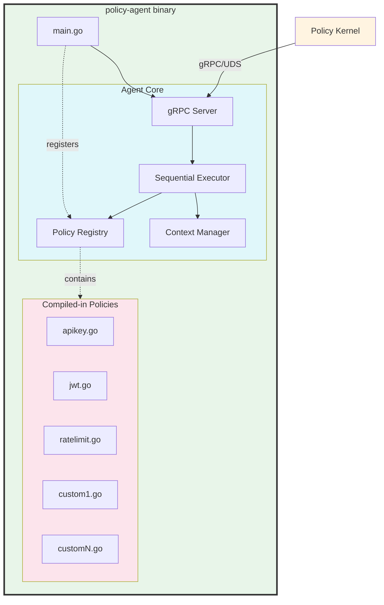

# Policy Agent Specification

## 1. Overview

The Policy Agent is a single binary (`policy-agent`) that contains:
- **Agent Core**: The gRPC server and execution engine
- **Policy Implementations**: Compiled-in policy modules (apiKeyAuth, jwtValidation, rateLimit, etc.)

The agent receives policy execution requests from the Policy Kernel, executes policies sequentially, maintains request context, and returns aggregated instructions.

## 2. Binary Architecture



## 3. Key Architectural Points

### 3.1 Single Binary Compilation

**All policy implementations are compiled directly into the `policy-agent` binary:**
- Policies are not loaded dynamically or via plugins
- Each policy is a Go package/module imported at compile time
- The agent core imports all policy packages and registers them in the policy registry at startup

### 3.2 Policy Registration

On startup, the agent binary:

```go
// Example: Agent initialization
func main() {
    config := loadConfig()
    agent := NewAgent(config)

    // Register all compiled-in policies
    agent.RegisterPolicy(apikey.NewAPIKeyPolicy())
    agent.RegisterPolicy(jwt.NewJWTPolicy())
    agent.RegisterPolicy(ratelimit.NewRateLimitPolicy())
    // ... other policies

    agent.Start()
}
```

### 3.3 Deployment Model

- To add/update/remove policies: Modify code → Rebuild binary → Redeploy container
- No runtime plugin loading or dynamic policy addition
- This provides better performance, simpler deployment, and easier debugging

### 3.4 Trade-offs

**Pros:**
- ✅ Better performance (no plugin overhead)
- ✅ Simpler architecture
- ✅ Compile-time type safety
- ✅ Easier to test and debug
- ✅ Predictable binary size and dependencies

**Cons:**
- ❌ Requires rebuild/redeploy for policy changes
- ❌ Cannot add policies at runtime
- ❌ All policies loaded in memory (even if unused)

**Future Enhancement:** Plugin-based architecture for dynamic loading (see root SPEC.md Future Enhancements)

## 4. Configuration

### 4.1 Configuration Schema

```yaml
agent_core:
  name: "default-agent"
  socket_path: "/var/run/policy-engine/agents/default.sock"

  server:
    max_concurrent_requests: 1000
    request_timeout_ms: 5000

  policies:
    fail_on_unknown: false

  observability:
    log_level: "info"
    metrics_enabled: true

  resource_limits:
    max_body_size_bytes: 1048576  # 1MB
    max_state_size_bytes: 65536   # 64KB
```

### 4.2 Configuration Details

| Parameter | Description | Default |
|-----------|-------------|---------|
| `name` | Agent name for identification | `default-agent` |
| `socket_path` | UDS path for communication with kernel | `/var/run/policy-engine/agents/default.sock` |
| `max_concurrent_requests` | Maximum concurrent policy executions | `1000` |
| `request_timeout_ms` | Hard timeout for policy execution | `5000` |
| `fail_on_unknown` | Fail if unknown policy requested | `false` |
| `max_body_size_bytes` | Maximum request/response body size | `1048576` (1MB) |
| `max_state_size_bytes` | Maximum context state size | `65536` (64KB) |


## 6. Component Specifications

The Policy Agent consists of two main parts:

- **[Agent Core](agent-core/SPEC.md)** - Execution engine, policy registry, context management
- **[Policies](policies/SPEC.md)** - Policy implementations and development guide

## 7. Observability

### 7.1 Metrics

```go
var (
    executionsTotal = prometheus.NewCounterVec(
        prometheus.CounterOpts{
            Name: "policy_agent_executions_total",
            Help: "Total number of policy executions",
        },
        []string{"policy", "status"},
    )

    executionDuration = prometheus.NewHistogramVec(
        prometheus.HistogramOpts{
            Name: "policy_agent_execution_duration_seconds",
            Help: "Policy execution duration",
            Buckets: []float64{.001, .005, .010, .025, .050, .100, .250, .500},
        },
        []string{"policy"},
    )

    policyFailures = prometheus.NewCounterVec(
        prometheus.CounterOpts{
            Name: "policy_agent_policy_failures_total",
            Help: "Total number of policy failures",
        },
        []string{"policy", "reason"},
    )

    contextSize = prometheus.NewHistogramVec(
        prometheus.HistogramOpts{
            Name: "policy_agent_context_size_bytes",
            Help: "Size of request context",
            Buckets: []float64{100, 500, 1000, 5000, 10000, 50000, 100000},
        },
        []string{"type"}, // headers, body, state
    )
)
```

### 7.2 Logging

**Structured JSON logs:**
```json
{
  "timestamp": "2025-11-02T10:15:30Z",
  "level": "info",
  "component": "agent",
  "request_id": "req-12345",
  "policy": "apiKeyAuth",
  "message": "Policy executed successfully",
  "duration_ms": 12,
  "metadata": {
    "auth_method": "api_key",
    "instructions_count": 1
  }
}
```

### 7.3 Tracing

OpenTelemetry spans:
- `agent.process_request` (root span)
  - `agent.policy.{policy_name}` (per policy)
  - `agent.context_update`

## 8. Deployment

### 8.1 Container Configuration

**Supervisord configuration for agent:**
```ini
[program:policy-agent]
command=/usr/local/bin/policy-agent --config=/etc/policy-engine/agent-config.yaml
autostart=true
autorestart=true
startretries=3
stdout_logfile=/var/log/policy-engine/agent.log
stderr_logfile=/var/log/policy-engine/agent-error.log
priority=2
```

### 8.2 Build Process

```bash
# Build Policy Agent (includes all policy implementations)
cd policy-agent

# All policies are imported in main.go or a registration file
# Example structure:
# policy-agent/
#   cmd/agent/main.go          # Entry point, registers all policies
#   internal/core/             # Agent core implementation
#   internal/policies/
#     apikey/apikey.go
#     jwt/jwt.go
#     ratelimit/ratelimit.go
#     custom1/custom1.go

go build -o policy-agent ./cmd/agent
```

### 8.3 Binary Structure

```
policy-agent/
├── cmd/
│   └── agent/
│       └── main.go                  # Entry point, policy registration
├── internal/
│   ├── core/                        # Agent core implementation
│   │   ├── server.go               # gRPC server
│   │   ├── registry.go             # Policy registry
│   │   ├── executor.go             # Sequential executor
│   │   └── context.go              # Context manager
│   └── policies/                    # Policy implementations
│       ├── interface.go             # Policy interface definition
│       ├── apikey/
│       │   └── apikey.go
│       ├── jwt/
│       │   └── jwt.go
│       ├── ratelimit/
│       │   └── ratelimit.go
│       └── custom/
│           └── custom.go
├── proto/                           # gRPC protocol definitions
├── go.mod
└── go.sum
```

## 9. Security Considerations

### 9.1 Resource Limits

- **Body Size Limit**: Enforce maximum request/response body size (configurable)
- **State Size Limit**: Limit context state size to prevent memory exhaustion
- **Timeout Enforcement**: Hard timeout on all policy execution
- **Memory Isolation**: Each request processed independently (no shared mutable state)

### 9.2 Policy Security

- **Metadata Validation**: Validate policy metadata against JSON schema before execution
- **Secret Management**: Policies must not log sensitive data (API keys, tokens)
- **Injection Prevention**: Sanitize all inputs used in downstream calls
- **Error Handling**: Don't leak sensitive information in error messages

## 10. Performance Requirements

| Metric | Target |
|--------|--------|
| Policy Execution Latency | P99 < 50ms per policy |
| Throughput | 10,000 executions/second |
| Memory | < 512MB under load |
| Context Update Overhead | < 1ms per instruction |

## 11. Testing

### 11.1 Unit Tests

- Policy registry operations
- Context update logic
- Instruction aggregation
- Error handling
- Resource limit enforcement

### 11.2 Integration Tests

- gRPC server operation
- Sequential policy execution
- Timeout handling
- Configuration loading
- Metrics collection

### 11.3 Policy Tests

- Individual policy implementations
- Metadata schema validation
- Error scenarios
- Performance benchmarks

---

## Document Revision History

| Version | Date | Author | Changes |
|---------|------|--------|---------|
| 1.0 | 2025-11-02 | System | Extracted from v2.0 monolithic specification |
