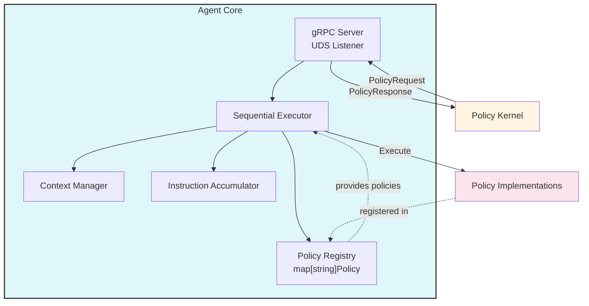
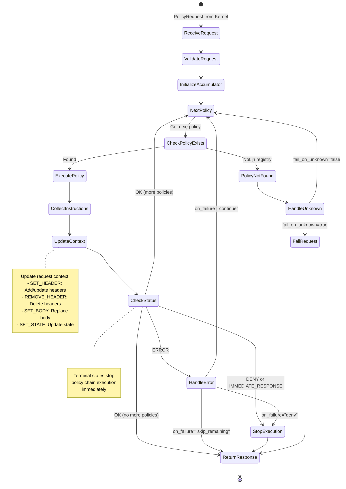

# Agent Core Specification

## 1. Overview

The Agent Core is the execution engine within the Policy Agent. It provides the gRPC server, policy registry, sequential execution engine, and request context management.

## 2. Responsibilities

1. **gRPC Server**: Accepts policy execution requests from Policy Kernel via UDS
2. **Policy Registry**: Maintains map of policy name → implementation (in-memory registry)
3. **Sequential Execution**: Executes policies in order, maintaining request context
4. **Context Management**: Updates request context based on policy instructions
5. **Instruction Collection**: Aggregates instructions from all policies
6. **Early Termination**: Stops execution if policy returns DENY or IMMEDIATE_RESPONSE

## 3. Architecture



## 4. Policy Interface

### 4.1 Go Interface Definition

```go
type Policy interface {
    // Name returns the unique identifier for this policy
    Name() string

    // Version returns the policy version (semver)
    Version() string

    // Description returns a human-readable description
    Description() string

    // SupportedPhases returns which phases this policy supports
    SupportedPhases() []PolicyPhase

    // MetadataSchema returns JSON schema for validating metadata
    MetadataSchema() string

    // Execute runs the policy logic
    // Returns instructions and error
    Execute(ctx context.Context, metadata map[string]string, reqCtx *RequestContext) (*PolicyResult, error)

    // Initialize is called once when policy is registered
    Initialize(config map[string]interface{}) error

    // HealthCheck returns the health status of the policy
    HealthCheck() error
}

type PolicyPhase int

const (
    REQUEST PolicyPhase = iota
    RESPONSE
)

type PolicyResult struct {
    Instructions []*Instruction
    Status       StatusCode
    Message      string
    Metadata     map[string]string
}

type StatusCode int

const (
    OK StatusCode = iota
    POLICY_DENIED
    POLICY_ERROR
    TIMEOUT
)
```

### 4.2 Request Context

```go
type RequestContext struct {
    // Immutable request properties
    Headers      map[string]string
    Body         []byte
    Method       string
    Path         string
    Scheme       string
    Authority    string
    QueryParams  map[string]string
    ClientIP     string

    // Mutable state for policy chain
    State        map[string]interface{}

    // Internal tracking
    phase        PolicyPhase
    modifications []Modification
}
```

### 4.3 Instruction Types

```go
type Instruction struct {
    Type    InstructionType
    Payload interface{}
}

type InstructionType int

const (
    SET_HEADER InstructionType = iota
    REMOVE_HEADER
    SET_BODY
    IMMEDIATE_RESPONSE
    CONTINUE
    SET_STATE
)

type HeaderInstruction struct {
    Key   string
    Value string
}

type BodyInstruction struct {
    Body []byte
}

type ImmediateResponse struct {
    StatusCode int
    Headers    map[string]string
    Body       string
}

type StateInstruction struct {
    Key   string
    Value interface{}
}
```

## 5. Sequential Execution Flow

### 5.1 Execution State Machine



### 5.2 Execution Algorithm

```go
func (e *Executor) Execute(req *PolicyRequest) (*PolicyResponse, error) {
    ctx := req.Context.Clone()
    accumulator := NewInstructionAccumulator()

    for _, policy := range req.Policies {
        // 1. Lookup policy
        impl, exists := e.registry.Get(policy.Name)
        if !exists {
            if e.config.FailOnUnknown {
                return e.buildErrorResponse(req.RequestID, "unknown policy: "+policy.Name)
            }
            e.logger.Warn("Unknown policy, skipping", "policy", policy.Name)
            continue
        }

        // 2. Execute policy
        result, err := e.executePolicy(ctx, impl, policy.Metadata)

        // 3. Collect instructions
        accumulator.Add(result.Instructions...)

        // 4. Update context
        e.contextMgr.ApplyInstructions(ctx, result.Instructions)

        // 5. Check for early termination
        if result.Status == POLICY_DENIED || e.hasImmediateResponse(result) {
            e.logger.Info("Policy chain terminated early", "policy", policy.Name, "status", result.Status)
            return accumulator.Build(req.RequestID, result.Status, result.Message)
        }

        // 6. Handle errors
        if err != nil || result.Status == POLICY_ERROR {
            switch policy.OnFailure {
            case "deny":
                return accumulator.Build(req.RequestID, POLICY_DENIED, "Policy error: "+err.Error())
            case "continue":
                e.logger.Warn("Policy failed, continuing", "policy", policy.Name, "error", err)
                continue
            case "skip_remaining":
                e.logger.Info("Policy failed, skipping remaining", "policy", policy.Name, "error", err)
                return accumulator.Build(req.RequestID, OK, "Policy chain completed with errors")
            }
        }
    }

    // All policies executed successfully
    return accumulator.Build(req.RequestID, OK, "Policy chain completed")
}
```

### 5.3 Policy Execution with Timeout

```go
func (e *Executor) executePolicy(ctx *RequestContext, policy Policy, metadata map[string]string) (*PolicyResult, error) {
    // Create timeout context
    execCtx, cancel := context.WithTimeout(context.Background(), e.config.PolicyTimeout)
    defer cancel()

    // Execute policy in goroutine
    resultChan := make(chan *PolicyResult, 1)
    errChan := make(chan error, 1)

    go func() {
        result, err := policy.Execute(execCtx, metadata, ctx)
        if err != nil {
            errChan <- err
            return
        }
        resultChan <- result
    }()

    // Wait for result or timeout
    select {
    case result := <-resultChan:
        return result, nil
    case err := <-errChan:
        return nil, err
    case <-execCtx.Done():
        return &PolicyResult{
            Status:  TIMEOUT,
            Message: "Policy execution timeout",
        }, context.DeadlineExceeded
    }
}
```

## 6. Context Management

### 6.1 Context Update Rules

| Instruction Type | Context Update | Validation |
|-----------------|----------------|------------|
| SET_HEADER | Add/update `context.Headers[key] = value` | Key non-empty |
| REMOVE_HEADER | Delete `context.Headers[key]` | Key exists (warn if not) |
| SET_BODY | Replace `context.Body = body` | Size < max_body_size |
| SET_STATE | Update `context.State[key] = value` | Total state size < max_state_size |
| IMMEDIATE_RESPONSE | No context update (terminal) | N/A |
| CONTINUE | No context update | N/A |

### 6.2 Context Update Implementation

```go
type ContextManager struct {
    config *Config
    logger *Logger
}

func (cm *ContextManager) ApplyInstructions(ctx *RequestContext, instructions []*Instruction) error {
    for _, inst := range instructions {
        switch inst.Type {
        case SET_HEADER:
            header := inst.Payload.(*HeaderInstruction)
            if header.Key == "" {
                return fmt.Errorf("invalid SET_HEADER: empty key")
            }
            ctx.Headers[header.Key] = header.Value
            ctx.modifications = append(ctx.modifications, Modification{
                Type:  "SET_HEADER",
                Key:   header.Key,
                Value: header.Value,
            })

        case REMOVE_HEADER:
            header := inst.Payload.(*HeaderInstruction)
            if _, exists := ctx.Headers[header.Key]; !exists {
                cm.logger.Warn("Removing non-existent header", "key", header.Key)
            }
            delete(ctx.Headers, header.Key)
            ctx.modifications = append(ctx.modifications, Modification{
                Type: "REMOVE_HEADER",
                Key:  header.Key,
            })

        case SET_BODY:
            body := inst.Payload.(*BodyInstruction)
            if len(body.Body) > cm.config.MaxBodySize {
                return fmt.Errorf("body size exceeds limit: %d > %d", len(body.Body), cm.config.MaxBodySize)
            }
            ctx.Body = body.Body
            ctx.modifications = append(ctx.modifications, Modification{
                Type: "SET_BODY",
                Size: len(body.Body),
            })

        case SET_STATE:
            state := inst.Payload.(*StateInstruction)
            ctx.State[state.Key] = state.Value

            // Check total state size
            totalSize := cm.calculateStateSize(ctx.State)
            if totalSize > cm.config.MaxStateSize {
                delete(ctx.State, state.Key) // Rollback
                return fmt.Errorf("state size exceeds limit: %d > %d", totalSize, cm.config.MaxStateSize)
            }

        case IMMEDIATE_RESPONSE, CONTINUE:
            // Terminal instructions - no context update
            continue
        }
    }
    return nil
}
```

## 7. Policy Registry

### 7.1 Registry Structure

```go
type PolicyRegistry struct {
    policies map[string]Policy
    mu       sync.RWMutex
}

func NewPolicyRegistry() *PolicyRegistry {
    return &PolicyRegistry{
        policies: make(map[string]Policy),
    }
}

func (r *PolicyRegistry) Register(policy Policy) error {
    r.mu.Lock()
    defer r.mu.Unlock()

    if _, exists := r.policies[policy.Name()]; exists {
        return fmt.Errorf("policy already registered: %s", policy.Name())
    }

    r.policies[policy.Name()] = policy
    return nil
}

func (r *PolicyRegistry) Get(name string) (Policy, bool) {
    r.mu.RLock()
    defer r.mu.RUnlock()

    policy, exists := r.policies[name]
    return policy, exists
}

func (r *PolicyRegistry) List() []PolicyInfo {
    r.mu.RLock()
    defer r.mu.RUnlock()

    infos := make([]PolicyInfo, 0, len(r.policies))
    for _, policy := range r.policies {
        infos = append(infos, PolicyInfo{
            Name:             policy.Name(),
            Version:          policy.Version(),
            Description:      policy.Description(),
            MetadataSchema:   policy.MetadataSchema(),
            SupportedPhases:  policy.SupportedPhases(),
        })
    }
    return infos
}
```

### 7.2 Policy Registration at Startup

```go
// In cmd/agent/main.go
func main() {
    // Load configuration
    config := loadConfig()

    // Create agent core
    core := agentcore.New(config)

    // Register all compiled-in policies
    core.RegisterPolicy(apikey.NewAPIKeyPolicy())
    core.RegisterPolicy(jwt.NewJWTPolicy())
    core.RegisterPolicy(ratelimit.NewRateLimitPolicy())
    core.RegisterPolicy(custom.NewCustomPolicy())

    // Start gRPC server
    core.Start()
}
```

## 8. Instruction Accumulator

### 8.1 Accumulator Implementation

```go
type InstructionAccumulator struct {
    instructions []*Instruction
    metadata     map[string]string
}

func NewInstructionAccumulator() *InstructionAccumulator {
    return &InstructionAccumulator{
        instructions: make([]*Instruction, 0),
        metadata:     make(map[string]string),
    }
}

func (a *InstructionAccumulator) Add(instructions ...*Instruction) {
    a.instructions = append(a.instructions, instructions...)
}

func (a *InstructionAccumulator) AddMetadata(key, value string) {
    a.metadata[key] = value
}

func (a *InstructionAccumulator) Build(requestID string, status StatusCode, message string) *PolicyResponse {
    return &PolicyResponse{
        RequestID:    requestID,
        Instructions: a.instructions,
        Status: &ResponseStatus{
            Code:    status,
            Message: message,
        },
        Metadata: a.metadata,
    }
}
```

## 9. gRPC Server

### 9.1 Service Implementation

```go
type AgentServer struct {
    executor  *Executor
    registry  *PolicyRegistry
    config    *Config
    logger    *Logger
}

func (s *AgentServer) GetAgentConfig(ctx context.Context, req *GetAgentConfigRequest) (*GetAgentConfigResponse, error) {
    policies := s.registry.List()

    return &GetAgentConfigResponse{
        AgentName:         s.config.Name,
        AgentVersion:      s.config.Version,
        SupportedPolicies: policies,
        AgentMetadata: map[string]string{
            "max_body_size":  fmt.Sprintf("%d", s.config.MaxBodySize),
            "max_state_size": fmt.Sprintf("%d", s.config.MaxStateSize),
        },
    }, nil
}

func (s *AgentServer) ExecutePolicies(ctx context.Context, req *PolicyRequest) (*PolicyResponse, error) {
    // Validate request
    if err := s.validateRequest(req); err != nil {
        return nil, status.Errorf(codes.InvalidArgument, "invalid request: %v", err)
    }

    // Execute policy chain
    resp, err := s.executor.Execute(req)
    if err != nil {
        s.logger.Error("Policy execution failed", "request_id", req.RequestID, "error", err)
        return nil, status.Errorf(codes.Internal, "execution failed: %v", err)
    }

    return resp, nil
}

func (s *AgentServer) HealthCheck(ctx context.Context, req *HealthCheckRequest) (*HealthCheckResponse, error) {
    // Check all registered policies
    for _, policy := range s.registry.List() {
        impl, _ := s.registry.Get(policy.Name)
        if err := impl.HealthCheck(); err != nil {
            return &HealthCheckResponse{
                Status: UNHEALTHY,
                Message: fmt.Sprintf("Policy %s unhealthy: %v", policy.Name, err),
            }, nil
        }
    }

    return &HealthCheckResponse{
        Status:  HEALTHY,
        Message: "All policies healthy",
    }, nil
}
```

### 9.2 Server Startup

```go
func (s *AgentServer) Start() error {
    // Remove existing socket file if exists
    if err := os.Remove(s.config.SocketPath); err != nil && !os.IsNotExist(err) {
        return fmt.Errorf("failed to remove socket: %w", err)
    }

    // Create UDS listener
    listener, err := net.Listen("unix", s.config.SocketPath)
    if err != nil {
        return fmt.Errorf("failed to listen on socket: %w", err)
    }

    // Set socket permissions
    if err := os.Chmod(s.config.SocketPath, 0600); err != nil {
        return fmt.Errorf("failed to set socket permissions: %w", err)
    }

    // Create gRPC server
    grpcServer := grpc.NewServer(
        grpc.MaxConcurrentStreams(uint32(s.config.MaxConcurrentRequests)),
    )

    // Register service
    pb.RegisterPolicyAgentServer(grpcServer, s)

    // Start serving
    s.logger.Info("Agent server starting", "socket", s.config.SocketPath)
    return grpcServer.Serve(listener)
}
```

## 10. Error Handling

### 10.1 Error Types

| Error Type | Handling | Response |
|------------|----------|----------|
| Unknown policy | Based on `fail_on_unknown` config | Skip or DENY |
| Policy timeout | Based on `on_failure` setting | DENY, CONTINUE, or SKIP_REMAINING |
| Policy panic | Recover and log | POLICY_ERROR |
| Context update error | Stop execution | POLICY_ERROR |
| Resource limit exceeded | Reject instruction | POLICY_ERROR |
| Invalid metadata | Before execution | InvalidArgument gRPC error |

### 10.2 Panic Recovery

```go
func (e *Executor) executePolicy(ctx *RequestContext, policy Policy, metadata map[string]string) (result *PolicyResult, err error) {
    defer func() {
        if r := recover(); r != nil {
            e.logger.Error("Policy panic recovered",
                "policy", policy.Name(),
                "panic", r,
                "stack", string(debug.Stack()))

            result = &PolicyResult{
                Status:  POLICY_ERROR,
                Message: fmt.Sprintf("Policy panic: %v", r),
            }
            err = fmt.Errorf("policy panic: %v", r)
        }
    }()

    // Execute policy...
    return policy.Execute(ctx, metadata, ctx)
}
```

## 11. Performance Optimizations

### 11.1 Context Cloning

```go
func (ctx *RequestContext) Clone() *RequestContext {
    clone := &RequestContext{
        Headers:       make(map[string]string, len(ctx.Headers)),
        Body:          ctx.Body, // Shared read-only
        Method:        ctx.Method,
        Path:          ctx.Path,
        Scheme:        ctx.Scheme,
        Authority:     ctx.Authority,
        QueryParams:   make(map[string]string, len(ctx.QueryParams)),
        ClientIP:      ctx.ClientIP,
        State:         make(map[string]interface{}),
        phase:         ctx.phase,
        modifications: make([]Modification, 0),
    }

    // Copy maps
    for k, v := range ctx.Headers {
        clone.Headers[k] = v
    }
    for k, v := range ctx.QueryParams {
        clone.QueryParams[k] = v
    }

    return clone
}
```

### 11.2 Instruction Pooling

```go
var instructionPool = sync.Pool{
    New: func() interface{} {
        return &Instruction{}
    },
}

func GetInstruction() *Instruction {
    return instructionPool.Get().(*Instruction)
}

func PutInstruction(inst *Instruction) {
    inst.Type = 0
    inst.Payload = nil
    instructionPool.Put(inst)
}
```

---

## Document Revision History

| Version | Date | Author | Changes |
|---------|------|--------|---------|
| 1.0 | 2025-11-02 | System | Extracted from v2.0 monolithic specification |
