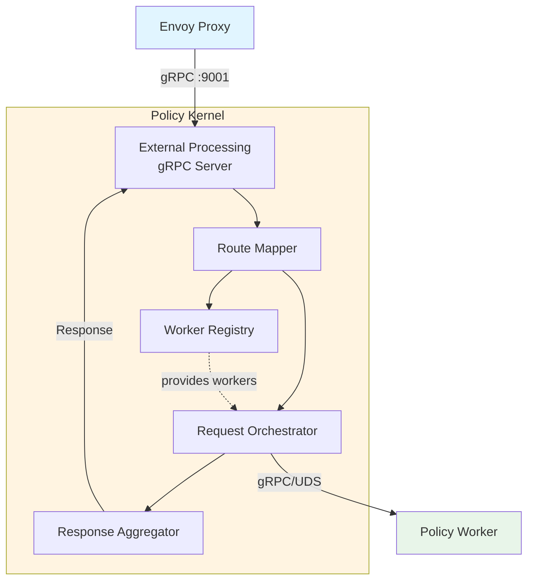
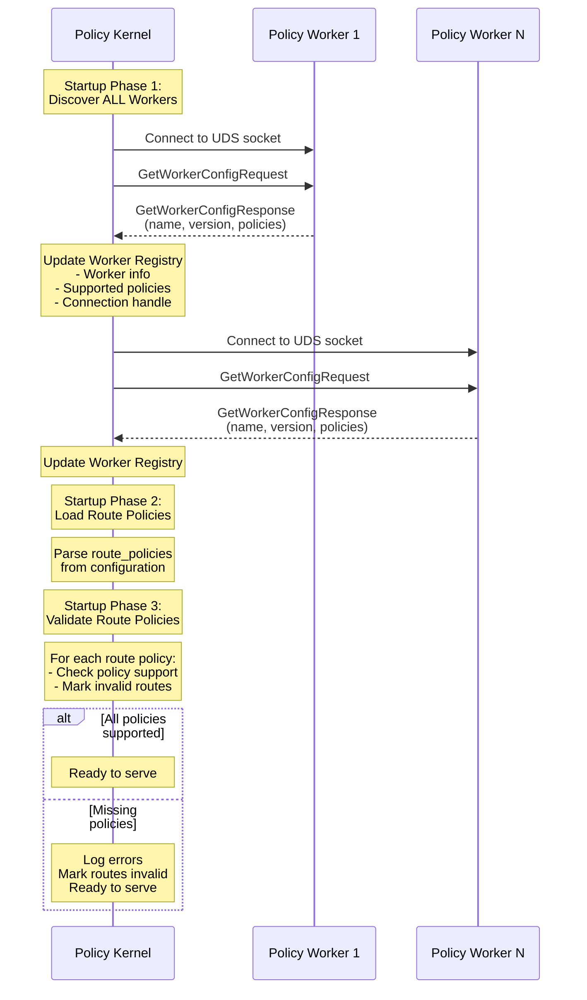
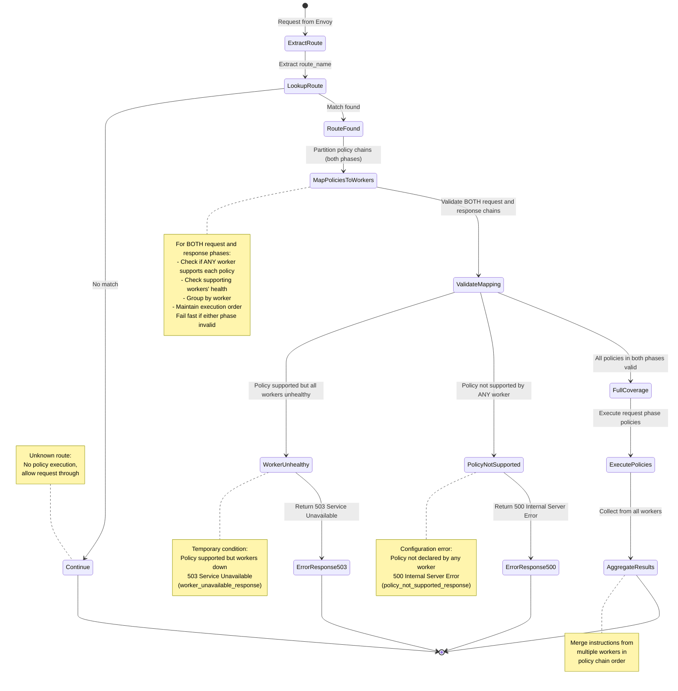
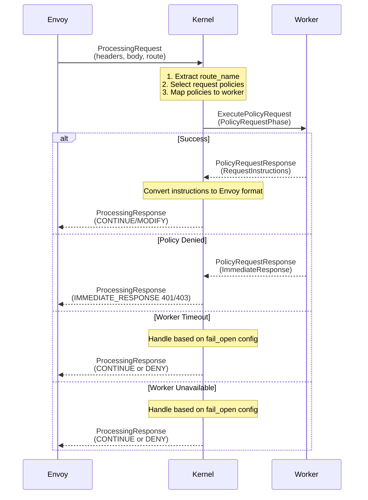
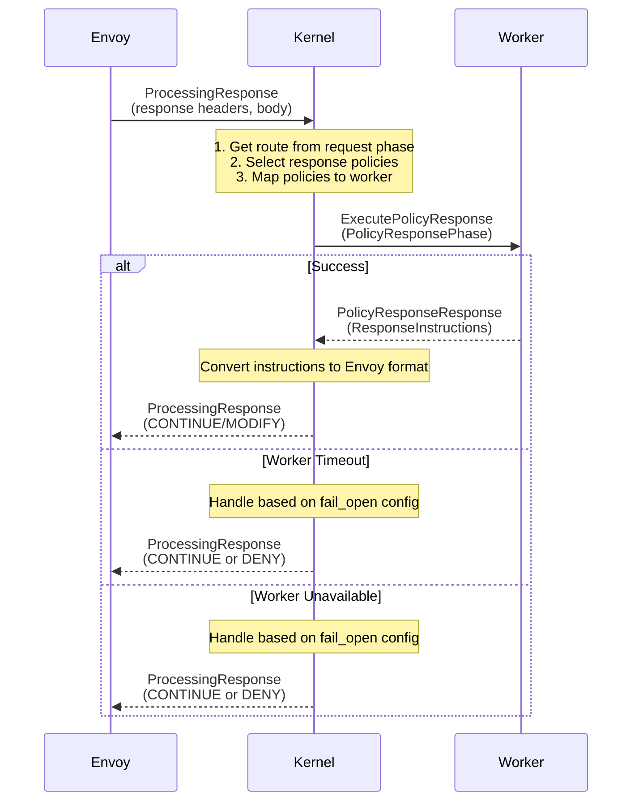
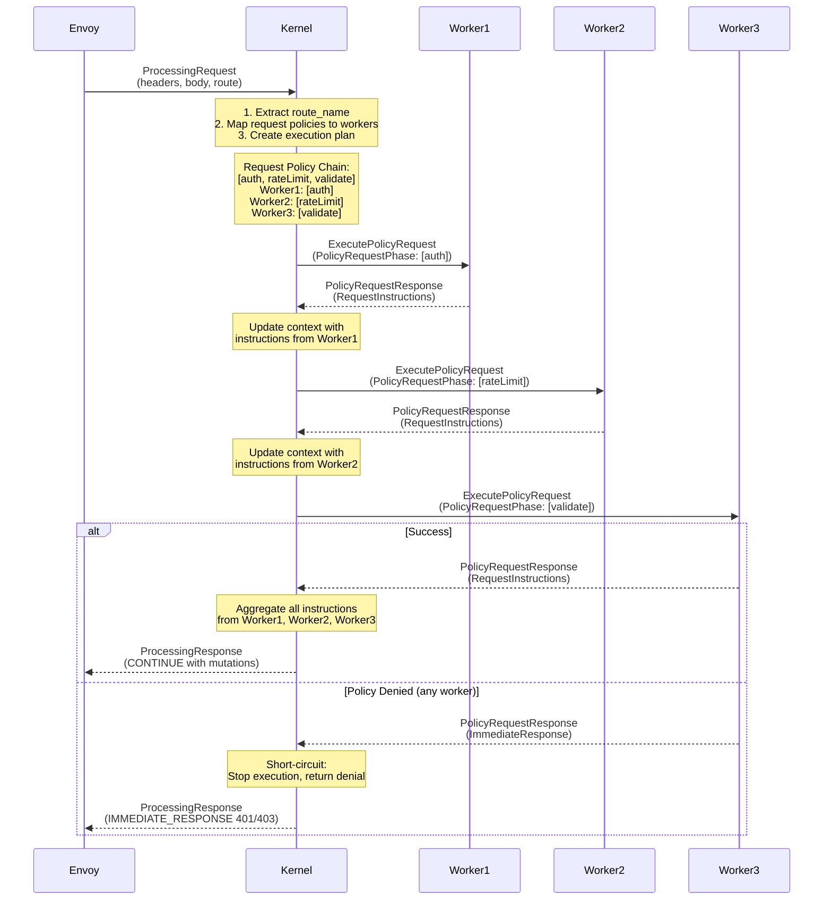
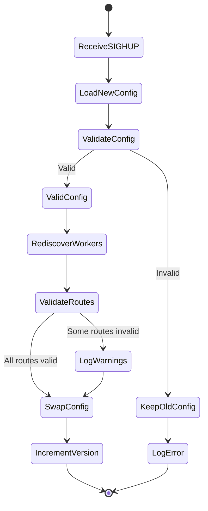

# Policy Kernel Specification

## 1. Overview

The Policy Kernel is the main orchestrator component that interfaces with Envoy Proxy through the External Processing Filter API. It manages route-based policy selection, worker registry, request routing, and response aggregation.

## 2. Responsibilities

1. **External Processing Server**: Implements Envoy's External Processing gRPC API
2. **Route-Based Policy Selection**: Maps route names to policy chains
3. **Worker Management**: Maintains registry of available Policy Workers and their health status
4. **Request Orchestration**: Routes requests to appropriate workers based on policy configuration
5. **Response Aggregation**: Collects instructions from workers and formats response for Envoy

## 3. Architecture



## 4. Configuration

### 4.1 Configuration Schema

```yaml
policy_kernel:
  server:
    address: "0.0.0.0"
    port: 9001
    max_concurrent_streams: 1000

  workers:
    - name: "default-worker"
      socket_path: "/var/run/policy-engine/workers/default.sock"
      timeout_ms: 500
      retry:
        max_attempts: 3
        backoff_ms: 100
      health_check_interval_ms: 5000

  route_policies:
    - route_name: "/api/v1/users"
      request_flow:
        processing_mode: "headers_only"  # Options: headers_only, buffered_body, streaming, auto
        policy_chain:
          - policy: "apiKeyAuth"
            params:
              header_name: "X-API-Key"
              required: true
          - policy: "rateLimit"
            params:
              requests_per_second: 100
              burst: 20
      response_flow:
        processing_mode: "headers_only"  # Options: headers_only, buffered_body, streaming, auto
        policy_chain:
          - policy: "addSecurityHeaders"
            params:
              headers: |
                X-Content-Type-Options: "nosniff"
                X-Frame-Options: "DENY"

    - route_name: "/api/v1/admin"
      request_flow:
        processing_mode: "buffered_body"  # Options: headers_only, buffered_body, streaming, auto
        policy_chain:
          - policy: "jwtValidation"
            params:
              issuer: "https://auth.example.com"
              audience: "api-service"
          - policy: "roleCheck"
            params:
              required_roles: ["admin"]
      response_flow:
        processing_mode: "buffered_body"  # Options: headers_only, buffered_body, streaming, auto
        policy_chain:
          - policy: "auditLog"
            params:
              log_response_body: true

  policy_not_supported_response:
    status_code: 500  # Internal Server Error (default)
    body: '{"error": "Policy configuration error", "code": "POLICY_NOT_SUPPORTED"}'
    headers:
      Content-Type: "application/json"
      X-Policy-Error: "configuration"

  worker_unavailable_response:
    status_code: 503  # Service Unavailable (default)
    body: '{"error": "Policy service temporarily unavailable", "code": "AGENT_UNAVAILABLE"}'
    headers:
      Content-Type: "application/json"
      X-Policy-Error: "temporary"
      Retry-After: "30"

  observability:
    metrics_port: 9090
    log_level: "info"
    tracing:
      enabled: true
      sampling_rate: 0.01
```

> **⚠️ Design Consideration - Dynamic Route Policy Configuration**
>
> Route policies are currently configured statically via YAML configuration file. However, in future versions, the Kernel will support **dynamic runtime configuration** of route policies through a management API, allowing policies to be added, modified, or removed without requiring a configuration reload or restart.
>
> **Important**: When designing and implementing any component in the Policy Kernel, always consider this future capability. Design decisions should account for:
> - Thread-safe concurrent access to route policy configuration
> - Atomic updates to policy mappings
> - Backward compatibility with static YAML configuration
> - Version management and rollback capabilities
> - Validation of dynamic policy updates against available workers

### 4.2 Request Processing Modes

The `processing_mode` field in `request_flow` controls how the Policy Kernel processes requests and executes policies in the request phase. This determines which Envoy External Processing messages are used to execute the policy chain.

**Processing Mode Options:**

1. **`headers_only`** - Execute all policies using request headers only
   - All policies in the chain are executed once during Envoy's `ProcessingRequest_RequestHeaders` phase
   - Request body is NOT sent to workers
   - Use for policies that only need header information (authentication, rate limiting, routing decisions)
   - Lowest latency option as body buffering is avoided
   - Policies execute: **Header processing function only**

2. **`buffered_body`** - Execute all policies with buffered request body
   - All policies in the chain are executed once during Envoy's `ProcessingRequest_RequestBody` phase
   - Complete request body is buffered and sent to workers
   - Use for policies that need to inspect or transform the entire request body (validation, content filtering, body transformation)
   - Higher latency due to complete body buffering
   - Policies execute: **Body processing function with complete body**

3. **`streaming`** - Execute policies with streaming body support
   - Policies are executed in the defined configuration order
   - Policies can implement two functions:
     1. **Header processing function** - called once during `ProcessingRequest_RequestHeaders`
     2. **Stream body processing function** - called for each chunk during `ProcessingRequest_RequestBody`
   - If a policy implements both functions:
     - First execution: During `ProcessingRequest_RequestHeaders` (header processing)
     - Subsequent executions: Once per streamed body chunk during `ProcessingRequest_RequestBody`
   - Use for policies that need to process large request bodies without buffering the entire content
   - Optimizes latency and memory usage for large payloads
   - Example: Virus scanning, content filtering, or streaming transformations

4. **`auto`** - Automatically determine the optimal processing mode **(default)**
   - Policy Kernel analyzes the policies in the chain and their capabilities
   - If all policies only implement header processing → uses `headers_only`
   - If any policy requires complete body → uses `buffered_body`
   - If policies support streaming → uses `streaming`
   - Default behavior when `processing_mode` is not specified
   - Recommended for most use cases

**Policy Execution Flow by Mode:**

```
headers_only mode:
  ProcessingRequest_RequestHeaders:
    → policy1.ProcessHeaders()
    → policy2.ProcessHeaders()
    → policy3.ProcessHeaders()

buffered_body mode:
  ProcessingRequest_RequestBody:
    → policy1.ProcessBody(completeBody)
    → policy2.ProcessBody(completeBody)
    → policy3.ProcessBody(completeBody)

streaming mode (policy2 implements both interfaces):
  ProcessingRequest_RequestHeaders:
    → policy1.ProcessHeaders()
    → policy2.ProcessHeaders()  ← First execution
    → policy3.ProcessHeaders()

  ProcessingRequest_RequestBody (chunk 1):
    → policy1.ProcessStreamChunk(chunk1)
    → policy2.ProcessStreamChunk(chunk1)  ← Second execution
    → policy3.ProcessStreamChunk(chunk1)

  ProcessingRequest_RequestBody (chunk 2):
    → policy1.ProcessStreamChunk(chunk2)
    → policy2.ProcessStreamChunk(chunk2)  ← Third execution
    → policy3.ProcessStreamChunk(chunk2)

  ProcessingRequest_RequestBody (chunk N):
    → policy1.ProcessStreamChunk(chunkN)
    → policy2.ProcessStreamChunk(chunkN)  ← N+1 execution
    → policy3.ProcessStreamChunk(chunkN)
```

**Processing Mode Selection Guidelines:**

| Policy Type | Recommended Mode | Rationale |
|-------------|------------------|-----------|
| Authentication (API key, JWT) | `headers_only` | Credentials typically in headers |
| Rate limiting | `headers_only` | Based on client ID/IP in headers |
| Request routing/rewriting | `headers_only` | Path/header based decisions |
| Small request body validation | `buffered_body` | Needs complete body content |
| Content transformation | `buffered_body` | Modifies entire request body |
| Large file upload validation | `streaming` | Process chunks without buffering |
| Virus scanning | `streaming` | Scan content as it streams |

**Response Flow Processing Modes:**

The same processing modes (`headers_only`, `buffered_body`, `streaming`, `auto`) apply to `response_flow` for handling response data from upstream services.

**Response Processing Mode Use Cases:**

1. **`headers_only`** - Response header manipulation only
   - Add security headers (CORS, CSP, X-Frame-Options)
   - Response header-based routing decisions
   - Logging/metrics based on response headers
   - Lowest latency as body is not processed

2. **`buffered_body`** - Complete response body processing
   - Response body transformation (format conversion, encryption)
   - Response validation against schemas
   - Content filtering on complete responses
   - Suitable for small to medium response payloads

3. **`streaming`** - Real-time response chunk processing
   - **Server-Sent Events (SSE)**: Streaming responses from AI APIs, real-time data feeds
   - **Streaming guardrails**: Content moderation, PII filtering on AI-generated content
   - **Large file downloads**: Virus scanning, content transformation without buffering
   - Policies execute once during `ProcessingResponse_ResponseHeaders`, then once per body chunk
   - Optimal for latency-sensitive streaming applications

4. **`auto`** (default) - Kernel determines optimal mode based on policy capabilities

**Example Configurations:**

```yaml
# Headers-only mode for authentication and rate limiting
- route_name: "/api/v1/users"
  request_flow:
    processing_mode: "headers_only"  # Default is "auto"
    policy_chain:
      - policy: "apiKeyAuth"
      - policy: "rateLimit"

# Buffered body mode for request validation
- route_name: "/api/v1/data"
  request_flow:
    processing_mode: "buffered_body"
    policy_chain:
      - policy: "jsonSchemaValidation"
      - policy: "contentFilter"

# Streaming mode for large file uploads
- route_name: "/api/v1/upload"
  request_flow:
    processing_mode: "streaming"
    policy_chain:
      - policy: "jwtAuth"           # Executes once in headers phase
      - policy: "virusScan"         # Executes once in headers phase, then once per body chunk
      - policy: "fileSizeLimit"     # Executes once per body chunk

# Auto mode (default) - let the kernel decide
- route_name: "/api/v1/endpoint"
  request_flow:
    # processing_mode defaults to "auto" if not specified
    policy_chain:
      - policy: "authentication"
      - policy: "validation"

# Streaming mode for AI API with SSE response guardrails
- route_name: "/api/v1/ai/chat"
  request_flow:
    processing_mode: "buffered_body"
    policy_chain:
      - policy: "apiKeyAuth"
      - policy: "requestValidation"
  response_flow:
    processing_mode: "streaming"  # Stream response chunks for real-time processing
    policy_chain:
      - policy: "contentModerationGuardrail"  # Filter inappropriate content in real-time
      - policy: "piiRedaction"                # Redact PII from streamed response
      - policy: "usageMetering"               # Track token usage per chunk

# Response headers-only mode for security headers
- route_name: "/api/v1/public"
  request_flow:
    processing_mode: "headers_only"
    policy_chain:
      - policy: "rateLimit"
  response_flow:
    processing_mode: "headers_only"  # Only modify response headers
    policy_chain:
      - policy: "addSecurityHeaders"
      - policy: "corsHeaders"
```

### 4.3 Startup Configuration Validation

On startup and reload (static YAML configuration):
1. Validate YAML syntax
2. Check worker socket paths exist
3. Discover and load ALL configured workers
4. Load route policies configuration
5. Verify policy references match worker capabilities (validate against discovered workers)
6. Validate parameter schemas for each policy

**Startup Validation Behavior (Permissive):**
- If some route policies reference unsupported policies: **Log errors, mark routes invalid, continue startup**
- If all workers are unavailable: **Log critical error, continue startup** (all routes marked invalid)
- Rationale: Prefer availability over strict correctness at startup to avoid complete system failure

### 4.3 Validation Failure Response Configuration

The kernel distinguishes between two types of policy validation failures and provides separate configurable responses for each:

#### 4.3.1 Policy Not Supported Response

The `policy_not_supported_response` configures the error response when a policy in the route's chain is **not supported by ANY worker** in the system (configuration error).

**Configuration Schema:**

```yaml
policy_not_supported_response:
  status_code: 500           # HTTP status code (default: 500 Internal Server Error)
  body: "..."                # Response body (string or JSON)
  headers:                   # Optional response headers
    header-name: "value"
```

**Default Values:**

- **status_code**: `500` (Internal Server Error)
- **body**: `'{"error": "Policy configuration error", "code": "POLICY_NOT_SUPPORTED"}'`
- **headers**:
  - `Content-Type: "application/json"`
  - `X-Policy-Error: "configuration"`

**Rationale for 500 Internal Server Error:**

- Indicates a **server configuration issue** - the route references a policy that no worker supports
- This is **not a temporary condition** - it won't resolve until system configuration changes
- Distinguishes from temporary service unavailability (503)
- Signals to clients and operators that intervention is required

**When This Response Is Used:**

- A route's policy chain includes a policy name that no worker has ever declared support for
- This represents a misconfiguration between route policies and available workers

#### 4.3.2 Worker Unavailable Response

The `worker_unavailable_response` configures the error response when a policy IS supported by at least one worker, but **all supporting workers are currently unhealthy** (temporary condition).

**Configuration Schema:**

```yaml
worker_unavailable_response:
  status_code: 503           # HTTP status code (default: 503 Service Unavailable)
  body: "..."                # Response body (string or JSON)
  headers:                   # Optional response headers
    header-name: "value"
```

**Default Values:**

- **status_code**: `503` (Service Unavailable)
- **body**: `'{"error": "Policy service temporarily unavailable", "code": "AGENT_UNAVAILABLE"}'`
- **headers**:
  - `Content-Type: "application/json"`
  - `X-Policy-Error: "temporary"`
  - `Retry-After: "30"` (suggests retry after 30 seconds)

**Rationale for 503 Service Unavailable:**

- Indicates a **temporary condition** - workers are expected to recover
- Standard semantic: the service is temporarily unable to handle the request
- Encourages retry behavior (via `Retry-After` header)
- Distinguishes from permanent configuration errors (500)

**When This Response Is Used:**

- A route's policy is supported by one or more workers in the system
- All workers that support the policy are currently unhealthy (failed health checks)
- This is expected to be temporary and may resolve as workers recover

#### 4.3.3 Configuration Examples

```yaml
# Example 1: Default JSON responses
policy_not_supported_response:
  status_code: 500
  body: '{"error": "Policy configuration error", "code": "POLICY_NOT_SUPPORTED"}'
  headers:
    Content-Type: "application/json"
    X-Policy-Error: "configuration"

worker_unavailable_response:
  status_code: 503
  body: '{"error": "Policy service temporarily unavailable", "code": "AGENT_UNAVAILABLE"}'
  headers:
    Content-Type: "application/json"
    X-Policy-Error: "temporary"
    Retry-After: "30"

# Example 2: Custom error messages with different status codes
policy_not_supported_response:
  status_code: 500
  body: '{"error": "Invalid policy configuration. Contact administrator.", "code": "CONFIG_ERROR"}'
  headers:
    Content-Type: "application/json"

worker_unavailable_response:
  status_code: 503
  body: '{"error": "Service maintenance in progress. Please retry.", "code": "MAINTENANCE"}'
  headers:
    Content-Type: "application/json"
    Retry-After: "60"

# Example 3: Plain text responses
policy_not_supported_response:
  status_code: 500
  body: "Server configuration error. Please contact support."
  headers:
    Content-Type: "text/plain"

worker_unavailable_response:
  status_code: 503
  body: "Service temporarily unavailable. Please try again in 30 seconds."
  headers:
    Content-Type: "text/plain"
    Retry-After: "30"
```

### 4.4 Dynamic Configuration Validation (Future)

When route policies are loaded dynamically via management API:

**Dynamic Validation Behavior (Strict):**
- Validate new/updated route policy against currently discovered workers
- If any policy in the chain is unsupported: **Reject update, return error**
- If referenced worker is unavailable or unhealthy: **Reject update, return error**
- If parameter schema validation fails: **Reject update, return error**
- Rationale: Dynamic updates should fail fast to prevent invalid configurations from being deployed

## 5. Worker Discovery and Registry

### 5.1 Discovery Protocol

At startup, the kernel queries each worker to discover its configuration:

```protobuf
// Request from Kernel to Worker (sent at startup)
message GetWorkerConfigRequest {}

// Response from Worker to Kernel
message GetWorkerConfigResponse {
  string worker_name = 1;
  string worker_version = 2;
  repeated PolicyInfo supported_policies = 3;
}

message PolicyInfo {
  string name = 1;
  string version = 2;
  repeated string param_schema = 3; // List of parameter names (e.g., ["headerName", "required"])
  PolicyPhase supported_phases = 4;
}

enum PolicyPhase {
  REQUEST = 0;
  RESPONSE = 1;
  REQUEST_RESPONSE = 2;
}
```

### 5.2 Discovery Flow



### 5.3 Worker Registry Structure

```go
type WorkerRegistry struct {
    workers map[string]*WorkerEntry
    mu     sync.RWMutex
}

type WorkerEntry struct {
    name              string
    socketPath        string
    version           string
    supportedPolicies map[string]PolicyInfo  // policy name -> policy info
    connection        *grpc.ClientConn
    healthy           bool
    lastHealthCheck   time.Time
}
```

### 5.4 Health Checking

Periodic health checks for each worker:

```go
// Health check every N milliseconds (configurable)
func (k *Kernel) healthCheckLoop(worker *WorkerEntry) {
    ticker := time.NewTicker(worker.healthCheckInterval)
    for range ticker.C {
        ctx, cancel := context.WithTimeout(context.Background(), 100*time.Millisecond) // (configurable)
        err := worker.connection.HealthCheck(ctx)
        cancel()

        worker.healthy = (err == nil)
        worker.lastHealthCheck = time.Now()
    }
}
```

## 6. Policy Selection Logic

### 6.1 Route Matching



### 6.2 Request Phase Selection

1. Extract `route_name` from Envoy request headers or metadata
2. Lookup route in `route_policies` configuration
3. **Route Not Found**: If route not found, return `CONTINUE` instruction to Envoy (no policy execution)
4. **All-or-Nothing Validation (Both Phases)**: Validate **BOTH** request and response phase policy chains upfront to fail fast. For each policy in **both** `request_flow.policy_chain` and `response_flow.policy_chain`, perform two-stage validation:

   **Stage 1: Check if policy is supported by ANY worker**
   - Query worker registry to find if ANY worker (healthy or unhealthy) declares support for this policy
   - If NO worker supports the policy → **Configuration Error**
     - Return `IMMEDIATE_RESPONSE` with `policy_not_supported_response` (500 Internal Server Error)
     - Log error with unsupported policy names and which phase failed

   **Stage 2: Check if supporting workers are healthy**
   - Filter supporting workers by health status (only healthy workers)
   - If policy is supported but ALL supporting workers are unhealthy → **Temporary Unavailability**
     - Return `IMMEDIATE_RESPONSE` with `worker_unavailable_response` (503 Service Unavailable)
     - Log warning with unhealthy worker names and which phase failed

   **Success: All policies in BOTH phases have healthy supporting workers**
   - Create execution plan for request phase policies, grouping consecutive policies by worker
   - Cache validation results for response phase (to avoid re-validation)

5. Execute the validated **request phase** policy chain across workers in the correct order

**Rationale for Upfront Validation**: By validating both request and response phase policies during request processing, the system fails fast if either phase would fail. This prevents partial execution where request policies succeed but response policies would fail, providing more predictable behavior and clearer error signaling.

**Important**: The order of worker execution follows the policy chain order. This may result in calling the same worker multiple times in non-sequential order (e.g., worker1 → worker2 → worker1 → worker3).

**Policy-to-Worker Mapping Example:**
```
Route: /api/v1/users
Policy Chain: [apiKeyAuth, rateLimit, tokenBasedRateLimit, jwtValidation]

Worker Registry:
- auth-worker: supports [apiKeyAuth, jwtValidation]
- rate-limiter-worker: supports [rateLimit, tokenBasedRateLimit]

Execution Plan:
1. auth-worker: [apiKeyAuth]
2. rate-limiter-worker: [rateLimit, tokenBasedRateLimit]
3. auth-worker: [jwtValidation]
```

### 6.3 Response Phase Selection

1. Use the same route matched during request phase
2. **Route Not Found or No Response Chain**: If route not found or no response chain configured, return `CONTINUE` instruction to Envoy
3. **Validation Already Complete**: Response phase policies were already validated during request phase processing (see section 6.2). The validation results are cached, so no re-validation is needed.

   **Note**: If workers have become unhealthy since request phase validation, the kernel has two options:
   - **Strict Mode**: Re-check worker health and fail if workers are now unhealthy
   - **Permissive Mode** (recommended): Use the cached validation results and attempt execution (may fail at execution time)

4. Create execution plan for response phase policies, grouping consecutive policies by worker
5. Execute the validated response policy chain across workers in the correct order
6. Aggregate responses from all workers

**Important**: The same non-sequential worker ordering applies to response phase (e.g., worker1 → worker2 → worker1).

**Rationale**: Since both phases were validated upfront during request processing, the response phase can proceed directly to execution. This ensures consistent validation state across both phases and prevents inconsistent behavior where request phase succeeds but response phase fails validation.

### 6.4 Worker Selection Strategy

When multiple workers support the same policy, the kernel uses the following selection strategy:

**Selection Priority:**
1. **Health Status**: Only consider healthy workers
2. **Worker Grouping**: Prefer grouping consecutive policies on the same worker to minimize calls
3. **Load Balancing**: Distribute load across workers (if multiple workers support the same policies)
4. **Configuration Preference**: If explicitly configured in route policy, use the specified worker

**Optimization: Policy Chain Grouping**

To minimize the number of worker calls, the kernel groups consecutive policies that can be handled by the same worker:

```go
// Example: Optimize execution plan
Policy Chain: [auth1, auth2, rateLimit, auth3]

Available Workers:
- auth-worker: supports [auth1, auth2, auth3]
- rate-limiter: supports [rateLimit]

Naive Plan (4 calls):
1. auth-worker: [auth1]
2. auth-worker: [auth2]
3. rate-limiter: [rateLimit]
4. auth-worker: [auth3]

Optimized Plan (3 calls):
1. auth-worker: [auth1, auth2]
2. rate-limiter: [rateLimit]
3. auth-worker: [auth3]
```

**Worker Selection Algorithm:**

**Note**: This function is called **twice during request phase processing** - once for request phase policies and once for response phase policies. If either call fails validation (returns error), the entire request is rejected with an appropriate error response.

```go
func (k *Kernel) createExecutionPlan(policies []*Policy) ([]WorkerPolicyGroup, error) {
    // Stage 1: Check if ALL policies are supported by at least one worker (configuration check)
    for _, policy := range policies {
        allWorkers := k.registry.FindWorkersForPolicy(policy.Name, false /* includeUnhealthy */)
        if len(allWorkers) == 0 {
            // Configuration error: No worker (healthy or unhealthy) supports this policy
            return nil, &PolicyNotSupportedError{
                PolicyName: policy.Name,
                Message: fmt.Sprintf("no worker declares support for policy: %s", policy.Name),
            }
        }
    }

    // Stage 2: Check if supporting workers are healthy (availability check)
    for _, policy := range policies {
        healthyWorkers := k.registry.FindWorkersForPolicy(policy.Name, true /* healthyOnly */)
        if len(healthyWorkers) == 0 {
            // Temporary unavailability: Policy supported but all workers unhealthy
            unhealthyWorkers := k.registry.FindWorkersForPolicy(policy.Name, false /* includeUnhealthy */)
            return nil, &WorkerUnavailableError{
                PolicyName: policy.Name,
                UnavailableWorkers: unhealthyWorkers,
                Message: fmt.Sprintf("all workers supporting policy %s are unhealthy", policy.Name),
            }
        }
    }

    // Stage 3: Create execution plan (grouping optimization)
    plan := []WorkerPolicyGroup{}
    var currentGroup *WorkerPolicyGroup

    for _, policy := range policies {
        // Find all healthy workers supporting this policy (guaranteed to exist after Stage 2)
        workers := k.registry.FindWorkersForPolicy(policy.Name, true /* healthyOnly */)

        // Try to extend current group if same worker can handle this policy
        if currentGroup != nil && currentGroup.Worker.SupportsPolicy(policy.Name) {
            currentGroup.Policies = append(currentGroup.Policies, policy)
        } else {
            // Start new group with first available worker
            worker := workers[0] // Could apply load balancing here
            currentGroup = &WorkerPolicyGroup{
                Worker:    worker,
                Policies: []*Policy{policy},
            }
            plan = append(plan, *currentGroup)
        }
    }

    return plan, nil
}

// Error types for distinguishing failure modes
type PolicyNotSupportedError struct {
    PolicyName string
    Message    string
}

type WorkerUnavailableError struct {
    PolicyName        string
    UnavailableWorkers []*WorkerEntry
    Message           string
}
```

### 6.5 All-or-Nothing Policy Validation

The kernel enforces a strict **all-or-nothing validation policy** for route policy chains with differentiated error responses:

**Validation Rules:**

1. **Complete Coverage Required**: ALL policies in a route's policy chain MUST be supported by at least one worker (healthy or unhealthy)
2. **Health Check Required**: ALL policies MUST have at least one healthy worker available
3. **No Partial Execution**: If ANY policy fails validation, the ENTIRE policy chain is skipped
4. **Differentiated Error Responses**: Validation failures return different HTTP status codes based on failure type:
   - **500 Internal Server Error**: Policy not supported by any worker (configuration error)
   - **503 Service Unavailable**: Policy supported but all workers unhealthy (temporary condition)
5. **Upfront Validation for Both Phases**: This validation applies to **BOTH** request and response policy chains **upfront during request phase processing** (see section 6.2). If validation fails for either phase, an immediate error response is returned before executing any policies. This "fail fast" approach prevents partial execution where request policies succeed but response policies would fail.
6. **Unknown Route Behavior**: If route is not found in configuration, kernel returns `CONTINUE` (not a validation failure)

**Rationale:**

This strict validation ensures:
- **Predictable behavior**: Routes either execute completely as configured or fail explicitly with an appropriate error
- **Security guarantees**: No partial policy enforcement that could leave security gaps
- **Clear operational state**: No ambiguity about which policies were applied
- **Fail fast**: Validation errors are caught early, preventing wasted execution when response phase would fail
- **Actionable error signals**: Different status codes guide different responses:
  - 500 → Configuration fix required (permanent issue)
  - 503 → Retry or wait for worker recovery (temporary issue)

**Example Scenarios:**

```yaml
# Scenario 1: All policies supported and workers healthy
Route: /api/v1/users
Policy Chain: [apiKeyAuth, rateLimit, jwtValidation]
Available Workers:
  - auth-worker: [apiKeyAuth, jwtValidation] (healthy)
  - rate-limiter: [rateLimit] (healthy)
Result: ✓ Execute full chain across workers
Response: Normal policy execution

# Scenario 2: Policy not supported by any worker (Configuration Error)
Route: /api/v1/admin
Policy Chain: [jwtValidation, roleCheck, auditLog]
Available Workers:
  - auth-worker: [jwtValidation, roleCheck] (healthy)
  - (NO worker declares support for auditLog)
Result: ✗ Skip ENTIRE chain, return IMMEDIATE_RESPONSE
Status: 500 Internal Server Error
Response: {"error": "Policy configuration error", "code": "POLICY_NOT_SUPPORTED"}
Error Type: PolicyNotSupportedError
Action: Fix configuration - deploy worker supporting auditLog or remove from route

# Scenario 3: Worker unhealthy at runtime (Temporary Unavailability)
Route: /api/v1/data
Policy Chain: [auth, transform]
Available Workers:
  - auth-worker: [auth] (healthy)
  - transform-worker: [transform] (UNHEALTHY)
Result: ✗ Skip ENTIRE chain, return IMMEDIATE_RESPONSE
Status: 503 Service Unavailable
Response: {"error": "Policy service temporarily unavailable", "code": "AGENT_UNAVAILABLE"}
Headers: Retry-After: 30
Error Type: WorkerUnavailableError
Action: Retry after worker recovers or investigate worker health

# Scenario 4: All workers for a policy are unhealthy
Route: /api/v1/secure
Policy Chain: [auth, encrypt]
Available Workers:
  - auth-worker-1: [auth] (UNHEALTHY)
  - auth-worker-2: [auth] (UNHEALTHY)
  - encrypt-worker: [encrypt] (healthy)
Result: ✗ Skip ENTIRE chain, return IMMEDIATE_RESPONSE
Status: 503 Service Unavailable
Response: {"error": "Policy service temporarily unavailable", "code": "AGENT_UNAVAILABLE"}
Action: Wait for any auth-worker to recover

# Scenario 5: Unknown route (not in configuration)
Request to: /api/v1/unknown
Route Configuration: (no match found)
Result: ✓ CONTINUE (allow request through, no policy execution)
Status: Pass-through (no immediate response)
```

**Validation Timing:**

- **Startup**: Routes are validated against discovered workers. Invalid routes are marked and logged.
- **Runtime**: During request phase processing, the kernel validates **BOTH** request and response policy chains upfront against currently healthy workers. If either phase fails validation, an immediate error response is returned. The response phase uses the cached validation results from request phase.
- **Dynamic Updates**: When route policies are updated, validation occurs immediately for both request and response policy chains.

**Logging:**

When a policy is not supported by any worker (configuration error):
```json
{
  "level": "error",
  "message": "Policy not supported by any worker - returning 500 error",
  "route": "/api/v1/admin",
  "phase": "request",
  "validation_phase": "upfront",
  "unsupported_policies": ["auditLog"],
  "available_workers": ["auth-worker", "rate-limiter"],
  "error_type": "POLICY_NOT_SUPPORTED",
  "response_status": 500,
  "action": "IMMEDIATE_RESPONSE",
  "note": "Both request and response phases validated upfront; either phase can trigger this error"
}
```

When workers are unhealthy (temporary unavailability):
```json
{
  "level": "warning",
  "message": "All supporting workers unhealthy - returning 503 error",
  "route": "/api/v1/data",
  "phase": "response",
  "validation_phase": "upfront",
  "affected_policies": ["transform"],
  "unhealthy_workers": ["transform-worker"],
  "error_type": "AGENT_UNAVAILABLE",
  "response_status": 503,
  "action": "IMMEDIATE_RESPONSE",
  "retry_after": 30,
  "note": "Both request and response phases validated upfront; either phase can trigger this error"
}
```

When route is not found:
```json
{
  "level": "info",
  "message": "Route not found - allowing request through",
  "route": "/api/v1/unknown",
  "action": "CONTINUE"
}
```

## 7. Request/Response Protocol

### 7.1 Protocol Overview

The Policy Kernel and Policy Worker communicate via gRPC. The Worker acts as the server, and the Kernel acts as the client.

**Communication Pattern:**
- Unlike Envoy's External Processor API (which sends 4 separate messages: request headers, request body, response headers, response body), the Kernel-Worker protocol uses **2 consolidated messages** per HTTP request:
  1. **Request Phase Message**: Contains request headers and optionally request body
  2. **Response Phase Message**: Contains request headers, response headers, and optionally response body

**Body Inclusion:**
- Body is included only when policies require it (e.g., body validation, transformation)
- Policies that only need headers (e.g., authentication, rate limiting) omit the body to reduce overhead
- The `body_included` flag indicates whether body data is present

### 7.2 Worker Service Definition

```protobuf
service PolicyWorker {
  // Execute policies for the REQUEST phase (before upstream)
  rpc ExecutePolicyRequest(PolicyRequestPhase) returns (PolicyRequestResponse);

  // Execute policies for the RESPONSE phase (after upstream)
  rpc ExecutePolicyResponse(PolicyResponsePhase) returns (PolicyResponseResponse);

  // Get worker configuration and supported policies (called at startup)
  rpc GetWorkerConfig(GetWorkerConfigRequest) returns (GetWorkerConfigResponse);

  // Health check
  rpc HealthCheck(HealthCheckRequest) returns (HealthCheckResponse);
}
```

### 7.3 Protocol Definitions

**Request Phase Messages:**

```protobuf
// Request phase execution - contains only request data
message PolicyRequestPhase {
  string request_id = 1;                      // Unique request identifier
  repeated Policy policies = 2;               // List of policies to execute
  RequestData request_data = 3;               // Request information
  int64 deadline_ms = 4;                      // Execution deadline
  map<string, string> policy_metadata = 5;    // Metadata from previous policies
}

// Response for request phase execution
message PolicyRequestResponse {
  string request_id = 1;                        // Matching request ID
  repeated RequestInstruction instructions = 2; // Request phase instructions
  string message = 3;                           // Human-readable message
  map<string, string> policy_metadata = 4;      // Metadata for subsequent policies
}
```

**Response Phase Messages:**

```protobuf
// Response phase execution - contains both request and response data
message PolicyResponsePhase {
  string request_id = 1;                      // Unique request identifier
  repeated Policy policies = 2;               // List of policies to execute
  RequestData request_data = 3;               // Original request information
  ResponseData response_data = 4;             // Response from upstream
  int64 deadline_ms = 5;                      // Execution deadline
  map<string, string> policy_metadata = 6;    // Metadata from previous policies
}

// Response for response phase execution
message PolicyResponseResponse {
  string request_id = 1;                         // Matching request ID
  repeated ResponseInstruction instructions = 2; // Response phase instructions
  string message = 3;                            // Human-readable message
  map<string, string> policy_metadata = 4;       // Metadata for subsequent policies
}
```

**Common Messages:**

```protobuf
// Policy configuration
message Policy {
  string name = 1;                   // Policy name (e.g., "jwtValidation")
  map<string, string> params = 2;    // Policy-specific parameters
  string on_failure = 3;             // "deny" | "continue" | "skip_remaining"
}

// Request data
message RequestData {
  HttpHeaders headers = 1;              // Request headers
  bytes body = 2;                       // Request body (optional)
  bool body_included = 3;               // Indicates if body is present
  string method = 4;                    // HTTP method (GET, POST, etc.)
  string path = 5;                      // URL path
  string scheme = 6;                    // http or https
  string authority = 7;                 // Host header
  QueryParameters query_params = 8;     // Parsed query parameters
  string client_ip = 9;                 // Client IP address
}

// Response data
message ResponseData {
  HttpHeaders headers = 1;      // Response headers
  bytes body = 2;               // Response body (optional)
  bool body_included = 3;       // Indicates if body is present
  int32 status_code = 4;        // HTTP status code
}

// HTTP headers
message HttpHeaders {
  repeated HeaderValue headers = 1;
}

message HeaderValue {
  string key = 1;
  string value = 2;
}

// Query parameters
message QueryParameters {
  map<string, string> params = 1;
}
```

### 7.4 Instruction Types

Workers return instructions to the Kernel, which specify how to modify the request/response or control the processing flow.

Instructions are **phase-specific** to ensure type safety and prevent invalid operations:

**Request Phase Instructions:**

```protobuf
message RequestInstruction {
  oneof instruction {
    // Header operations (on request headers)
    SetHeader set_header = 1;
    AppendHeader append_header = 2;
    RemoveHeader remove_header = 3;

    // Body operations (on request body)
    SetBody set_body = 4;

    // Request-specific operations (only valid in request phase)
    SetPath set_path = 5;
    SetQueryParam set_query_param = 6;
    RemoveQueryParam remove_query_param = 7;
    SetMethod set_method = 8;

    // Immediate response (bypass upstream - request phase only)
    ImmediateResponse immediate_response = 9;

    // Metadata and control flow
    SetMetadata set_metadata = 10;
    Continue continue = 11;
    SkipRemainingPolicies skip_remaining_policies = 12;
  }
}
```

**Response Phase Instructions:**

```protobuf
message ResponseInstruction {
  oneof instruction {
    // Header operations (on response headers)
    SetHeader set_header = 1;
    AppendHeader append_header = 2;
    RemoveHeader remove_header = 3;

    // Body operations (on response body)
    SetBody set_body = 4;

    // Response-specific operations (only valid in response phase)
    SetStatusCode set_status_code = 5;

    // Metadata and control flow
    SetMetadata set_metadata = 6;
    Continue continue = 7;
    SkipRemainingPolicies skip_remaining_policies = 8;
  }
}
```

#### 7.4.1 Header Instructions

Modify HTTP headers on requests or responses.

```protobuf
// Set or replace a header value
message SetHeader {
  string name = 1;   // Header name
  string value = 2;  // Header value
}

// Append to existing header (for multi-value headers like Set-Cookie)
message AppendHeader {
  string name = 1;   // Header name
  string value = 2;  // Header value to append
}

// Remove a header entirely
message RemoveHeader {
  string name = 1;  // Header name
}
```

**Use Cases:**
- `SetHeader`: Add authentication tokens, set user ID headers, replace content-type
- `AppendHeader`: Add multiple values to headers like `Set-Cookie`, `Cache-Control`
- `RemoveHeader`: Remove sensitive headers like `X-Internal-Token`

**Examples:**
```
SetHeader { name: "X-User-ID", value: "12345" }
SetHeader { name: "Authorization", value: "Bearer token123" }
AppendHeader { name: "Set-Cookie", value: "session=abc; Path=/" }
RemoveHeader { name: "X-Internal-Secret" }
```

#### 7.4.2 Body Instructions

Modify request or response body content.

```protobuf
message SetBody {
  bytes body = 1;          // New body content
  string content_type = 2; // Content-Type header value (optional, updates header if provided)
}
```

**Use Cases:**
- Transform request/response payload
- Inject or modify JSON fields
- Filter sensitive data from responses
- Add security wrappers

**Examples:**
```
SetBody {
  body: '{"status":"ok","data":{"user":"john"}}'
  content_type: "application/json"
}
```

#### 7.4.3 Path Instructions

Rewrite the URL path for request routing.

```protobuf
message SetPath {
  string path = 1;  // New URL path
}
```

**Use Cases:**
- Rewrite paths based on user permissions
- Versioning rewrites (e.g., `/api/users` → `/v2/api/users`)
- A/B testing route selection
- Multi-tenancy path prefixing

**Examples:**
```
SetPath { path: "/v2/api/users" }
SetPath { path: "/tenant-123/api/resources" }
```

#### 7.4.4 Query Parameter Instructions

Modify URL query parameters.

```protobuf
// Set or replace a query parameter
message SetQueryParam {
  string name = 1;   // Parameter name
  string value = 2;  // Parameter value
}

// Remove a query parameter
message RemoveQueryParam {
  string name = 1;  // Parameter name
}
```

**Use Cases:**
- Add tracking parameters
- Remove sensitive parameters
- Inject API keys or tokens
- Override user-provided parameters

**Examples:**
```
SetQueryParam { name: "api_key", value: "secret123" }
SetQueryParam { name: "user_id", value: "12345" }
RemoveQueryParam { name: "debug" }
```

#### 7.4.5 HTTP Method Instructions

Override the HTTP method (request phase only).

```protobuf
message SetMethod {
  string method = 1;  // New HTTP method (GET, POST, PUT, DELETE, PATCH, etc.)
}
```

**Use Cases:**
- Method override for legacy systems (e.g., POST tunneling)
- Security policies that restrict methods
- REST to GraphQL translation

**Examples:**
```
SetMethod { method: "POST" }
SetMethod { method: "GET" }
```

#### 7.4.6 Status Code Instructions

Modify the HTTP status code from upstream (response phase only).

```protobuf
message SetStatusCode {
  int32 status_code = 1;  // HTTP status code (e.g., 200, 404, 500)
}
```

**Use Cases:**
- Override upstream error codes
- Convert between status codes (e.g., 404 → 403 for security)
- Custom error handling policies
- Status code normalization

**Examples:**
```
SetStatusCode { status_code: 403 }  // Convert 404 to 403
SetStatusCode { status_code: 200 }  // Mask upstream errors
```

#### 7.4.7 Metadata Instructions

Set metadata to pass data between policies in the chain.

```protobuf
message SetMetadata {
  string key = 1;    // Metadata key
  string value = 2;  // Metadata value
}
```

**Use Cases:**
- Share authentication context between policies (e.g., user ID, roles, permissions)
- Pass rate limit counters or quota information
- Propagate user attributes across policy chain
- Store policy execution results for subsequent policies

**Examples:**
```
SetMetadata {
  key: "authenticated_user_id"
  value: "12345"
}

SetMetadata {
  key: "user_tier"
  value: "premium"
}

SetMetadata {
  key: "auth_scope"
  value: "read:users,write:posts"
}
```

#### 7.4.8 Immediate Response Instructions

Immediately return a response to the client, bypassing upstream (request phase only).

```protobuf
message ImmediateResponse {
  int32 status_code = 1;             // HTTP status code
  bytes body = 2;                    // Response body
  repeated HeaderValue headers = 3;  // Response headers
  string reason = 4;                 // Reason for response (for logging/metrics)
}
```

**Use Cases:**
- Deny unauthorized requests
- Return rate limit errors
- Send validation error responses
- Implement circuit breaker responses
- Custom error pages

**Common Reason Values:**
- `"authentication_failed"` - Invalid credentials or missing authentication
- `"unauthorized"` - Authentication succeeded but lacks authorization
- `"forbidden"` - Access forbidden due to permissions
- `"rate_limited"` - Rate limit exceeded
- `"invalid_request"` - Malformed or invalid request
- `"policy_denied"` - Generic policy denial
- Custom values specific to policy logic

**Examples:**
```
// Authentication failure
ImmediateResponse {
  status_code: 401
  body: '{"error":"Invalid API key"}'
  headers: [{"key":"Content-Type","value":"application/json"}]
  reason: "authentication_failed"
}

// Rate limit exceeded
ImmediateResponse {
  status_code: 429
  body: '{"error":"Rate limit exceeded","retry_after":60}'
  headers: [
    {"key":"Content-Type","value":"application/json"},
    {"key":"Retry-After","value":"60"}
  ]
  reason: "rate_limited"
}

// Custom policy denial
ImmediateResponse {
  status_code: 403
  body: '{"error":"User not allowed to access resource in maintenance mode"}'
  headers: [{"key":"Content-Type","value":"application/json"}]
  reason: "maintenance_mode_restriction"
}
```

#### 7.4.9 Control Flow Instructions

Control the execution flow of the policy chain (available in both phases).

```protobuf
// Continue processing normally (policy passed)
message Continue {
  string reason = 1;  // Optional reason for logging
}

// Skip remaining policies in current phase
message SkipRemainingPolicies {
  string reason = 1;  // Optional reason for logging
}
```

**Use Cases:**

**Continue**: Explicit signal that policy passed and processing should continue
- Default behavior when all policies succeed
- Used for clarity in policy logic

**SkipRemainingPolicies**: Short-circuit the policy chain
- Authentication policy detects internal/trusted traffic
- Early exit when request is whitelisted
- Skip expensive policies for cached responses
- Optimization when later policies are unnecessary

**Examples:**
```
// Skip rate limiting for internal traffic
SkipRemainingPolicies {
  reason: "internal_traffic_whitelisted"
}

// Explicit continue
Continue {
  reason: "jwt_validation_passed"
}
```

### 7.5 Instruction Composition

Workers can return multiple instructions in a single response. Instructions are applied in order.

**Phase-Specific Constraints:**
- **Request phase**: Can use all request instructions including `ImmediateResponse`, `SetPath`, `SetMethod`, `SetQueryParam`
- **Response phase**: Can use response instructions including `SetStatusCode`, but NOT `ImmediateResponse` or request-modification instructions

**Valid Combinations:**
- Multiple header instructions (SetHeader, AppendHeader, RemoveHeader)
- Multiple query parameter instructions (SetQueryParam, RemoveQueryParam) - request phase only
- Multiple metadata instructions (SetMetadata)
- Header + body instructions (SetHeader + SetBody)
- Path + query instructions (SetPath + SetQueryParam) - request phase only
- Any modification instruction + control flow (Continue/SkipRemainingPolicies)

**Invalid Combinations:**
- Multiple immediate responses (only first is used) - request phase only
- Control flow after immediate response (immediate response takes precedence)
- Multiple Continue or SkipRemainingPolicies instructions (only first is used)
- Request-specific instructions in response phase (SetPath, SetMethod, SetQueryParam, ImmediateResponse)
- Response-specific instructions in request phase (SetStatusCode)

**Example Request Phase Multi-Instruction Response:**
```protobuf
PolicyRequestResponse {
  request_id: "req-12345"
  instructions: [
    RequestInstruction { set_header: { name: "X-User-ID", value: "12345" } },
    RequestInstruction { set_header: { name: "X-User-Tier", value: "premium" } },
    RequestInstruction { set_metadata: { key: "user_tier", value: "premium" } },
    RequestInstruction { continue: { reason: "jwt_validation_passed" } }
  ]
  message: "JWT validation successful"
  policy_metadata: { "authenticated_user_id": "12345" }
}
```

**Example Response Phase Multi-Instruction Response:**
```protobuf
PolicyResponseResponse {
  request_id: "req-12345"
  instructions: [
    ResponseInstruction { set_header: { name: "X-Content-Type-Options", value: "nosniff" } },
    ResponseInstruction { set_header: { name: "X-Frame-Options", value: "DENY" } },
    ResponseInstruction { set_status_code: { status_code: 200 } },
    ResponseInstruction { continue: { reason: "security_headers_added" } }
  ]
  message: "Security headers applied"
}
```

### 7.6 Request Processing Flow

**Request Phase Execution:**


**Response Phase Execution:**


**Multi-Worker Request Phase Execution:**


## 8. Error Handling

### 8.1 Error Scenarios

| Error Condition | Behavior | Response to Envoy |
|----------------|----------|-------------------|
| Worker unavailable at startup | Log error, mark policies invalid | N/A (startup validation) |
| Worker timeout during execution | Cancel request, log timeout | CONTINUE or DENY based on `fail_open` config |
| Invalid worker response | Log error, treat as policy failure | DENY with 500 Internal Server Error |
| Policy execution failure | Depends on policy `on_failure` setting | DENY or CONTINUE based on policy config |
| **Unknown route** | **No policy execution**, log info | **CONTINUE** (allow request through) |
| Configuration reload failure | Continue with previous config, alert | N/A (runtime operation) |
| **Policy not supported by ANY worker** | **Skip ENTIRE chain**, log error | **500 Internal Server Error** (policy_not_supported_response) |
| **Policy supported but all workers unhealthy** | **Skip ENTIRE chain**, log warning | **503 Service Unavailable** (worker_unavailable_response) |
| **Multi-worker: Partial chain failure** | Stop chain, return aggregated results so far | CONTINUE or DENY based on `on_failure` config |
| **Multi-worker: Worker failure mid-chain** | Stop chain, return aggregated results so far | CONTINUE or DENY based on `on_failure` config |

### 8.2 Multi-Worker Error Handling

When executing a policy chain across multiple workers, errors can occur at any point in the chain:

**Failure Handling Strategy:**

```go
func (k *Kernel) executePolicyChain(executionPlan []WorkerPolicyGroup, initialContext *RequestContext) (*AggregatedResponse, error) {
    currentContext := initialContext.Clone()
    responses := []*PolicyResponse{}

    for i, group := range executionPlan {
        req := &PolicyRequest{
            RequestID:  generateRequestID(),
            Policies:   group.Policies,
            Context:    currentContext,
            DeadlineMS: group.Worker.TimeoutMS,
        }

        resp, err := group.Worker.ExecutePolicy(req)

        // Handle worker failure
        if err != nil {
            k.logError("worker %s failed at step %d: %v", group.Worker.Name, i, err)

            // Check on_failure policy setting for first policy in failed group
            onFailure := group.Policies[0].OnFailure
            switch onFailure {
            case "deny":
                // Return denial immediately
                return k.createDenialResponse(fmt.Sprintf("Policy execution failed: %v", err)), nil
            case "continue":
                // Skip this worker, continue with next
                k.logWarning("skipping failed worker %s, continuing chain", group.Worker.Name)
                continue
            case "skip_remaining":
                // Stop chain, return what we have so far
                k.logWarning("stopping chain at failed worker %s", group.Worker.Name)
                break
            default:
                // Default: check fail_open config
                if group.Worker.FailOpen {
                    k.logWarning("worker failed but fail_open=true, continuing")
                    continue
                } else {
                    return k.createDenialResponse("Policy execution failed"), nil
                }
            }
        }

        // Check for policy denial
        if resp.Status.Code == POLICY_DENIED {
            return k.aggregateResponses(append(responses, resp)), nil
        }

        // Update context with this worker's instructions
        currentContext = k.applyInstructionsToContext(currentContext, []*PolicyResponse{resp})
        responses = append(responses, resp)
    }

    return k.aggregateResponses(responses), nil
}
```

**Error Scenarios:**

1. **Worker unavailable at start**:
   - Skip policies assigned to that worker
   - Log warning about uncovered policies
   - Continue with remaining workers

2. **Worker fails mid-chain**:
   - Already executed workers' results are preserved
   - Apply `on_failure` policy setting
   - Aggregate partial results if continuing

3. **Worker timeout mid-chain**:
   - Cancel request to timed-out worker
   - Apply timeout handling based on config
   - Continue or abort based on `fail_open` setting

4. **Invalid response from worker**:
   - Log error with worker details
   - Treat as policy failure
   - Apply `on_failure` policy setting

### 8.3 Fail-Open Configuration

```yaml
workers:
  - name: "default-worker"
    socket_path: "/var/run/policy-engine/workers/default.sock"
    fail_open: false  # If true, allow requests when worker is unavailable
```

## 9. Response Aggregation

### 9.1 Multi-Worker Instruction Aggregation

When executing policies across multiple workers, the kernel must aggregate instructions from all workers in the policy chain. The aggregation follows these rules:

**Aggregation Rules:**

1. **Execution Order**: Workers are called sequentially in policy chain order
2. **Context Propagation**: Each worker's instructions update the request/response context for the next worker
3. **Short-Circuit on Denial**: If any worker returns `IMMEDIATE_RESPONSE` (denial), stop execution and return the denial
4. **Instruction Merging**: Collect all instructions from successful workers and merge them
5. **Conflict Resolution**: Later instructions override earlier ones for the same header/field

**Instruction Merge Priority (last wins):**
```
Worker1: SET_HEADER("X-User-ID", "123")
Worker2: SET_HEADER("X-User-ID", "456")
Result: X-User-ID = "456"
```

**Header Mutation Merging:**
```go
type AggregatedResponse struct {
    headerMutations   map[string]string  // header name -> final value
    removedHeaders    []string           // headers to remove
    bodyMutation      *BodyMutation      // last body mutation wins
    immediateResponse *ImmediateResponse // set if any worker denies
    metadata          map[string]string  // merged metadata from all workers
}

func (k *Kernel) aggregateResponses(responses []*PolicyResponse) *AggregatedResponse {
    agg := &AggregatedResponse{
        headerMutations: make(map[string]string),
        metadata:        make(map[string]string),
    }

    for _, resp := range responses {
        // Short-circuit on denial
        if resp.Status.Code == POLICY_DENIED {
            for _, inst := range resp.Instructions {
                if inst.Type == IMMEDIATE_RESPONSE {
                    agg.immediateResponse = inst.ImmediateResponse
                    return agg
                }
            }
        }

        // Aggregate instructions
        for _, inst := range resp.Instructions {
            switch inst.Type {
            case SET_HEADER:
                agg.headerMutations[inst.Header.Name] = inst.Header.Value
            case REMOVE_HEADER:
                delete(agg.headerMutations, inst.Header.Name)
                agg.removedHeaders = append(agg.removedHeaders, inst.Header.Name)
            case SET_BODY:
                agg.bodyMutation = inst.Body  // last wins
            }
        }

        // Merge metadata
        for k, v := range resp.Metadata {
            agg.metadata[k] = v
        }
    }

    return agg
}
```

### 9.2 Context Propagation Between Workers

When executing a policy chain across multiple workers, the context is updated after each worker execution:

```go
func (k *Kernel) executePolicyChain(executionPlan []WorkerPolicyGroup, initialContext *RequestContext) (*AggregatedResponse, error) {
    currentContext := initialContext.Clone()
    responses := []*PolicyResponse{}

    for _, group := range executionPlan {
        // Apply previous instructions to context
        currentContext = k.applyInstructionsToContext(currentContext, responses)

        // Call worker with updated context
        req := &PolicyRequest{
            RequestID: generateRequestID(),
            Policies:  group.Policies,
            Context:   currentContext,
            DeadlineMS: group.Worker.TimeoutMS,
        }

        resp, err := group.Worker.ExecutePolicy(req)
        if err != nil {
            return nil, fmt.Errorf("worker %s failed: %w", group.Worker.Name, err)
        }

        // Check for immediate response (denial)
        if resp.Status.Code == POLICY_DENIED {
            return k.aggregateResponses(append(responses, resp)), nil
        }

        responses = append(responses, resp)
    }

    return k.aggregateResponses(responses), nil
}

type WorkerPolicyGroup struct {
    Worker    *WorkerEntry
    Policies []*Policy
}
```

### 9.3 Conversion to Envoy Format

After aggregating responses from all workers, the kernel converts the aggregated instructions to Envoy's External Processing format:

```go
func (k *Kernel) convertToEnvoyResponse(agg *AggregatedResponse) *extproc.ProcessingResponse {
    envoyResp := &extproc.ProcessingResponse{}

    // Handle immediate response (denial) first
    if agg.immediateResponse != nil {
        envoyResp.Response = &extproc.ImmediateResponse{
            Status:  agg.immediateResponse.StatusCode,
            Headers: agg.immediateResponse.Headers,
            Body:    agg.immediateResponse.Body,
        }
        return envoyResp
    }

    // Apply header mutations
    for name, value := range agg.headerMutations {
        envoyResp.HeaderMutation.SetHeaders = append(
            envoyResp.HeaderMutation.SetHeaders,
            &core.HeaderValueOption{Header: &core.HeaderValue{Key: name, Value: value}},
        )
    }

    for _, name := range agg.removedHeaders {
        envoyResp.HeaderMutation.RemoveHeaders = append(
            envoyResp.HeaderMutation.RemoveHeaders,
            name,
        )
    }

    // Apply body mutation (if any)
    if agg.bodyMutation != nil {
        envoyResp.BodyMutation = &extproc.BodyMutation{
            Mutation: &extproc.BodyMutation_Body{Body: agg.bodyMutation.Body},
        }
    }

    // Default to CONTINUE if no immediate response
    if envoyResp.Response == nil {
        envoyResp.Response = &extproc.CommonResponse{Status: extproc.CommonResponse_CONTINUE}
    }

    return envoyResp
}
```

## 10. Observability

### 10.1 Metrics

```go
// Prometheus metrics
var (
    requestsTotal = prometheus.NewCounterVec(
        prometheus.CounterOpts{
            Name: "policy_kernel_requests_total",
            Help: "Total number of requests processed",
        },
        []string{"route", "worker", "status"},
    )

    requestDuration = prometheus.NewHistogramVec(
        prometheus.HistogramOpts{
            Name: "policy_kernel_request_duration_seconds",
            Help: "Request processing duration",
            Buckets: []float64{.001, .005, .010, .025, .050, .100, .250, .500, 1.0},
        },
        []string{"route", "worker"},
    )

    workerHealth = prometheus.NewGaugeVec(
        prometheus.GaugeOpts{
            Name: "policy_kernel_worker_health",
            Help: "Worker health status (0=unhealthy, 1=healthy)",
        },
        []string{"worker"},
    )

    workerTimeouts = prometheus.NewCounterVec(
        prometheus.CounterOpts{
            Name: "policy_kernel_worker_timeouts_total",
            Help: "Total number of worker timeouts",
        },
        []string{"worker"},
    )

    configReloads = prometheus.NewCounterVec(
        prometheus.CounterOpts{
            Name: "policy_kernel_config_reload_total",
            Help: "Total number of config reload attempts",
        },
        []string{"status"},
    )

    // Multi-worker execution metrics
    workerCallsPerRequest = prometheus.NewHistogramVec(
        prometheus.HistogramOpts{
            Name: "policy_kernel_worker_calls_per_request",
            Help: "Number of worker calls per request (multi-worker execution)",
            Buckets: []float64{1, 2, 3, 4, 5, 10},
        },
        []string{"route"},
    )

    policyChainExecutionDuration = prometheus.NewHistogramVec(
        prometheus.HistogramOpts{
            Name: "policy_kernel_chain_execution_duration_seconds",
            Help: "Total duration for executing full policy chain",
            Buckets: []float64{.001, .005, .010, .025, .050, .100, .250, .500, 1.0},
        },
        []string{"route", "num_workers"},
    )

    partialChainFailures = prometheus.NewCounterVec(
        prometheus.CounterOpts{
            Name: "policy_kernel_partial_chain_failures_total",
            Help: "Total number of partial policy chain failures",
        },
        []string{"route", "failed_worker", "failure_type"},
    )

    instructionAggregationConflicts = prometheus.NewCounterVec(
        prometheus.CounterOpts{
            Name: "policy_kernel_instruction_conflicts_total",
            Help: "Number of instruction conflicts during aggregation",
        },
        []string{"route", "conflict_type"},
    )
)
```

### 10.2 Logging

**Structured logging with fields:**

**Single-worker execution:**
```json
{
  "timestamp": "2025-11-02T10:15:30Z",
  "level": "info",
  "component": "kernel",
  "request_id": "req-12345",
  "route_name": "/api/v1/users",
  "worker_name": "default-worker",
  "message": "Request processed successfully",
  "duration_ms": 45,
  "metadata": {
    "policies_executed": 2,
    "instructions_count": 3
  }
}
```

**Multi-worker execution:**
```json
{
  "timestamp": "2025-11-02T10:15:30Z",
  "level": "info",
  "component": "kernel",
  "request_id": "req-12345",
  "route_name": "/api/v1/admin",
  "message": "Policy chain executed across multiple workers",
  "duration_ms": 87,
  "metadata": {
    "total_policies": 5,
    "workers_called": 3,
    "worker_sequence": ["auth-worker", "rate-limiter", "auth-worker"],
    "policies_per_worker": {
      "auth-worker": ["jwtValidation", "roleCheck"],
      "rate-limiter": ["rateLimit"]
    },
    "total_instructions": 8,
    "worker_durations_ms": {
      "auth-worker": [25, 18],
      "rate-limiter": [12]
    }
  }
}
```

**Partial chain failure:**
```json
{
  "timestamp": "2025-11-02T10:15:30Z",
  "level": "warning",
  "component": "kernel",
  "request_id": "req-12346",
  "route_name": "/api/v1/users",
  "message": "Partial policy chain execution due to worker failure",
  "metadata": {
    "total_policies": 4,
    "executed_policies": 2,
    "failed_at_worker": "rate-limiter",
    "failed_at_step": 2,
    "failure_reason": "worker timeout",
    "on_failure_action": "continue",
    "policies_skipped": ["rateLimit", "validate"]
  }
}
```

### 10.3 Tracing

**OpenTelemetry spans:**

**Single-worker execution:**
- `kernel.process_request` (root span)
  - `kernel.route_lookup`
  - `kernel.worker_call`
    - attributes: `worker.name`, `policy.names`, `policy.count`
  - `kernel.response_conversion`

**Multi-worker execution:**
- `kernel.process_request` (root span)
  - `kernel.route_lookup`
  - `kernel.create_execution_plan`
    - attributes: `total.policies`, `total.workers`, `execution.groups`
  - `kernel.execute_policy_chain`
    - `kernel.worker_call.1` (auth-worker)
      - attributes: `worker.name=auth-worker`, `policies=[auth1,auth2]`, `group.index=1`
    - `kernel.context_update.1`
    - `kernel.worker_call.2` (rate-limiter)
      - attributes: `worker.name=rate-limiter`, `policies=[rateLimit]`, `group.index=2`
    - `kernel.context_update.2`
    - `kernel.worker_call.3` (auth-worker)
      - attributes: `worker.name=auth-worker`, `policies=[auth3]`, `group.index=3`
    - `kernel.context_update.3`
  - `kernel.aggregate_responses`
    - attributes: `response.count`, `instruction.count`, `conflicts.detected`
  - `kernel.response_conversion`

**Span attributes for multi-worker execution:**
- `route.name`: Route name
- `execution.mode`: `single-worker` | `multi-worker`
- `worker.count`: Number of workers called
- `policy.count`: Total policies in chain
- `execution.groups`: Number of worker groups
- `partial.failure`: `true` if partial chain executed
- `failed.worker`: Worker name if failure occurred
- `aggregation.conflicts`: Number of instruction conflicts

## 11. Configuration Hot Reload

### 11.1 Reload Trigger

Signal-based reload:
```bash
kill -SIGHUP <kernel-pid>
```

### 11.2 Reload Process



## 12. Performance Requirements

| Metric | Target |
|--------|--------|
| P99 Latency | < 50ms (excluding policy execution) |
| Throughput | 10,000 requests/second per instance |
| Memory | 512MB base + 256MB per worker |
| CPU | 2 cores minimum |
| Worker Timeout | 500ms default, 5000ms max |
| Health Check Timeout | 100ms |

## 13. Deployment

### 13.1 Container Configuration

See root [SPEC.md](../SPEC.md#deployment-model) for complete container setup.

**Supervisord configuration for kernel:**
```ini
[program:policy-kernel]
command=/usr/local/bin/policy-kernel --config=/etc/policy-engine/kernel-config.yaml
autostart=true
autorestart=true
startretries=3
stdout_logfile=/var/log/policy-engine/kernel.log
stderr_logfile=/var/log/policy-engine/kernel-error.log
priority=1
```

### 13.2 Build

```bash
cd policy-kernel
go build -o policy-kernel ./cmd/kernel
```

## 14. Testing

### 14.1 Unit Tests

- Route selection logic
- Worker registry management
- Configuration validation
- Error handling
- Instruction conversion
- **Multi-worker execution:**
  - Policy-to-worker mapping
  - Execution plan creation and optimization
  - Policy chain grouping algorithm
  - Worker selection strategy
- **Response aggregation:**
  - Instruction merging logic
  - Conflict resolution (header overwrites)
  - Context propagation between workers
  - Short-circuit on denial

### 14.2 Integration Tests

- Worker discovery protocol
- Health check mechanism
- Configuration reload
- Timeout handling
- Fail-open behavior
- **Multi-worker scenarios:**
  - Sequential execution across multiple workers
  - Context propagation between worker calls
  - Partial chain execution on worker failure
  - Instruction aggregation from multiple workers
  - Worker grouping optimization
- **Error scenarios:**
  - Worker failure mid-chain
  - Worker timeout during multi-worker execution
  - Partial policy coverage
  - Conflicting instructions from different workers

---

## Document Revision History

| Version | Date | Author | Changes |
|---------|------|--------|---------|
| 1.5 | 2025-11-05 | System | Redesigned Kernel-Worker protocol: consolidated to 2 messages (request/response phase) vs 4 in Envoy External Processor; added comprehensive instruction set with clear action-based naming: SetHeader, AppendHeader, RemoveHeader, SetBody, SetPath, SetQueryParam, RemoveQueryParam, SetMethod, SetMetadata (simplified key-value pairs for policy-to-policy data passing), ImmediateResponse with DenyReason enum, Continue, and SkipRemainingPolicies; added body_included flag for selective body transmission |
| 1.4 | 2025-11-03 | System | Updated validation logic to validate BOTH request and response phase policy chains upfront during request phase processing (fail fast approach). Response phase uses cached validation results. This prevents partial execution where request phase succeeds but response phase would fail validation. |
| 1.3 | 2025-11-02 | System | Split validation failure response into two configurations: policy_not_supported_response (500) and worker_unavailable_response (503) to distinguish configuration errors from temporary unavailability |
| 1.2 | 2025-11-02 | System | Replaced default_policy with validation_failure_response configuration (immediate error response) |
| 1.1 | 2025-11-02 | System | Added multi-worker policy execution support with response aggregation |
| 1.0 | 2025-11-02 | System | Extracted from v2.0 monolithic specification |
