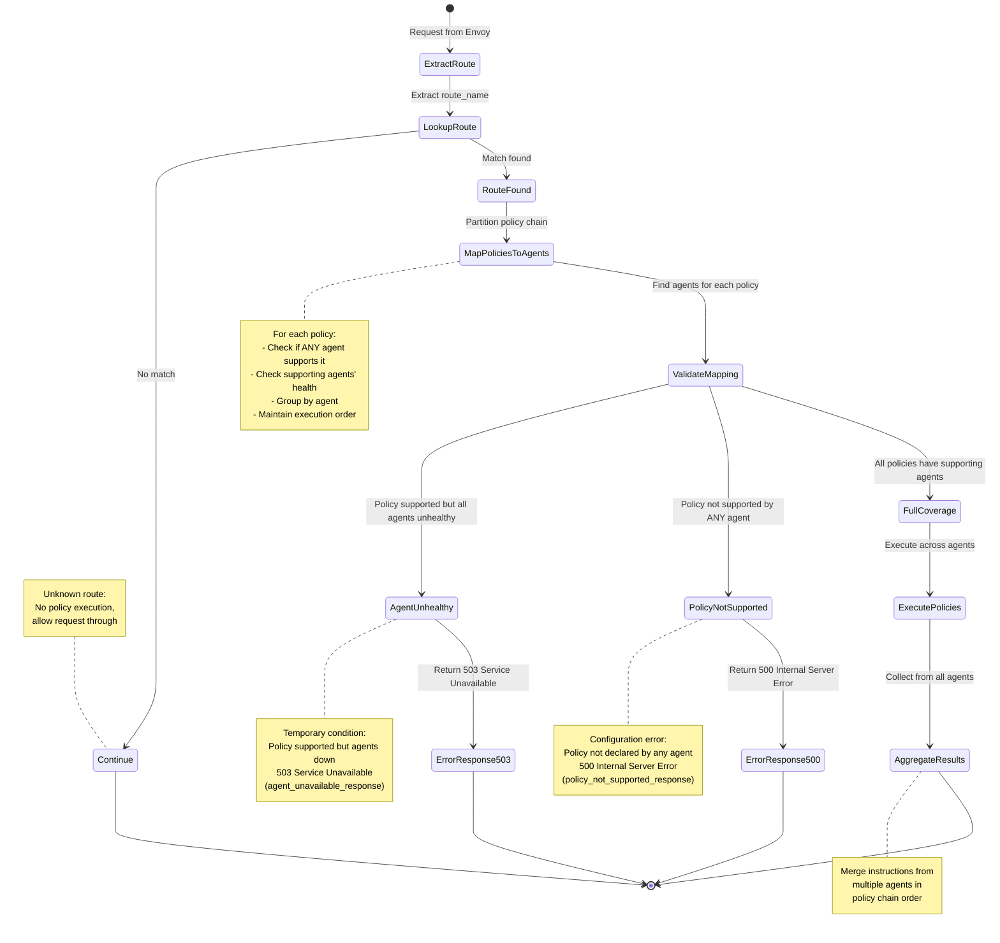

# Policy Kernel Specification

## 1. Overview

The Policy Kernel is the main orchestrator component that interfaces with Envoy Proxy through the External Processing Filter API. It manages route-based policy selection, agent registry, request routing, and response aggregation.

## 2. Responsibilities

1. **External Processing Server**: Implements Envoy's External Processing gRPC API
2. **Route-Based Policy Selection**: Maps route names to policy chains
3. **Agent Management**: Maintains registry of available Policy Agents and their health status
4. **Request Orchestration**: Routes requests to appropriate agents based on policy configuration
5. **Response Aggregation**: Collects instructions from agents and formats response for Envoy

## 3. Architecture


## 4. Configuration

### 4.1 Configuration Schema

```yaml
policy_kernel:
  server:
    address: "0.0.0.0"
    port: 9001
    max_concurrent_streams: 1000

  agents:
    - name: "default-agent"
      socket_path: "/var/run/policy-engine/agents/default.sock"
      timeout_ms: 500
      retry:
        max_attempts: 3
        backoff_ms: 100
      health_check_interval_ms: 5000

  route_policies:
    - route_name: "/api/v1/users"
      request_policy_chain:
        - policy: "apiKeyAuth"
          params:
            header_name: "X-API-Key"
            required: true
        - policy: "rateLimit"
          params:
            requests_per_second: 100
            burst: 20
      response_policy_chain:
        - policy: "addSecurityHeaders"
          params:
            headers: |
              X-Content-Type-Options: "nosniff"
              X-Frame-Options: "DENY"

    - route_name: "/api/v1/admin"
      request_policy_chain:
        - policy: "jwtValidation"
          params:
            issuer: "https://auth.example.com"
            audience: "api-service"
        - policy: "roleCheck"
          params:
            required_roles: ["admin"]
      response_policy_chain:
        - policy: "auditLog"
          params:
            log_response_body: true

  policy_not_supported_response:
    status_code: 500  # Internal Server Error (default)
    body: '{"error": "Policy configuration error", "code": "POLICY_NOT_SUPPORTED"}'
    headers:
      Content-Type: "application/json"
      X-Policy-Error: "configuration"

  agent_unavailable_response:
    status_code: 503  # Service Unavailable (default)
    body: '{"error": "Policy service temporarily unavailable", "code": "AGENT_UNAVAILABLE"}'
    headers:
      Content-Type: "application/json"
      X-Policy-Error: "temporary"
      Retry-After: "30"

  observability:
    metrics_port: 9090
    log_level: "info"
    tracing:
      enabled: true
      sampling_rate: 0.01
```

> **⚠️ Design Consideration - Dynamic Route Policy Configuration**
>
> Route policies are currently configured statically via YAML configuration file. However, in future versions, the Kernel will support **dynamic runtime configuration** of route policies through a management API, allowing policies to be added, modified, or removed without requiring a configuration reload or restart.
>
> **Important**: When designing and implementing any component in the Policy Kernel, always consider this future capability. Design decisions should account for:
> - Thread-safe concurrent access to route policy configuration
> - Atomic updates to policy mappings
> - Backward compatibility with static YAML configuration
> - Version management and rollback capabilities
> - Validation of dynamic policy updates against available agents

### 4.2 Startup Configuration Validation

On startup and reload (static YAML configuration):
1. Validate YAML syntax
2. Check agent socket paths exist
3. Discover and load ALL configured agents
4. Load route policies configuration
5. Verify policy references match agent capabilities (validate against discovered agents)
6. Validate parameter schemas for each policy

**Startup Validation Behavior (Permissive):**
- If some route policies reference unsupported policies: **Log errors, mark routes invalid, continue startup**
- If all agents are unavailable: **Log critical error, continue startup** (all routes marked invalid)
- Rationale: Prefer availability over strict correctness at startup to avoid complete system failure

### 4.3 Validation Failure Response Configuration

The kernel distinguishes between two types of policy validation failures and provides separate configurable responses for each:

#### 4.3.1 Policy Not Supported Response

The `policy_not_supported_response` configures the error response when a policy in the route's chain is **not supported by ANY agent** in the system (configuration error).

**Configuration Schema:**

```yaml
policy_not_supported_response:
  status_code: 500           # HTTP status code (default: 500 Internal Server Error)
  body: "..."                # Response body (string or JSON)
  headers:                   # Optional response headers
    header-name: "value"
```

**Default Values:**

- **status_code**: `500` (Internal Server Error)
- **body**: `'{"error": "Policy configuration error", "code": "POLICY_NOT_SUPPORTED"}'`
- **headers**:
  - `Content-Type: "application/json"`
  - `X-Policy-Error: "configuration"`

**Rationale for 500 Internal Server Error:**

- Indicates a **server configuration issue** - the route references a policy that no agent supports
- This is **not a temporary condition** - it won't resolve until system configuration changes
- Distinguishes from temporary service unavailability (503)
- Signals to clients and operators that intervention is required

**When This Response Is Used:**

- A route's policy chain includes a policy name that no agent has ever declared support for
- This represents a misconfiguration between route policies and available agents

#### 4.3.2 Agent Unavailable Response

The `agent_unavailable_response` configures the error response when a policy IS supported by at least one agent, but **all supporting agents are currently unhealthy** (temporary condition).

**Configuration Schema:**

```yaml
agent_unavailable_response:
  status_code: 503           # HTTP status code (default: 503 Service Unavailable)
  body: "..."                # Response body (string or JSON)
  headers:                   # Optional response headers
    header-name: "value"
```

**Default Values:**

- **status_code**: `503` (Service Unavailable)
- **body**: `'{"error": "Policy service temporarily unavailable", "code": "AGENT_UNAVAILABLE"}'`
- **headers**:
  - `Content-Type: "application/json"`
  - `X-Policy-Error: "temporary"`
  - `Retry-After: "30"` (suggests retry after 30 seconds)

**Rationale for 503 Service Unavailable:**

- Indicates a **temporary condition** - agents are expected to recover
- Standard semantic: the service is temporarily unable to handle the request
- Encourages retry behavior (via `Retry-After` header)
- Distinguishes from permanent configuration errors (500)

**When This Response Is Used:**

- A route's policy is supported by one or more agents in the system
- All agents that support the policy are currently unhealthy (failed health checks)
- This is expected to be temporary and may resolve as agents recover

#### 4.3.3 Configuration Examples

```yaml
# Example 1: Default JSON responses
policy_not_supported_response:
  status_code: 500
  body: '{"error": "Policy configuration error", "code": "POLICY_NOT_SUPPORTED"}'
  headers:
    Content-Type: "application/json"
    X-Policy-Error: "configuration"

agent_unavailable_response:
  status_code: 503
  body: '{"error": "Policy service temporarily unavailable", "code": "AGENT_UNAVAILABLE"}'
  headers:
    Content-Type: "application/json"
    X-Policy-Error: "temporary"
    Retry-After: "30"

# Example 2: Custom error messages with different status codes
policy_not_supported_response:
  status_code: 500
  body: '{"error": "Invalid policy configuration. Contact administrator.", "code": "CONFIG_ERROR"}'
  headers:
    Content-Type: "application/json"

agent_unavailable_response:
  status_code: 503
  body: '{"error": "Service maintenance in progress. Please retry.", "code": "MAINTENANCE"}'
  headers:
    Content-Type: "application/json"
    Retry-After: "60"

# Example 3: Plain text responses
policy_not_supported_response:
  status_code: 500
  body: "Server configuration error. Please contact support."
  headers:
    Content-Type: "text/plain"

agent_unavailable_response:
  status_code: 503
  body: "Service temporarily unavailable. Please try again in 30 seconds."
  headers:
    Content-Type: "text/plain"
    Retry-After: "30"
```

### 4.4 Dynamic Configuration Validation (Future)

When route policies are loaded dynamically via management API:

**Dynamic Validation Behavior (Strict):**
- Validate new/updated route policy against currently discovered agents
- If any policy in the chain is unsupported: **Reject update, return error**
- If referenced agent is unavailable or unhealthy: **Reject update, return error**
- If parameter schema validation fails: **Reject update, return error**
- Rationale: Dynamic updates should fail fast to prevent invalid configurations from being deployed

## 5. Agent Discovery and Registry

### 5.1 Discovery Protocol

At startup, the kernel queries each agent to discover its configuration:

```protobuf
// Request from Kernel to Agent (sent at startup)
message GetAgentConfigRequest {}

// Response from Agent to Kernel
message GetAgentConfigResponse {
  string agent_name = 1;
  string agent_version = 2;
  repeated PolicyInfo supported_policies = 3;
}

message PolicyInfo {
  string name = 1;
  string version = 2;
  repeated string param_schema = 3; // List of parameter names (e.g., ["headerName", "required"])
  PolicyPhase supported_phases = 4;
}

enum PolicyPhase {
  REQUEST = 0;
  RESPONSE = 1;
  REQUEST_RESPONSE = 2;
}
```

### 5.2 Discovery Flow


### 5.3 Agent Registry Structure

```go
type AgentRegistry struct {
    agents map[string]*AgentEntry
    mu     sync.RWMutex
}

type AgentEntry struct {
    name              string
    socketPath        string
    version           string
    supportedPolicies map[string]PolicyInfo  // policy name -> policy info
    connection        *grpc.ClientConn
    healthy           bool
    lastHealthCheck   time.Time
}
```

### 5.4 Health Checking

Periodic health checks for each agent:

```go
// Health check every N milliseconds (configurable)
func (k *Kernel) healthCheckLoop(agent *AgentEntry) {
    ticker := time.NewTicker(agent.healthCheckInterval)
    for range ticker.C {
        ctx, cancel := context.WithTimeout(context.Background(), 100*time.Millisecond) // (configurable)
        err := agent.connection.HealthCheck(ctx)
        cancel()

        agent.healthy = (err == nil)
        agent.lastHealthCheck = time.Now()
    }
}
```

## 6. Policy Selection Logic

### 6.1 Route Matching



### 6.2 Request Phase Selection

1. Extract `route_name` from Envoy request headers or metadata
2. Lookup route in `route_policies` configuration
3. **Route Not Found**: If route not found, return `CONTINUE` instruction to Envoy (no policy execution)
4. **All-or-Nothing Validation**: For each policy in `request_policy_chain`, perform two-stage validation:

   **Stage 1: Check if policy is supported by ANY agent**
   - Query agent registry to find if ANY agent (healthy or unhealthy) declares support for this policy
   - If NO agent supports the policy → **Configuration Error**
     - Return `IMMEDIATE_RESPONSE` with `policy_not_supported_response` (500 Internal Server Error)
     - Log error with unsupported policy names

   **Stage 2: Check if supporting agents are healthy**
   - Filter supporting agents by health status (only healthy agents)
   - If policy is supported but ALL supporting agents are unhealthy → **Temporary Unavailability**
     - Return `IMMEDIATE_RESPONSE` with `agent_unavailable_response` (503 Service Unavailable)
     - Log warning with unhealthy agent names

   **Success: All policies have healthy supporting agents**
   - Create execution plan grouping consecutive policies by agent

5. Execute the validated policy chain across agents in the correct order

**Important**: The order of agent execution follows the policy chain order. This may result in calling the same agent multiple times in non-sequential order (e.g., agent1 → agent2 → agent1 → agent3).

**Policy-to-Agent Mapping Example:**
```
Route: /api/v1/users
Policy Chain: [apiKeyAuth, rateLimit, jwtValidation]

Agent Registry:
- auth-agent: supports [apiKeyAuth, jwtValidation]
- rate-limiter-agent: supports [rateLimit]

Execution Plan:
1. auth-agent: [apiKeyAuth]
2. rate-limiter-agent: [rateLimit]
3. auth-agent: [jwtValidation]
```

### 6.3 Response Phase Selection

1. Use the same route matched during request phase
2. **Route Not Found or No Response Chain**: If route not found or no response chain configured, return `CONTINUE` instruction to Envoy
3. **All-or-Nothing Validation**: Apply same two-stage validation as request phase (see section 6.2):

   **Stage 1**: Check if each policy is supported by ANY agent
   - If not → Return `IMMEDIATE_RESPONSE` with `policy_not_supported_response` (500)

   **Stage 2**: Check if supporting agents are healthy
   - If policy supported but all agents unhealthy → Return `IMMEDIATE_RESPONSE` with `agent_unavailable_response` (503)

   **Success**: Create execution plan

4. Execute the validated response policy chain across agents in the correct order
5. Aggregate responses from all agents

**Important**: The same non-sequential agent ordering applies to response phase (e.g., agent1 → agent2 → agent1).

### 6.4 Agent Selection Strategy

When multiple agents support the same policy, the kernel uses the following selection strategy:

**Selection Priority:**
1. **Health Status**: Only consider healthy agents
2. **Agent Grouping**: Prefer grouping consecutive policies on the same agent to minimize calls
3. **Load Balancing**: Distribute load across agents (if multiple agents support the same policies)
4. **Configuration Preference**: If explicitly configured in route policy, use the specified agent

**Optimization: Policy Chain Grouping**

To minimize the number of agent calls, the kernel groups consecutive policies that can be handled by the same agent:

```go
// Example: Optimize execution plan
Policy Chain: [auth1, auth2, rateLimit, auth3]

Available Agents:
- auth-agent: supports [auth1, auth2, auth3]
- rate-limiter: supports [rateLimit]

Naive Plan (4 calls):
1. auth-agent: [auth1]
2. auth-agent: [auth2]
3. rate-limiter: [rateLimit]
4. auth-agent: [auth3]

Optimized Plan (3 calls):
1. auth-agent: [auth1, auth2]
2. rate-limiter: [rateLimit]
3. auth-agent: [auth3]
```

**Agent Selection Algorithm:**
```go
func (k *Kernel) createExecutionPlan(policies []*Policy) ([]AgentPolicyGroup, error) {
    // Stage 1: Check if ALL policies are supported by at least one agent (configuration check)
    for _, policy := range policies {
        allAgents := k.registry.FindAgentsForPolicy(policy.Name, false /* includeUnhealthy */)
        if len(allAgents) == 0 {
            // Configuration error: No agent (healthy or unhealthy) supports this policy
            return nil, &PolicyNotSupportedError{
                PolicyName: policy.Name,
                Message: fmt.Sprintf("no agent declares support for policy: %s", policy.Name),
            }
        }
    }

    // Stage 2: Check if supporting agents are healthy (availability check)
    for _, policy := range policies {
        healthyAgents := k.registry.FindAgentsForPolicy(policy.Name, true /* healthyOnly */)
        if len(healthyAgents) == 0 {
            // Temporary unavailability: Policy supported but all agents unhealthy
            unhealthyAgents := k.registry.FindAgentsForPolicy(policy.Name, false /* includeUnhealthy */)
            return nil, &AgentUnavailableError{
                PolicyName: policy.Name,
                UnavailableAgents: unhealthyAgents,
                Message: fmt.Sprintf("all agents supporting policy %s are unhealthy", policy.Name),
            }
        }
    }

    // Stage 3: Create execution plan (grouping optimization)
    plan := []AgentPolicyGroup{}
    var currentGroup *AgentPolicyGroup

    for _, policy := range policies {
        // Find all healthy agents supporting this policy (guaranteed to exist after Stage 2)
        agents := k.registry.FindAgentsForPolicy(policy.Name, true /* healthyOnly */)

        // Try to extend current group if same agent can handle this policy
        if currentGroup != nil && currentGroup.Agent.SupportsPolicy(policy.Name) {
            currentGroup.Policies = append(currentGroup.Policies, policy)
        } else {
            // Start new group with first available agent
            agent := agents[0] // Could apply load balancing here
            currentGroup = &AgentPolicyGroup{
                Agent:    agent,
                Policies: []*Policy{policy},
            }
            plan = append(plan, *currentGroup)
        }
    }

    return plan, nil
}

// Error types for distinguishing failure modes
type PolicyNotSupportedError struct {
    PolicyName string
    Message    string
}

type AgentUnavailableError struct {
    PolicyName        string
    UnavailableAgents []*AgentEntry
    Message           string
}
```

### 6.5 All-or-Nothing Policy Validation

The kernel enforces a strict **all-or-nothing validation policy** for route policy chains with differentiated error responses:

**Validation Rules:**

1. **Complete Coverage Required**: ALL policies in a route's policy chain MUST be supported by at least one agent (healthy or unhealthy)
2. **Health Check Required**: ALL policies MUST have at least one healthy agent available
3. **No Partial Execution**: If ANY policy fails validation, the ENTIRE policy chain is skipped
4. **Differentiated Error Responses**: Validation failures return different HTTP status codes based on failure type:
   - **500 Internal Server Error**: Policy not supported by any agent (configuration error)
   - **503 Service Unavailable**: Policy supported but all agents unhealthy (temporary condition)
5. **Applies to Both Phases**: This validation applies to both request and response policy chains independently
6. **Unknown Route Behavior**: If route is not found in configuration, kernel returns `CONTINUE` (not a validation failure)

**Rationale:**

This strict validation ensures:
- **Predictable behavior**: Routes either execute completely as configured or fail explicitly with an appropriate error
- **Security guarantees**: No partial policy enforcement that could leave security gaps
- **Clear operational state**: No ambiguity about which policies were applied
- **Actionable error signals**: Different status codes guide different responses:
  - 500 → Configuration fix required (permanent issue)
  - 503 → Retry or wait for agent recovery (temporary issue)

**Example Scenarios:**

```yaml
# Scenario 1: All policies supported and agents healthy
Route: /api/v1/users
Policy Chain: [apiKeyAuth, rateLimit, jwtValidation]
Available Agents:
  - auth-agent: [apiKeyAuth, jwtValidation] (healthy)
  - rate-limiter: [rateLimit] (healthy)
Result: ✓ Execute full chain across agents
Response: Normal policy execution

# Scenario 2: Policy not supported by any agent (Configuration Error)
Route: /api/v1/admin
Policy Chain: [jwtValidation, roleCheck, auditLog]
Available Agents:
  - auth-agent: [jwtValidation, roleCheck] (healthy)
  - (NO agent declares support for auditLog)
Result: ✗ Skip ENTIRE chain, return IMMEDIATE_RESPONSE
Status: 500 Internal Server Error
Response: {"error": "Policy configuration error", "code": "POLICY_NOT_SUPPORTED"}
Error Type: PolicyNotSupportedError
Action: Fix configuration - deploy agent supporting auditLog or remove from route

# Scenario 3: Agent unhealthy at runtime (Temporary Unavailability)
Route: /api/v1/data
Policy Chain: [auth, transform]
Available Agents:
  - auth-agent: [auth] (healthy)
  - transform-agent: [transform] (UNHEALTHY)
Result: ✗ Skip ENTIRE chain, return IMMEDIATE_RESPONSE
Status: 503 Service Unavailable
Response: {"error": "Policy service temporarily unavailable", "code": "AGENT_UNAVAILABLE"}
Headers: Retry-After: 30
Error Type: AgentUnavailableError
Action: Retry after agent recovers or investigate agent health

# Scenario 4: All agents for a policy are unhealthy
Route: /api/v1/secure
Policy Chain: [auth, encrypt]
Available Agents:
  - auth-agent-1: [auth] (UNHEALTHY)
  - auth-agent-2: [auth] (UNHEALTHY)
  - encrypt-agent: [encrypt] (healthy)
Result: ✗ Skip ENTIRE chain, return IMMEDIATE_RESPONSE
Status: 503 Service Unavailable
Response: {"error": "Policy service temporarily unavailable", "code": "AGENT_UNAVAILABLE"}
Action: Wait for any auth-agent to recover

# Scenario 5: Unknown route (not in configuration)
Request to: /api/v1/unknown
Route Configuration: (no match found)
Result: ✓ CONTINUE (allow request through, no policy execution)
Status: Pass-through (no immediate response)
```

**Validation Timing:**

- **Startup**: Routes are validated against discovered agents. Invalid routes are marked and logged.
- **Runtime**: Before each request, the kernel validates the policy chain against currently healthy agents.
- **Dynamic Updates**: When route policies are updated, validation occurs immediately.

**Logging:**

When a policy is not supported by any agent (configuration error):
```json
{
  "level": "error",
  "message": "Policy not supported by any agent - returning 500 error",
  "route": "/api/v1/admin",
  "unsupported_policies": ["auditLog"],
  "available_agents": ["auth-agent", "rate-limiter"],
  "error_type": "POLICY_NOT_SUPPORTED",
  "response_status": 500,
  "action": "IMMEDIATE_RESPONSE"
}
```

When agents are unhealthy (temporary unavailability):
```json
{
  "level": "warning",
  "message": "All supporting agents unhealthy - returning 503 error",
  "route": "/api/v1/data",
  "affected_policies": ["transform"],
  "unhealthy_agents": ["transform-agent"],
  "error_type": "AGENT_UNAVAILABLE",
  "response_status": 503,
  "action": "IMMEDIATE_RESPONSE",
  "retry_after": 30
}
```

When route is not found:
```json
{
  "level": "info",
  "message": "Route not found - allowing request through",
  "route": "/api/v1/unknown",
  "action": "CONTINUE"
}
```

## 7. Request/Response Protocol

### 7.1 Protocol Definitions

**Request to Agent (gRPC):**
```protobuf
message PolicyRequest {
  string request_id = 1;
  repeated Policy policies = 2;
  RequestContext context = 3;
  int64 deadline_ms = 4;
  PolicyPhase phase = 5; // REQUEST or RESPONSE
}

enum PolicyPhase {
  REQUEST = 0;
  RESPONSE = 1;
}

message Policy {
  string name = 1;
  map<string, string> params = 2;
  string on_failure = 3; // "deny" | "continue" | "skip_remaining"
}

message RequestContext {
  map<string, string> headers = 1;
  bytes body = 2;
  string method = 3;
  string path = 4;
  string scheme = 5;
  string authority = 6;
  map<string, string> query_params = 7;
  string client_ip = 8;
}

message ResponseContext {
  map<string, string> headers = 1;
  bytes body = 2;
  int32 status_code = 3;
}
```

**Response from Agent (gRPC):**
```protobuf
message PolicyResponse {
  string request_id = 1;
  repeated Instruction instructions = 2;
  ResponseStatus status = 3;
  string message = 4;
  map<string, string> metadata = 5;
}

message Instruction {
  InstructionType type = 1;
  oneof payload {
    HeaderInstruction header = 2;
    BodyInstruction body = 3;
    ImmediateResponse immediate_response = 4;
    ContinueRequest continue_request = 5;
  }
}

enum InstructionType {
  SET_HEADER = 0;
  REMOVE_HEADER = 1;
  SET_BODY = 2;
  IMMEDIATE_RESPONSE = 3;
  CONTINUE = 4;
}

message ResponseStatus {
  StatusCode code = 1;
  string policy_name = 2; // Policy that generated this response
}

enum StatusCode {
  OK = 0;
  POLICY_DENIED = 1;
  POLICY_ERROR = 2;
  TIMEOUT = 3;
}
```

### 7.2 Request Processing Flow

**Single Agent Execution:**


**Multi-Agent Execution:**


## 8. Error Handling

### 8.1 Error Scenarios

| Error Condition | Behavior | Response to Envoy |
|----------------|----------|-------------------|
| Agent unavailable at startup | Log error, mark policies invalid | N/A (startup validation) |
| Agent timeout during execution | Cancel request, log timeout | CONTINUE or DENY based on `fail_open` config |
| Invalid agent response | Log error, treat as policy failure | DENY with 500 Internal Server Error |
| Policy execution failure | Depends on policy `on_failure` setting | DENY or CONTINUE based on policy config |
| **Unknown route** | **No policy execution**, log info | **CONTINUE** (allow request through) |
| Configuration reload failure | Continue with previous config, alert | N/A (runtime operation) |
| **Policy not supported by ANY agent** | **Skip ENTIRE chain**, log error | **500 Internal Server Error** (policy_not_supported_response) |
| **Policy supported but all agents unhealthy** | **Skip ENTIRE chain**, log warning | **503 Service Unavailable** (agent_unavailable_response) |
| **Multi-agent: Partial chain failure** | Stop chain, return aggregated results so far | CONTINUE or DENY based on `on_failure` config |
| **Multi-agent: Agent failure mid-chain** | Stop chain, return aggregated results so far | CONTINUE or DENY based on `on_failure` config |

### 8.2 Multi-Agent Error Handling

When executing a policy chain across multiple agents, errors can occur at any point in the chain:

**Failure Handling Strategy:**

```go
func (k *Kernel) executePolicyChain(executionPlan []AgentPolicyGroup, initialContext *RequestContext) (*AggregatedResponse, error) {
    currentContext := initialContext.Clone()
    responses := []*PolicyResponse{}

    for i, group := range executionPlan {
        req := &PolicyRequest{
            RequestID:  generateRequestID(),
            Policies:   group.Policies,
            Context:    currentContext,
            DeadlineMS: group.Agent.TimeoutMS,
        }

        resp, err := group.Agent.ExecutePolicy(req)

        // Handle agent failure
        if err != nil {
            k.logError("agent %s failed at step %d: %v", group.Agent.Name, i, err)

            // Check on_failure policy setting for first policy in failed group
            onFailure := group.Policies[0].OnFailure
            switch onFailure {
            case "deny":
                // Return denial immediately
                return k.createDenialResponse(fmt.Sprintf("Policy execution failed: %v", err)), nil
            case "continue":
                // Skip this agent, continue with next
                k.logWarning("skipping failed agent %s, continuing chain", group.Agent.Name)
                continue
            case "skip_remaining":
                // Stop chain, return what we have so far
                k.logWarning("stopping chain at failed agent %s", group.Agent.Name)
                break
            default:
                // Default: check fail_open config
                if group.Agent.FailOpen {
                    k.logWarning("agent failed but fail_open=true, continuing")
                    continue
                } else {
                    return k.createDenialResponse("Policy execution failed"), nil
                }
            }
        }

        // Check for policy denial
        if resp.Status.Code == POLICY_DENIED {
            return k.aggregateResponses(append(responses, resp)), nil
        }

        // Update context with this agent's instructions
        currentContext = k.applyInstructionsToContext(currentContext, []*PolicyResponse{resp})
        responses = append(responses, resp)
    }

    return k.aggregateResponses(responses), nil
}
```

**Error Scenarios:**

1. **Agent unavailable at start**:
   - Skip policies assigned to that agent
   - Log warning about uncovered policies
   - Continue with remaining agents

2. **Agent fails mid-chain**:
   - Already executed agents' results are preserved
   - Apply `on_failure` policy setting
   - Aggregate partial results if continuing

3. **Agent timeout mid-chain**:
   - Cancel request to timed-out agent
   - Apply timeout handling based on config
   - Continue or abort based on `fail_open` setting

4. **Invalid response from agent**:
   - Log error with agent details
   - Treat as policy failure
   - Apply `on_failure` policy setting

### 8.3 Fail-Open Configuration

```yaml
agents:
  - name: "default-agent"
    socket_path: "/var/run/policy-engine/agents/default.sock"
    fail_open: false  # If true, allow requests when agent is unavailable
```

## 9. Response Aggregation

### 9.1 Multi-Agent Instruction Aggregation

When executing policies across multiple agents, the kernel must aggregate instructions from all agents in the policy chain. The aggregation follows these rules:

**Aggregation Rules:**

1. **Execution Order**: Agents are called sequentially in policy chain order
2. **Context Propagation**: Each agent's instructions update the request/response context for the next agent
3. **Short-Circuit on Denial**: If any agent returns `IMMEDIATE_RESPONSE` (denial), stop execution and return the denial
4. **Instruction Merging**: Collect all instructions from successful agents and merge them
5. **Conflict Resolution**: Later instructions override earlier ones for the same header/field

**Instruction Merge Priority (last wins):**
```
Agent1: SET_HEADER("X-User-ID", "123")
Agent2: SET_HEADER("X-User-ID", "456")
Result: X-User-ID = "456"
```

**Header Mutation Merging:**
```go
type AggregatedResponse struct {
    headerMutations   map[string]string  // header name -> final value
    removedHeaders    []string           // headers to remove
    bodyMutation      *BodyMutation      // last body mutation wins
    immediateResponse *ImmediateResponse // set if any agent denies
    metadata          map[string]string  // merged metadata from all agents
}

func (k *Kernel) aggregateResponses(responses []*PolicyResponse) *AggregatedResponse {
    agg := &AggregatedResponse{
        headerMutations: make(map[string]string),
        metadata:        make(map[string]string),
    }

    for _, resp := range responses {
        // Short-circuit on denial
        if resp.Status.Code == POLICY_DENIED {
            for _, inst := range resp.Instructions {
                if inst.Type == IMMEDIATE_RESPONSE {
                    agg.immediateResponse = inst.ImmediateResponse
                    return agg
                }
            }
        }

        // Aggregate instructions
        for _, inst := range resp.Instructions {
            switch inst.Type {
            case SET_HEADER:
                agg.headerMutations[inst.Header.Name] = inst.Header.Value
            case REMOVE_HEADER:
                delete(agg.headerMutations, inst.Header.Name)
                agg.removedHeaders = append(agg.removedHeaders, inst.Header.Name)
            case SET_BODY:
                agg.bodyMutation = inst.Body  // last wins
            }
        }

        // Merge metadata
        for k, v := range resp.Metadata {
            agg.metadata[k] = v
        }
    }

    return agg
}
```

### 9.2 Context Propagation Between Agents

When executing a policy chain across multiple agents, the context is updated after each agent execution:

```go
func (k *Kernel) executePolicyChain(executionPlan []AgentPolicyGroup, initialContext *RequestContext) (*AggregatedResponse, error) {
    currentContext := initialContext.Clone()
    responses := []*PolicyResponse{}

    for _, group := range executionPlan {
        // Apply previous instructions to context
        currentContext = k.applyInstructionsToContext(currentContext, responses)

        // Call agent with updated context
        req := &PolicyRequest{
            RequestID: generateRequestID(),
            Policies:  group.Policies,
            Context:   currentContext,
            DeadlineMS: group.Agent.TimeoutMS,
        }

        resp, err := group.Agent.ExecutePolicy(req)
        if err != nil {
            return nil, fmt.Errorf("agent %s failed: %w", group.Agent.Name, err)
        }

        // Check for immediate response (denial)
        if resp.Status.Code == POLICY_DENIED {
            return k.aggregateResponses(append(responses, resp)), nil
        }

        responses = append(responses, resp)
    }

    return k.aggregateResponses(responses), nil
}

type AgentPolicyGroup struct {
    Agent    *AgentEntry
    Policies []*Policy
}
```

### 9.3 Conversion to Envoy Format

After aggregating responses from all agents, the kernel converts the aggregated instructions to Envoy's External Processing format:

```go
func (k *Kernel) convertToEnvoyResponse(agg *AggregatedResponse) *extproc.ProcessingResponse {
    envoyResp := &extproc.ProcessingResponse{}

    // Handle immediate response (denial) first
    if agg.immediateResponse != nil {
        envoyResp.Response = &extproc.ImmediateResponse{
            Status:  agg.immediateResponse.StatusCode,
            Headers: agg.immediateResponse.Headers,
            Body:    agg.immediateResponse.Body,
        }
        return envoyResp
    }

    // Apply header mutations
    for name, value := range agg.headerMutations {
        envoyResp.HeaderMutation.SetHeaders = append(
            envoyResp.HeaderMutation.SetHeaders,
            &core.HeaderValueOption{Header: &core.HeaderValue{Key: name, Value: value}},
        )
    }

    for _, name := range agg.removedHeaders {
        envoyResp.HeaderMutation.RemoveHeaders = append(
            envoyResp.HeaderMutation.RemoveHeaders,
            name,
        )
    }

    // Apply body mutation (if any)
    if agg.bodyMutation != nil {
        envoyResp.BodyMutation = &extproc.BodyMutation{
            Mutation: &extproc.BodyMutation_Body{Body: agg.bodyMutation.Body},
        }
    }

    // Default to CONTINUE if no immediate response
    if envoyResp.Response == nil {
        envoyResp.Response = &extproc.CommonResponse{Status: extproc.CommonResponse_CONTINUE}
    }

    return envoyResp
}
```

## 10. Observability

### 10.1 Metrics

```go
// Prometheus metrics
var (
    requestsTotal = prometheus.NewCounterVec(
        prometheus.CounterOpts{
            Name: "policy_kernel_requests_total",
            Help: "Total number of requests processed",
        },
        []string{"route", "agent", "status"},
    )

    requestDuration = prometheus.NewHistogramVec(
        prometheus.HistogramOpts{
            Name: "policy_kernel_request_duration_seconds",
            Help: "Request processing duration",
            Buckets: []float64{.001, .005, .010, .025, .050, .100, .250, .500, 1.0},
        },
        []string{"route", "agent"},
    )

    agentHealth = prometheus.NewGaugeVec(
        prometheus.GaugeOpts{
            Name: "policy_kernel_agent_health",
            Help: "Agent health status (0=unhealthy, 1=healthy)",
        },
        []string{"agent"},
    )

    agentTimeouts = prometheus.NewCounterVec(
        prometheus.CounterOpts{
            Name: "policy_kernel_agent_timeouts_total",
            Help: "Total number of agent timeouts",
        },
        []string{"agent"},
    )

    configReloads = prometheus.NewCounterVec(
        prometheus.CounterOpts{
            Name: "policy_kernel_config_reload_total",
            Help: "Total number of config reload attempts",
        },
        []string{"status"},
    )

    // Multi-agent execution metrics
    agentCallsPerRequest = prometheus.NewHistogramVec(
        prometheus.HistogramOpts{
            Name: "policy_kernel_agent_calls_per_request",
            Help: "Number of agent calls per request (multi-agent execution)",
            Buckets: []float64{1, 2, 3, 4, 5, 10},
        },
        []string{"route"},
    )

    policyChainExecutionDuration = prometheus.NewHistogramVec(
        prometheus.HistogramOpts{
            Name: "policy_kernel_chain_execution_duration_seconds",
            Help: "Total duration for executing full policy chain",
            Buckets: []float64{.001, .005, .010, .025, .050, .100, .250, .500, 1.0},
        },
        []string{"route", "num_agents"},
    )

    partialChainFailures = prometheus.NewCounterVec(
        prometheus.CounterOpts{
            Name: "policy_kernel_partial_chain_failures_total",
            Help: "Total number of partial policy chain failures",
        },
        []string{"route", "failed_agent", "failure_type"},
    )

    instructionAggregationConflicts = prometheus.NewCounterVec(
        prometheus.CounterOpts{
            Name: "policy_kernel_instruction_conflicts_total",
            Help: "Number of instruction conflicts during aggregation",
        },
        []string{"route", "conflict_type"},
    )
)
```

### 10.2 Logging

**Structured logging with fields:**

**Single-agent execution:**
```json
{
  "timestamp": "2025-11-02T10:15:30Z",
  "level": "info",
  "component": "kernel",
  "request_id": "req-12345",
  "route_name": "/api/v1/users",
  "agent_name": "default-agent",
  "message": "Request processed successfully",
  "duration_ms": 45,
  "metadata": {
    "policies_executed": 2,
    "instructions_count": 3
  }
}
```

**Multi-agent execution:**
```json
{
  "timestamp": "2025-11-02T10:15:30Z",
  "level": "info",
  "component": "kernel",
  "request_id": "req-12345",
  "route_name": "/api/v1/admin",
  "message": "Policy chain executed across multiple agents",
  "duration_ms": 87,
  "metadata": {
    "total_policies": 5,
    "agents_called": 3,
    "agent_sequence": ["auth-agent", "rate-limiter", "auth-agent"],
    "policies_per_agent": {
      "auth-agent": ["jwtValidation", "roleCheck"],
      "rate-limiter": ["rateLimit"]
    },
    "total_instructions": 8,
    "agent_durations_ms": {
      "auth-agent": [25, 18],
      "rate-limiter": [12]
    }
  }
}
```

**Partial chain failure:**
```json
{
  "timestamp": "2025-11-02T10:15:30Z",
  "level": "warning",
  "component": "kernel",
  "request_id": "req-12346",
  "route_name": "/api/v1/users",
  "message": "Partial policy chain execution due to agent failure",
  "metadata": {
    "total_policies": 4,
    "executed_policies": 2,
    "failed_at_agent": "rate-limiter",
    "failed_at_step": 2,
    "failure_reason": "agent timeout",
    "on_failure_action": "continue",
    "policies_skipped": ["rateLimit", "validate"]
  }
}
```

### 10.3 Tracing

**OpenTelemetry spans:**

**Single-agent execution:**
- `kernel.process_request` (root span)
  - `kernel.route_lookup`
  - `kernel.agent_call`
    - attributes: `agent.name`, `policy.names`, `policy.count`
  - `kernel.response_conversion`

**Multi-agent execution:**
- `kernel.process_request` (root span)
  - `kernel.route_lookup`
  - `kernel.create_execution_plan`
    - attributes: `total.policies`, `total.agents`, `execution.groups`
  - `kernel.execute_policy_chain`
    - `kernel.agent_call.1` (auth-agent)
      - attributes: `agent.name=auth-agent`, `policies=[auth1,auth2]`, `group.index=1`
    - `kernel.context_update.1`
    - `kernel.agent_call.2` (rate-limiter)
      - attributes: `agent.name=rate-limiter`, `policies=[rateLimit]`, `group.index=2`
    - `kernel.context_update.2`
    - `kernel.agent_call.3` (auth-agent)
      - attributes: `agent.name=auth-agent`, `policies=[auth3]`, `group.index=3`
    - `kernel.context_update.3`
  - `kernel.aggregate_responses`
    - attributes: `response.count`, `instruction.count`, `conflicts.detected`
  - `kernel.response_conversion`

**Span attributes for multi-agent execution:**
- `route.name`: Route name
- `execution.mode`: `single-agent` | `multi-agent`
- `agent.count`: Number of agents called
- `policy.count`: Total policies in chain
- `execution.groups`: Number of agent groups
- `partial.failure`: `true` if partial chain executed
- `failed.agent`: Agent name if failure occurred
- `aggregation.conflicts`: Number of instruction conflicts

## 11. Configuration Hot Reload

### 11.1 Reload Trigger

Signal-based reload:
```bash
kill -SIGHUP <kernel-pid>
```

### 11.2 Reload Process


## 12. Performance Requirements

| Metric | Target |
|--------|--------|
| P99 Latency | < 50ms (excluding policy execution) |
| Throughput | 10,000 requests/second per instance |
| Memory | 512MB base + 256MB per agent |
| CPU | 2 cores minimum |
| Agent Timeout | 500ms default, 5000ms max |
| Health Check Timeout | 100ms |

## 13. Deployment

### 13.1 Container Configuration

See root [SPEC.md](../SPEC.md#deployment-model) for complete container setup.

**Supervisord configuration for kernel:**
```ini
[program:policy-kernel]
command=/usr/local/bin/policy-kernel --config=/etc/policy-engine/kernel-config.yaml
autostart=true
autorestart=true
startretries=3
stdout_logfile=/var/log/policy-engine/kernel.log
stderr_logfile=/var/log/policy-engine/kernel-error.log
priority=1
```

### 13.2 Build

```bash
cd policy-kernel
go build -o policy-kernel ./cmd/kernel
```

## 14. Testing

### 14.1 Unit Tests

- Route selection logic
- Agent registry management
- Configuration validation
- Error handling
- Instruction conversion
- **Multi-agent execution:**
  - Policy-to-agent mapping
  - Execution plan creation and optimization
  - Policy chain grouping algorithm
  - Agent selection strategy
- **Response aggregation:**
  - Instruction merging logic
  - Conflict resolution (header overwrites)
  - Context propagation between agents
  - Short-circuit on denial

### 14.2 Integration Tests

- Agent discovery protocol
- Health check mechanism
- Configuration reload
- Timeout handling
- Fail-open behavior
- **Multi-agent scenarios:**
  - Sequential execution across multiple agents
  - Context propagation between agent calls
  - Partial chain execution on agent failure
  - Instruction aggregation from multiple agents
  - Agent grouping optimization
- **Error scenarios:**
  - Agent failure mid-chain
  - Agent timeout during multi-agent execution
  - Partial policy coverage
  - Conflicting instructions from different agents

---

## Document Revision History

| Version | Date | Author | Changes |
|---------|------|--------|---------|
| 1.3 | 2025-11-02 | System | Split validation failure response into two configurations: policy_not_supported_response (500) and agent_unavailable_response (503) to distinguish configuration errors from temporary unavailability |
| 1.2 | 2025-11-02 | System | Replaced default_policy with validation_failure_response configuration (immediate error response) |
| 1.1 | 2025-11-02 | System | Added multi-agent policy execution support with response aggregation |
| 1.0 | 2025-11-02 | System | Extracted from v2.0 monolithic specification |
