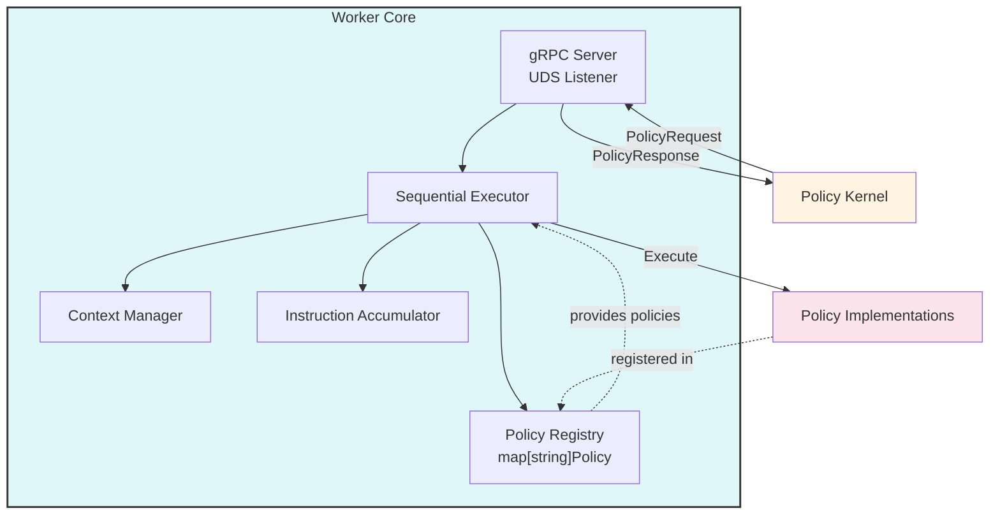
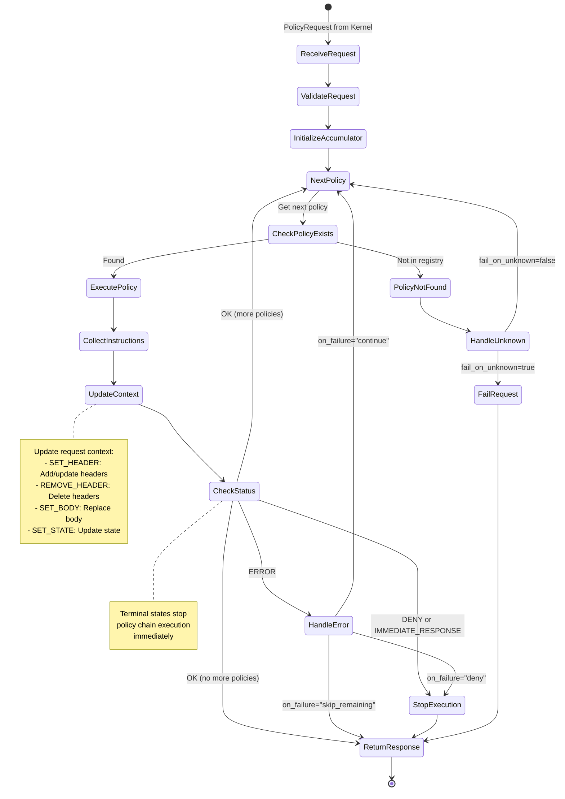

# Worker Core Specification

## 1. Overview

The Worker Core is the execution engine within the Policy Worker. It provides the gRPC server, policy registry, sequential execution engine, and request context management.

## 2. Responsibilities

1. **gRPC Server**: Accepts policy execution requests from Policy Kernel via UDS
2. **Policy Registry**: Maintains map of policy name → implementation (in-memory registry)
3. **Sequential Execution**: Executes policies in order, maintaining request context
4. **Context Management**: Updates request context based on policy instructions
5. **Instruction Collection**: Aggregates instructions from all policies
6. **Early Termination**: Stops execution if policy returns DENY or IMMEDIATE_RESPONSE

## 3. Architecture



## 4. Policy Interface

### 4.1 Go Interface Definition

```go
// Policy represents a single policy implementation that can be executed
// by a Policy Worker. Each Policy is responsible for:
// - Declaring its metadata (name, version, supported phases, parameters)
// - Executing policy logic for request and/or response phases
type Policy interface {
    // Name returns the unique policy identifier (e.g., "jwtValidation", "rateLimit")
    Name() string

    // Version returns the policy implementation version (e.g., "1.0.0")
    Version() string

    // SupportedPhases returns which processing phases this policy can handle
    SupportedPhases() PolicyPhase

    // ParameterSchema returns the list of parameter names this policy accepts
    // Used by the kernel for validation during startup configuration checks
    ParameterSchema() []string

    // HandleRequest executes policy logic during the REQUEST phase
    // Called before the request is sent to the upstream service
    // Return nil if this policy doesn't handle the request phase
    HandleRequest(ctx context.Context, req *RequestContext) *RequestResult

    // HandleResponse executes policy logic during the RESPONSE phase
    // Called after receiving the response from the upstream service
    // Return nil if this policy doesn't handle the response phase
    HandleResponse(ctx context.Context, req *ResponseContext) *ResponseResult
}

// PolicyPhase indicates when a policy can be executed
type PolicyPhase int

const (
    PhaseRequest         PolicyPhase = 0  // REQUEST phase only
    PhaseResponse        PolicyPhase = 1  // RESPONSE phase only
    PhaseRequestResponse PolicyPhase = 2  // Both REQUEST and RESPONSE phases
)

// RequestResult is returned by request phase policy execution
type RequestResult struct {
    // Instructions to modify the request or control flow
    Instructions []RequestInstruction

    // Message provides human-readable details about the execution
    Message string

    // Metadata to pass to subsequent policies in the chain
    Metadata map[string]string
}

// ResponseResult is returned by response phase policy execution
type ResponseResult struct {
    // Instructions to modify the response or control flow
    Instructions []ResponseInstruction

    // Message provides human-readable details about the execution
    Message string

    // Metadata to pass to subsequent policies in the chain
    Metadata map[string]string
}

// RequestInstruction represents actions available during request phase
// This is a sealed/closed sum type - only predefined types can implement it
type RequestInstruction interface {
    // isRequestInstruction is an unexported method that seals this interface.
    // Types outside this package cannot implement RequestInstruction.
    isRequestInstruction()
}

// ResponseInstruction represents actions available during response phase
// This is a sealed/closed sum type - only predefined types can implement it
type ResponseInstruction interface {
    // isResponseInstruction is an unexported method that seals this interface.
    // Types outside this package cannot implement ResponseInstruction.
    isResponseInstruction()
}

// ==================== Helper Functions ====================

// InternalError creates a RequestResult with a 500 Internal Server Error response
// Use this when policy execution encounters operational errors (e.g., database failure,
// external service unavailable, parsing errors)
func InternalError(message string) *RequestResult {
    return &RequestResult{
        Instructions: []RequestInstruction{
            ImmediateResponse{
                StatusCode: 500,
                Body:       []byte(`{"error":"Internal server error","code":"POLICY_ERROR"}`),
                Headers:    map[string]string{"Content-Type": "application/json"},
                Reason:     "policy_error",
            },
        },
        Message: message,
    }
}

// InternalErrorWithDetails creates a RequestResult with a 500 error and custom error details
func InternalErrorWithDetails(message string, errorDetails string) *RequestResult {
    body := []byte(`{"error":"` + errorDetails + `","code":"POLICY_ERROR"}`)
    return &RequestResult{
        Instructions: []RequestInstruction{
            ImmediateResponse{
                StatusCode: 500,
                Body:       body,
                Headers:    map[string]string{"Content-Type": "application/json"},
                Reason:     "policy_error",
            },
        },
        Message: message,
    }
}
```

### 4.2 Execution Contexts

```go
// RequestContext contains all data needed for request phase policy execution
type RequestContext struct {
    // RequestID is a unique identifier for this request
    RequestID string

    // Params contains policy-specific parameters from route configuration
    Params map[string]string

    // Metadata contains data passed from previous policies in the chain
    Metadata map[string]string

    // Request contains HTTP request data
    Request *RequestData
}

// ResponseContext contains all data needed for response phase policy execution
type ResponseContext struct {
    // RequestID is a unique identifier for this request
    RequestID string

    // Params contains policy-specific parameters from route configuration
    Params map[string]string

    // Metadata contains data passed from previous policies in the chain
    Metadata map[string]string

    // Request contains the original HTTP request data
    Request *RequestData

    // Response contains HTTP response data from upstream
    Response *ResponseData
}

// RequestData contains HTTP request information
type RequestData struct {
    Headers      map[string][]string  // HTTP headers (multi-value support)
    Body         []byte               // Request body (optional)
    BodyIncluded bool                 // Indicates if body is present
    Method       string               // HTTP method (GET, POST, etc.)
    Path         string               // URL path
    Scheme       string               // http or https
    Authority    string               // Host header value
    QueryParams  map[string]string    // Parsed query parameters
    ClientIP     string               // Client IP address
}

// ResponseData contains HTTP response information
type ResponseData struct {
    Headers      map[string][]string  // HTTP response headers
    Body         []byte               // Response body (optional)
    BodyIncluded bool                 // Indicates if body is present
    StatusCode   int32                // HTTP status code
}
```

### 4.3 Instruction Types

Instructions are **phase-specific** to ensure type safety and prevent invalid operations.

```go
// ==================== Header Instructions (Both Phases) ====================

// SetHeader sets or replaces a header value
type SetHeader struct {
    Name  string
    Value string
}

func (SetHeader) isRequestInstruction()  {}
func (SetHeader) isResponseInstruction() {}

// AppendHeader appends to an existing header (for multi-value headers like Set-Cookie)
type AppendHeader struct {
    Name  string
    Value string
}

func (AppendHeader) isRequestInstruction()  {}
func (AppendHeader) isResponseInstruction() {}

// RemoveHeader removes a header entirely
type RemoveHeader struct {
    Name string
}

func (RemoveHeader) isRequestInstruction()  {}
func (RemoveHeader) isResponseInstruction() {}

// ==================== Body Instructions (Both Phases) ====================

// SetBody modifies the request or response body
type SetBody struct {
    Body        []byte
    ContentType string  // Optional: updates Content-Type header if provided
}

func (SetBody) isRequestInstruction()  {}
func (SetBody) isResponseInstruction() {}

// ==================== Path Instructions (Request Phase Only) ====================

// SetPath rewrites the URL path
type SetPath struct {
    Path string
}

func (SetPath) isRequestInstruction() {}

// ==================== Query Parameter Instructions (Request Phase Only) ====================

// SetQueryParam sets or replaces a query parameter
type SetQueryParam struct {
    Name  string
    Value string
}

func (SetQueryParam) isRequestInstruction() {}

// RemoveQueryParam removes a query parameter
type RemoveQueryParam struct {
    Name string
}

func (RemoveQueryParam) isRequestInstruction() {}

// ==================== HTTP Method Instructions (Request Phase Only) ====================

// SetMethod overrides the HTTP method
type SetMethod struct {
    Method string  // GET, POST, PUT, DELETE, PATCH, etc.
}

func (SetMethod) isRequestInstruction() {}

// ==================== Status Code Instructions (Response Phase Only) ====================

// SetStatusCode modifies the HTTP status code from upstream
type SetStatusCode struct {
    StatusCode int32
}

func (SetStatusCode) isResponseInstruction() {}

// ==================== Metadata Instructions (Both Phases) ====================

// SetMetadata sets metadata to pass to subsequent policies in the chain
// Common use cases: share authentication context, user attributes, rate limit counters
type SetMetadata struct {
    Key   string
    Value string
}

func (SetMetadata) isRequestInstruction()  {}
func (SetMetadata) isResponseInstruction() {}

// ==================== Immediate Response Instructions (Request Phase Only) ====================

// ImmediateResponse returns an immediate response to the client, bypassing upstream
// Used for: authentication failures, rate limiting, validation errors, etc.
type ImmediateResponse struct {
    StatusCode int32              // HTTP status code (e.g., 401, 403, 429)
    Body       []byte             // Response body
    Headers    map[string]string  // Response headers
    Reason     string             // Reason for denial (for logging/metrics)
}

func (ImmediateResponse) isRequestInstruction() {}

// Common Reason values for ImmediateResponse
const (
    ReasonAuthenticationFailed = "authentication_failed"
    ReasonUnauthorized         = "unauthorized"
    ReasonForbidden            = "forbidden"
    ReasonRateLimited          = "rate_limited"
    ReasonInvalidRequest       = "invalid_request"
    ReasonPolicyDenied         = "policy_denied"
)

// ==================== Control Flow Instructions (Both Phases) ====================

// Continue signals that policy passed and processing should continue normally
type Continue struct {
    Reason string  // Optional reason for logging
}

func (Continue) isRequestInstruction()  {}
func (Continue) isResponseInstruction() {}

// SkipRemainingPolicies short-circuits the policy chain, skipping remaining policies
// Use cases: whitelisted traffic, internal traffic, cached responses
type SkipRemainingPolicies struct {
    Reason string  // Optional reason for logging
}

func (SkipRemainingPolicies) isRequestInstruction()  {}
func (SkipRemainingPolicies) isResponseInstruction() {}
```

### 4.4 Example Policy Implementation

```go
// Example 1: Request-only policy (JWT validation)
type JWTValidationPolicy struct {
    validator *JWTValidator
}

func (p *JWTValidationPolicy) Name() string { return "jwtValidation" }
func (p *JWTValidationPolicy) Version() string { return "1.0.0" }
func (p *JWTValidationPolicy) SupportedPhases() PolicyPhase { return PhaseRequest }
func (p *JWTValidationPolicy) ParameterSchema() []string {
    return []string{"issuer", "audience"}
}

func (p *JWTValidationPolicy) HandleRequest(ctx context.Context, req *RequestContext) *RequestResult {
    authHeader := req.Request.Headers["Authorization"]
    if len(authHeader) == 0 {
        // Business logic denial
        return &RequestResult{
            Instructions: []RequestInstruction{
                ImmediateResponse{
                    StatusCode: 401,
                    Body: []byte(`{"error":"Missing authorization header"}`),
                    Headers: map[string]string{"Content-Type": "application/json"},
                    Reason: ReasonAuthenticationFailed,
                },
            },
            Message: "Authorization header missing",
        }
    }

    token := authHeader[0]
    claims, err := p.validator.Validate(ctx, token, req.Params["issuer"], req.Params["audience"])
    if err != nil {
        // Operational error - use helper function
        return InternalError("JWT validation service unavailable: " + err.Error())
    }

    if !claims.Valid {
        // Business logic denial
        return &RequestResult{
            Instructions: []RequestInstruction{
                ImmediateResponse{
                    StatusCode: 401,
                    Body: []byte(`{"error":"Invalid or expired token"}`),
                    Headers: map[string]string{"Content-Type": "application/json"},
                    Reason: ReasonAuthenticationFailed,
                },
            },
            Message: "JWT token invalid",
        }
    }

    // Success
    return &RequestResult{
        Instructions: []RequestInstruction{
            SetHeader{Name: "X-User-ID", Value: claims.UserID},
            SetMetadata{Key: "authenticated_user_id", Value: claims.UserID},
            Continue{Reason: "jwt_validation_passed"},
        },
        Message: "JWT validation successful",
        Metadata: map[string]string{
            "authenticated_user_id": claims.UserID,
            "user_tier": claims.Tier,
        },
    }
}

func (p *JWTValidationPolicy) HandleResponse(ctx context.Context, req *ResponseContext) *ResponseResult {
    return nil  // Not used for request-only policy
}

// Example 2: Response-only policy (Add security headers)
type SecurityHeadersPolicy struct{}

func (p *SecurityHeadersPolicy) Name() string { return "addSecurityHeaders" }
func (p *SecurityHeadersPolicy) Version() string { return "1.0.0" }
func (p *SecurityHeadersPolicy) SupportedPhases() PolicyPhase { return PhaseResponse }
func (p *SecurityHeadersPolicy) ParameterSchema() []string {
    return []string{"headers"}
}

func (p *SecurityHeadersPolicy) HandleRequest(ctx context.Context, req *RequestContext) *RequestResult {
    return nil  // Not used for response-only policy
}

func (p *SecurityHeadersPolicy) HandleResponse(ctx context.Context, req *ResponseContext) *ResponseResult {
    return &ResponseResult{
        Instructions: []ResponseInstruction{
            SetHeader{Name: "X-Content-Type-Options", Value: "nosniff"},
            SetHeader{Name: "X-Frame-Options", Value: "DENY"},
            Continue{Reason: "security_headers_added"},
        },
        Message: "Security headers added",
    }
}

// Example 3: Request AND Response policy (Audit logging)
type AuditLogPolicy struct {
    logger *AuditLogger
}

func (p *AuditLogPolicy) Name() string { return "auditLog" }
func (p *AuditLogPolicy) Version() string { return "1.0.0" }
func (p *AuditLogPolicy) SupportedPhases() PolicyPhase { return PhaseRequestResponse }
func (p *AuditLogPolicy) ParameterSchema() []string {
    return []string{"log_request_body", "log_response_body"}
}

func (p *AuditLogPolicy) HandleRequest(ctx context.Context, req *RequestContext) *RequestResult {
    // Log request details
    timestamp := time.Now().Format(time.RFC3339)
    p.logger.LogRequest(req.RequestID, req.Request)

    // Store request timestamp in metadata for response phase
    return &RequestResult{
        Instructions: []RequestInstruction{
            SetMetadata{Key: "audit_request_timestamp", Value: timestamp},
            Continue{Reason: "request_logged"},
        },
        Message: "Request logged",
        Metadata: map[string]string{
            "audit_request_timestamp": timestamp,
        },
    }
}

func (p *AuditLogPolicy) HandleResponse(ctx context.Context, req *ResponseContext) *ResponseResult {
    // Log response details and calculate duration using metadata from request phase
    requestTimestamp := req.Metadata["audit_request_timestamp"]
    duration := time.Since(parseTime(requestTimestamp))

    p.logger.LogResponse(req.RequestID, req.Response, duration)

    return &ResponseResult{
        Instructions: []ResponseInstruction{
            Continue{Reason: "response_logged"},
        },
        Message: "Response logged",
    }
}
```

## 5. Sequential Execution Flow

### 5.1 Execution State Machine



### 5.2 Execution Algorithm

```go
func (e *Executor) Execute(req *PolicyRequest) (*PolicyResponse, error) {
    ctx := req.Context.Clone()
    accumulator := NewInstructionAccumulator()

    for _, policy := range req.Policies {
        // 1. Lookup policy
        impl, exists := e.registry.Get(policy.Name)
        if !exists {
            if e.config.FailOnUnknown {
                return e.buildErrorResponse(req.RequestID, "unknown policy: "+policy.Name)
            }
            e.logger.Warn("Unknown policy, skipping", "policy", policy.Name)
            continue
        }

        // 2. Execute policy
        result, err := e.executePolicy(ctx, impl, policy.Metadata)

        // 3. Collect instructions
        accumulator.Add(result.Instructions...)

        // 4. Update context
        e.contextMgr.ApplyInstructions(ctx, result.Instructions)

        // 5. Check for early termination
        if result.Status == POLICY_DENIED || e.hasImmediateResponse(result) {
            e.logger.Info("Policy chain terminated early", "policy", policy.Name, "status", result.Status)
            return accumulator.Build(req.RequestID, result.Status, result.Message)
        }

        // 6. Handle errors
        if err != nil || result.Status == POLICY_ERROR {
            switch policy.OnFailure {
            case "deny":
                return accumulator.Build(req.RequestID, POLICY_DENIED, "Policy error: "+err.Error())
            case "continue":
                e.logger.Warn("Policy failed, continuing", "policy", policy.Name, "error", err)
                continue
            case "skip_remaining":
                e.logger.Info("Policy failed, skipping remaining", "policy", policy.Name, "error", err)
                return accumulator.Build(req.RequestID, OK, "Policy chain completed with errors")
            }
        }
    }

    // All policies executed successfully
    return accumulator.Build(req.RequestID, OK, "Policy chain completed")
}
```

### 5.3 Policy Execution with Timeout

```go
func (e *Executor) executePolicy(ctx *RequestContext, policy Policy, metadata map[string]string) (*PolicyResult, error) {
    // Create timeout context
    execCtx, cancel := context.WithTimeout(context.Background(), e.config.PolicyTimeout)
    defer cancel()

    // Execute policy in goroutine
    resultChan := make(chan *PolicyResult, 1)
    errChan := make(chan error, 1)

    go func() {
        result, err := policy.Execute(execCtx, metadata, ctx)
        if err != nil {
            errChan <- err
            return
        }
        resultChan <- result
    }()

    // Wait for result or timeout
    select {
    case result := <-resultChan:
        return result, nil
    case err := <-errChan:
        return nil, err
    case <-execCtx.Done():
        return &PolicyResult{
            Status:  TIMEOUT,
            Message: "Policy execution timeout",
        }, context.DeadlineExceeded
    }
}
```

## 6. Context Management

### 6.1 Context Update Rules

| Instruction Type | Context Update | Validation |
|-----------------|----------------|------------|
| SET_HEADER | Add/update `context.Headers[key] = value` | Key non-empty |
| REMOVE_HEADER | Delete `context.Headers[key]` | Key exists (warn if not) |
| SET_BODY | Replace `context.Body = body` | Size < max_body_size |
| SET_STATE | Update `context.State[key] = value` | Total state size < max_state_size |
| IMMEDIATE_RESPONSE | No context update (terminal) | N/A |
| CONTINUE | No context update | N/A |

### 6.2 Context Update Implementation

```go
type ContextManager struct {
    config *Config
    logger *Logger
}

func (cm *ContextManager) ApplyInstructions(ctx *RequestContext, instructions []*Instruction) error {
    for _, inst := range instructions {
        switch inst.Type {
        case SET_HEADER:
            header := inst.Payload.(*HeaderInstruction)
            if header.Key == "" {
                return fmt.Errorf("invalid SET_HEADER: empty key")
            }
            ctx.Headers[header.Key] = header.Value
            ctx.modifications = append(ctx.modifications, Modification{
                Type:  "SET_HEADER",
                Key:   header.Key,
                Value: header.Value,
            })

        case REMOVE_HEADER:
            header := inst.Payload.(*HeaderInstruction)
            if _, exists := ctx.Headers[header.Key]; !exists {
                cm.logger.Warn("Removing non-existent header", "key", header.Key)
            }
            delete(ctx.Headers, header.Key)
            ctx.modifications = append(ctx.modifications, Modification{
                Type: "REMOVE_HEADER",
                Key:  header.Key,
            })

        case SET_BODY:
            body := inst.Payload.(*BodyInstruction)
            if len(body.Body) > cm.config.MaxBodySize {
                return fmt.Errorf("body size exceeds limit: %d > %d", len(body.Body), cm.config.MaxBodySize)
            }
            ctx.Body = body.Body
            ctx.modifications = append(ctx.modifications, Modification{
                Type: "SET_BODY",
                Size: len(body.Body),
            })

        case SET_STATE:
            state := inst.Payload.(*StateInstruction)
            ctx.State[state.Key] = state.Value

            // Check total state size
            totalSize := cm.calculateStateSize(ctx.State)
            if totalSize > cm.config.MaxStateSize {
                delete(ctx.State, state.Key) // Rollback
                return fmt.Errorf("state size exceeds limit: %d > %d", totalSize, cm.config.MaxStateSize)
            }

        case IMMEDIATE_RESPONSE, CONTINUE:
            // Terminal instructions - no context update
            continue
        }
    }
    return nil
}
```

## 7. Policy Registry

### 7.1 Registry Structure

```go
type PolicyRegistry struct {
    policies map[string]Policy
    mu       sync.RWMutex
}

func NewPolicyRegistry() *PolicyRegistry {
    return &PolicyRegistry{
        policies: make(map[string]Policy),
    }
}

func (r *PolicyRegistry) Register(policy Policy) error {
    r.mu.Lock()
    defer r.mu.Unlock()

    if _, exists := r.policies[policy.Name()]; exists {
        return fmt.Errorf("policy already registered: %s", policy.Name())
    }

    r.policies[policy.Name()] = policy
    return nil
}

func (r *PolicyRegistry) Get(name string) (Policy, bool) {
    r.mu.RLock()
    defer r.mu.RUnlock()

    policy, exists := r.policies[name]
    return policy, exists
}

func (r *PolicyRegistry) List() []PolicyInfo {
    r.mu.RLock()
    defer r.mu.RUnlock()

    infos := make([]PolicyInfo, 0, len(r.policies))
    for _, policy := range r.policies {
        infos = append(infos, PolicyInfo{
            Name:             policy.Name(),
            Version:          policy.Version(),
            Description:      policy.Description(),
            MetadataSchema:   policy.MetadataSchema(),
            SupportedPhases:  policy.SupportedPhases(),
        })
    }
    return infos
}
```

### 7.2 Policy Registration at Startup

```go
// In cmd/worker/main.go
func main() {
    // Load configuration
    config := loadConfig()

    // Create worker core
    core := workercore.New(config)

    // Register all compiled-in policies
    core.RegisterPolicy(apikey.NewAPIKeyPolicy())
    core.RegisterPolicy(jwt.NewJWTPolicy())
    core.RegisterPolicy(ratelimit.NewRateLimitPolicy())
    core.RegisterPolicy(custom.NewCustomPolicy())

    // Start gRPC server
    core.Start()
}
```

## 8. Instruction Accumulator

### 8.1 Accumulator Implementation

```go
type InstructionAccumulator struct {
    instructions []*Instruction
    metadata     map[string]string
}

func NewInstructionAccumulator() *InstructionAccumulator {
    return &InstructionAccumulator{
        instructions: make([]*Instruction, 0),
        metadata:     make(map[string]string),
    }
}

func (a *InstructionAccumulator) Add(instructions ...*Instruction) {
    a.instructions = append(a.instructions, instructions...)
}

func (a *InstructionAccumulator) AddMetadata(key, value string) {
    a.metadata[key] = value
}

func (a *InstructionAccumulator) Build(requestID string, status StatusCode, message string) *PolicyResponse {
    return &PolicyResponse{
        RequestID:    requestID,
        Instructions: a.instructions,
        Status: &ResponseStatus{
            Code:    status,
            Message: message,
        },
        Metadata: a.metadata,
    }
}
```

## 9. gRPC Server

### 9.1 Service Implementation

```go
type WorkerServer struct {
    executor  *Executor
    registry  *PolicyRegistry
    config    *Config
    logger    *Logger
}

func (s *WorkerServer) GetWorkerConfig(ctx context.Context, req *GetWorkerConfigRequest) (*GetWorkerConfigResponse, error) {
    policies := s.registry.List()

    return &GetWorkerConfigResponse{
        WorkerName:         s.config.Name,
        WorkerVersion:      s.config.Version,
        SupportedPolicies: policies,
        WorkerMetadata: map[string]string{
            "max_body_size":  fmt.Sprintf("%d", s.config.MaxBodySize),
            "max_state_size": fmt.Sprintf("%d", s.config.MaxStateSize),
        },
    }, nil
}

func (s *WorkerServer) ExecutePolicies(ctx context.Context, req *PolicyRequest) (*PolicyResponse, error) {
    // Validate request
    if err := s.validateRequest(req); err != nil {
        return nil, status.Errorf(codes.InvalidArgument, "invalid request: %v", err)
    }

    // Execute policy chain
    resp, err := s.executor.Execute(req)
    if err != nil {
        s.logger.Error("Policy execution failed", "request_id", req.RequestID, "error", err)
        return nil, status.Errorf(codes.Internal, "execution failed: %v", err)
    }

    return resp, nil
}

func (s *WorkerServer) HealthCheck(ctx context.Context, req *HealthCheckRequest) (*HealthCheckResponse, error) {
    // Check all registered policies
    for _, policy := range s.registry.List() {
        impl, _ := s.registry.Get(policy.Name)
        if err := impl.HealthCheck(); err != nil {
            return &HealthCheckResponse{
                Status: UNHEALTHY,
                Message: fmt.Sprintf("Policy %s unhealthy: %v", policy.Name, err),
            }, nil
        }
    }

    return &HealthCheckResponse{
        Status:  HEALTHY,
        Message: "All policies healthy",
    }, nil
}
```

### 9.2 Server Startup

```go
func (s *WorkerServer) Start() error {
    // Remove existing socket file if exists
    if err := os.Remove(s.config.SocketPath); err != nil && !os.IsNotExist(err) {
        return fmt.Errorf("failed to remove socket: %w", err)
    }

    // Create UDS listener
    listener, err := net.Listen("unix", s.config.SocketPath)
    if err != nil {
        return fmt.Errorf("failed to listen on socket: %w", err)
    }

    // Set socket permissions
    if err := os.Chmod(s.config.SocketPath, 0600); err != nil {
        return fmt.Errorf("failed to set socket permissions: %w", err)
    }

    // Create gRPC server
    grpcServer := grpc.NewServer(
        grpc.MaxConcurrentStreams(uint32(s.config.MaxConcurrentRequests)),
    )

    // Register service
    pb.RegisterPolicyWorkerServer(grpcServer, s)

    // Start serving
    s.logger.Info("Worker server starting", "socket", s.config.SocketPath)
    return grpcServer.Serve(listener)
}
```

## 10. Error Handling

### 10.1 Error Types

| Error Type | Handling | Response |
|------------|----------|----------|
| Unknown policy | Based on `fail_on_unknown` config | Skip or DENY |
| Policy timeout | Based on `on_failure` setting | DENY, CONTINUE, or SKIP_REMAINING |
| Policy panic | Recover and log | POLICY_ERROR |
| Context update error | Stop execution | POLICY_ERROR |
| Resource limit exceeded | Reject instruction | POLICY_ERROR |
| Invalid metadata | Before execution | InvalidArgument gRPC error |

### 10.2 Panic Recovery

```go
func (e *Executor) executePolicy(ctx *RequestContext, policy Policy, metadata map[string]string) (result *PolicyResult, err error) {
    defer func() {
        if r := recover(); r != nil {
            e.logger.Error("Policy panic recovered",
                "policy", policy.Name(),
                "panic", r,
                "stack", string(debug.Stack()))

            result = &PolicyResult{
                Status:  POLICY_ERROR,
                Message: fmt.Sprintf("Policy panic: %v", r),
            }
            err = fmt.Errorf("policy panic: %v", r)
        }
    }()

    // Execute policy...
    return policy.Execute(ctx, metadata, ctx)
}
```

## 11. Performance Optimizations

### 11.1 Context Cloning

```go
func (ctx *RequestContext) Clone() *RequestContext {
    clone := &RequestContext{
        Headers:       make(map[string]string, len(ctx.Headers)),
        Body:          ctx.Body, // Shared read-only
        Method:        ctx.Method,
        Path:          ctx.Path,
        Scheme:        ctx.Scheme,
        Authority:     ctx.Authority,
        QueryParams:   make(map[string]string, len(ctx.QueryParams)),
        ClientIP:      ctx.ClientIP,
        State:         make(map[string]interface{}),
        phase:         ctx.phase,
        modifications: make([]Modification, 0),
    }

    // Copy maps
    for k, v := range ctx.Headers {
        clone.Headers[k] = v
    }
    for k, v := range ctx.QueryParams {
        clone.QueryParams[k] = v
    }

    return clone
}
```

### 11.2 Instruction Pooling

```go
var instructionPool = sync.Pool{
    New: func() interface{} {
        return &Instruction{}
    },
}

func GetInstruction() *Instruction {
    return instructionPool.Get().(*Instruction)
}

func PutInstruction(inst *Instruction) {
    inst.Type = 0
    inst.Payload = nil
    instructionPool.Put(inst)
}
```

---

## Document Revision History

| Version | Date | Author | Changes |
|---------|------|--------|---------|
| 1.0 | 2025-11-02 | System | Extracted from v2.0 monolithic specification |
